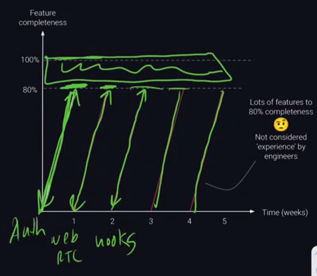
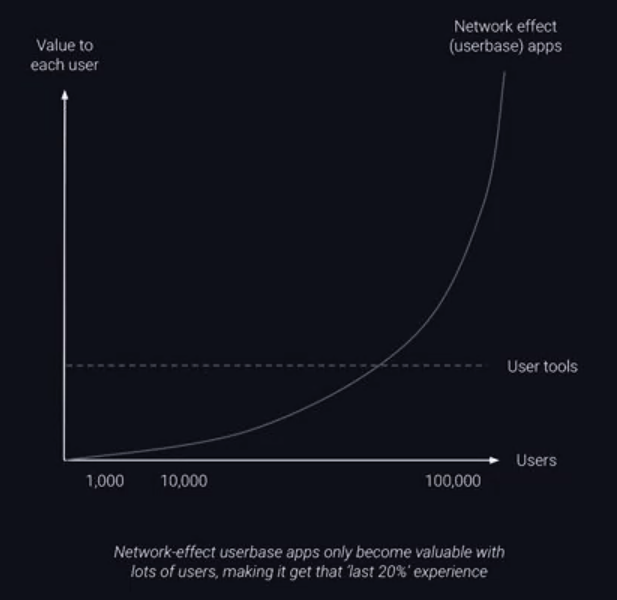

# What can we Build

## Goals

1. Grow as a T-shaped developer (solid in most, expert in one). Why?
  - Great teams are made up of lots T-shaped developers - Comparative Advantage.
  - Shows potential to be expert in something -> or anything.
  - Use as a signal of your ability in interviews.

2. Show you are ready to contribute to solving demanding engineering problems that Engineers interviewing you can relate to (problem solving that engineers actually value).

3. Take into account different team members' priorities and maintain a realistic scope.

## What kind of experience do engineers value?

- The answer (surprisingly) is not 'building web apps'. Instead, we need to understand what engineers are really paid for.

- Engineering follows Pareto Principle (80-20)
  - 80% of a feature is done in 20% of the time.
  - The remaining 20% of the feature takes 80% of the time.
  - This final 20% is where the hard and high value engineering happens.

## Why the final 20%?

- The final 20% of feature completeness are the hard engineering & edge cases.

- They take an app from being a generic 'React user authentication app' to a specific tool for that product/company - requiring tackling challenges like:
  - Reduce rendering time.
  - Consistency of complex state changes.
  - Sophisticated UI features.

## So how hard is it to get experience the 'final 20%'?

1. Many edge cases only become visible with lots of users and data.
   - You usually need users. This is why (some) developers call projects without users 'toy apps'.

2. Final 20% is less satisfying so most developers (on projects without user pressure) will not finish the hard edge cases of features and instead work on new features which are more fun (and only get those to 80% too...)

- How do we focus on the 20%?

## Effective ways to gain experience with serious engineering challenges?

1. Client projects with users baked-in so that there is data to identify that 20%.
2. Developer libraries, tools and services. Build tools that solve those 'hard' challenges not only for one product but for many engineers who have the same probelm.

## Developer libraries

- React-D3 - A JavaScript library that allows developers the ability to use D3 in React. (800+ github stars)

- WebDSP - A client-side signal processing library utilizing the power of WebAssembly (1,000 github stars, featured at Google I/O)

- FlacheQL - Fast, lightweight, and flexible client-side cache for GraphQL. Offers partial retrieval of cached data based on search parameters.

## Developer tools and integrations

- Tools to help solve problems and automate tasks in the development process
  - Postman
  - Redux Devtools
  - Travis CI

- KafkaLens
  - Analytics tool for troubleshooting Kafka networks

- Reactide
  - First dedicated IDE for React web application development (9400+ github stars)

- PreVue - All in One Prototyping Tool for Vue Developers (1,300+ github stars)

- Orcha - Streamlined Workflows and Orchestrator for AWS Lambda FaaS.

## Developer services

Provide an ongoing hosted portion of a live application (as a service)

- Some of the most prominent and successful companies are developer services
  - AWS
  - mlab
  - Algolia
  - Twilio

- Interesting area but you need to be smart about how you avoid it being financially costly to your team.
  1. Sandbox or rate limit.
  2. Actually charge for the service
    - Comes with its own challenges

## Open Source Labs Tech Accelerator

Software organization that maintains open source projects with support from engineers in development companies.

- Open Source projects and needs are contributed by engineering leaders in the community.

- Codesmith residents have the opportunity to apply to work on a existing OS Labs open source project.
  - Current OSLabs Primary Repos:
    - Reactime, PreVue, Swell, OverVue, Reactype, Chronos, Spearmint, Nautilus, Quell, Recoilize, Obsidian, and others

- Approved production projects are part of OS Labs Beta

- Every Quarter OSLabs board votes OS Labs Beta projects to be selected to become permanently maintained as part of OS Labs.

## Client Projects

Probably not the best bucket.

- Can be projects from prior colleagues, companies or connections.
- Codesmith may sometimes have client projects available.
- Crucial to set expectations and carefully scope (remember 80-20 rule).

## What might be less effective

- Network-effect user base apps (extra hard to get users)
  - E.g. 'Airbnb for musical instruments', 'Find a pair-programming partner'.

- Games (hardest part is design and story-writing)

(ideas where the hard things are not engineering)

All of these are great options for Scratch/Iteration/Reinforcement

## How to ideate on developer libraries, tools, services

1. What are developers missing?
   - Hn.algolia.com (searchable Hacker News) Reddit, Medium, Stackoverflow
   - Github trending (open issues)

2. What has been done but you could do differently, better of simplified DX (developer experience)?
   - Github trending projects (including non-JS)
   - Producthunt lists (Dev tools)

3. What's new that needs tooling?
   - Conferences (JS, Node, Devops), HN etc
   - Caution around Google and Facebook conferences (often  too complex topics)

## What makes a great production project?

- Focus on developing powerful stories of mature engineering judgments and deep-diving on technology
- Building dev-oriented projects in key web software engineering areas (UI frameworks, Node, DevOps)
- Build an 'adjacent' fullstack React/Node web app (perhaps for rendering data of your dev tool or if a library, to enable a user to get an API key)
  - This enables you to reference your production project when asked about core web techs.

## What is less effective in the production project

- Focusing too much on 'finishing' instead of developing engineering narratives
- Projects in ML, AR, VR, Blockchain (hard to become expert T-shaped when starting from zero)
  - Best approach to get roles in these areas is to get a SE role at a mid/senior level and move laterally after a brief period.
- Worrying about originality (there are 50 Node.js web frameworks - each offers something different).

Solving problems you encountered as developers in your first 4 weeks at Codesmith. These will look less challenging to you very soon & you might face biases from interviewers. Examples include:

- Converters (React -> Angular) - either so customizable that it's better to write the code or too basic to be usable.
- Visualizers of things that are often considered too 'easy' to understand from text (git history, SQL databases) - other visualizers are great.
- Config file generators - Lots of 'if, else' statements in response to user input.

While these may be legitimate tools, you might reinforce biases from interviewers of inexperience.

## How to succeed in the production project

- Above all else, you must feel excited and passionate about what you are building.
- If you proposed a 'ML, VR, network-effect userbase app with no users that visualizes github history and converts it into a React app' but you are truly passionate about it, it will be approved.
- What matters most is that you bring all your energy to the coming weeks and that relies on your passion and commitment.

## Questions

How to choose the stem of my T tactically?

Should I focus on what is already a strength?

--- Interview questions answer example

What is your react experience?

So many things come to mind, when I think about my React experience. So while I building out this NODEJS library (referencing thing you really want to talk about), we chose to build an extension FE in react...

----

Nhan for an awesome talk today!

Shoutout to Nicole, Elan, Lanre, Heidi

Phillip

Josh

Shoutout to PTRI2

Shoutout to Pat, Paulo, Xiao
