# Design Patterns

## Objectives

- Explore design patterns
  - How they work
  - How to use them in your projects

## Overview

Design patterns help us to address common architectural problems encountered while coding.

## What are design patterns?

1. Repeatable object-oriented solutions to commonly occurring problems.
2. Reusable designs and interactions of objects.
3. Each pattern has a name that becomes part of a vocabulary when discussing design solutions.

## Why design patterns?

1. Design patterns enable you to write readable, maintainable, reusable code.
2. Design patterns can generally be applied across programming languages.
3. Most frameworks are built around one or a few design patterns.
4. Can be implemented across a spectrum of scope
   - Code <----> System Architecture

## What makes a design pattern good?

Design patterns are heavily vetted by the community.
- Solves a particular problem.
- Does not have an obvious solution.
- Describes a proven concept.
- Describes a relationship.

Accepted design patterns are well documented.

## Related Terminology

- Proto-pattern
  - A young emergent pattern.
- Anti-pattern
  - A pattern that has been shown again and again to be problematic.

## Design Patterns

- Book - Gang of Four (GoF)
  - Seminal book on design patterns
    - Design Patterns - Elements of Reusable Object-Oriented Software

- The 23 patterns they outline are generally considered the foundation for other patterns.

## Three Categories of Design Patters

- Creational Patterns:
  - The way objects are created
- Structural Patterns
  - Relationships between objects
- Behavioural Patterns
  - Communication between objects

## Some Patterns

- Creational
  - Abstract Factory
  - Builder
  - Factory Method
  - Prototype
  - Singleton

- Structural
  - Adapter
  - Brdige
  - Composite
  - Decorator
  - Facade
  - Flyweight
  - Proxy

- Behavioural
  - Chain of Resp.
  - Command
  - Interpreter
  - Iterator
  - Mediator
  - Memento
  - Observer
  - State
  - Strategy
  - template Method

## Creational Patterns

Patterns that create objects for you, rather than you having to instantiate objects directly. This gives your program more flexibility....

### Factory Method

At the heart of creational the design pattern is the Factory method. Factory methods deal with the problem of creating objects without having to directly use the exact class of the object.

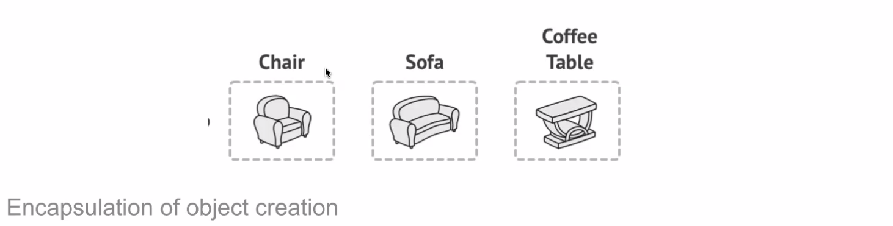
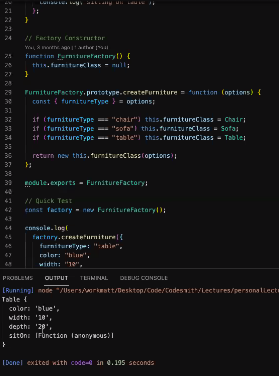
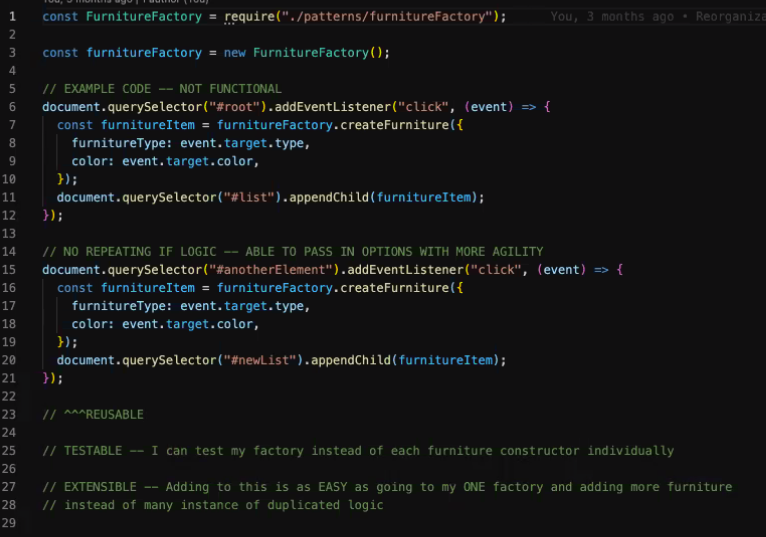

- Reusable, testable and extensible

### Singleton

The Singleton Pattern limits the number of instances of a particular class to just one.

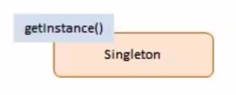
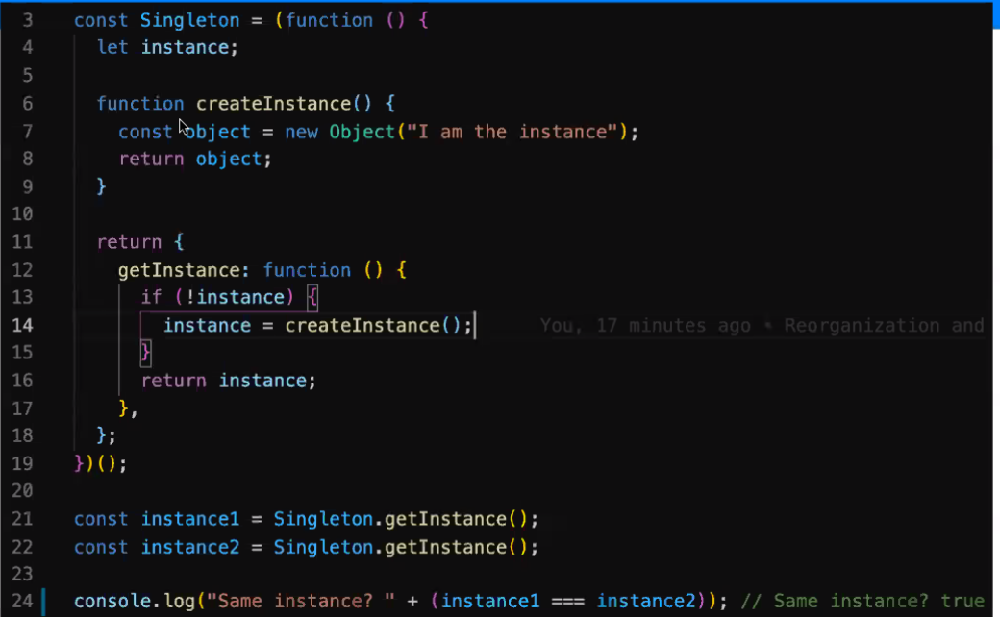

- e.g. the Redux store

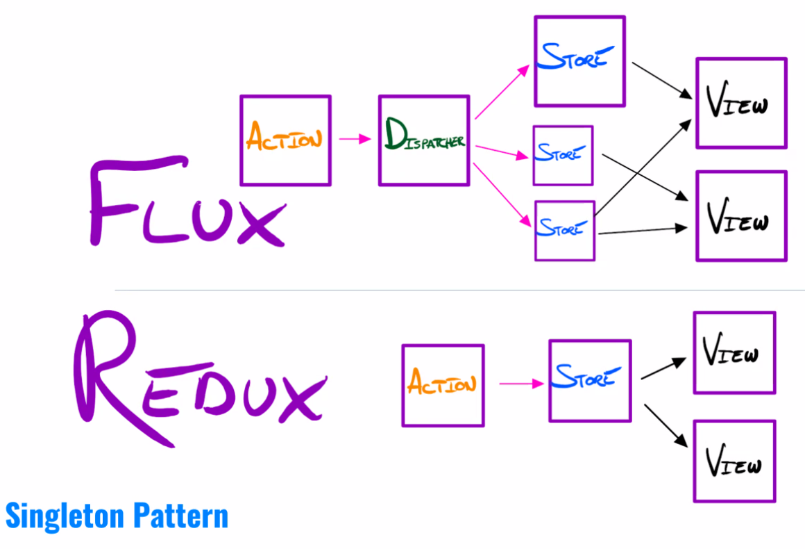

## Some Quick OOP Vocab

- **Abstract Class** - a blueprint for making *Classes*
  - Cannot be instantiated directly
  - Meant to extend a child class
  - Specifies an interface (API) that all child classes must implement

- **Concrete Class** - A blueprint for *Objects*
  - Used with the **NEW** keyword
  - Cna inherit from (extend) an abstract class
  - Contains implementations or overrides of abstract methods

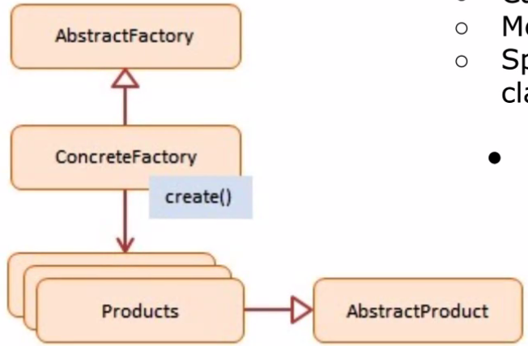

### Abstract Factory

The purpose of the Abstract Factory is to provide an interface for creating families of related objects, without specifying uncontrolled concrete classes.

The abstract factory specifies the interface of your child factories.

Your child factories make use of and alter your primary product classes.

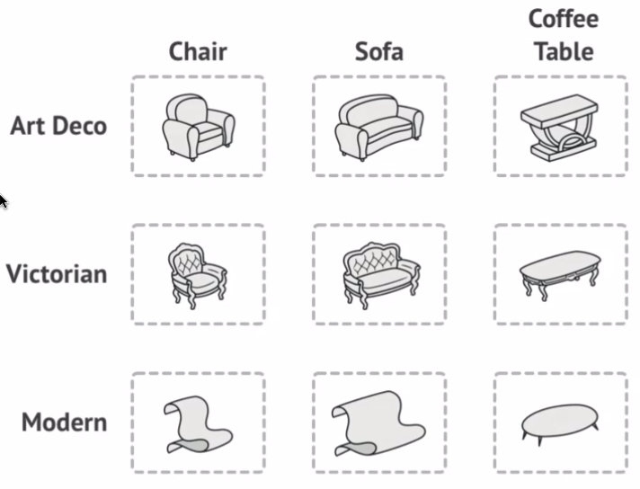
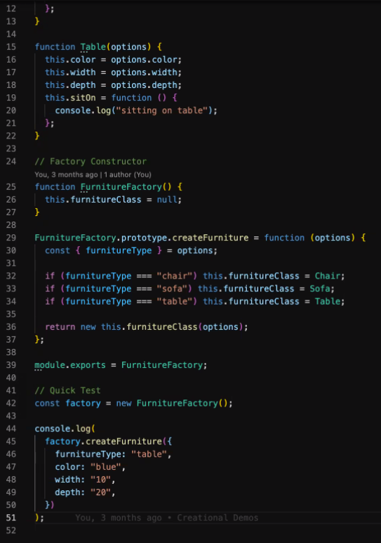
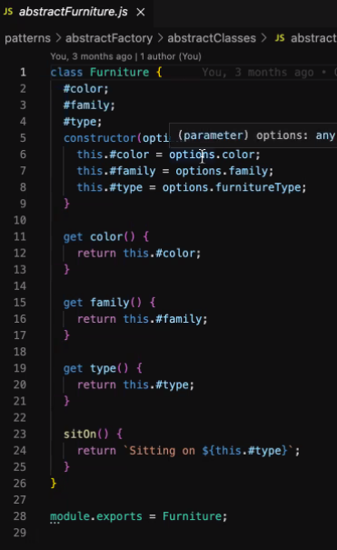
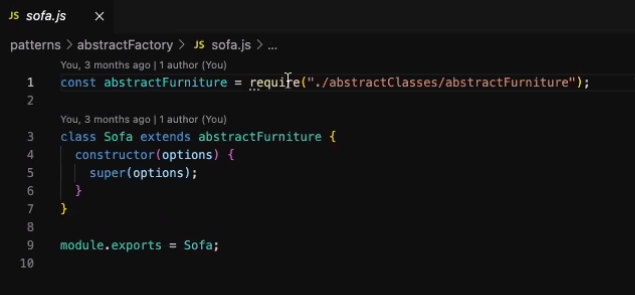
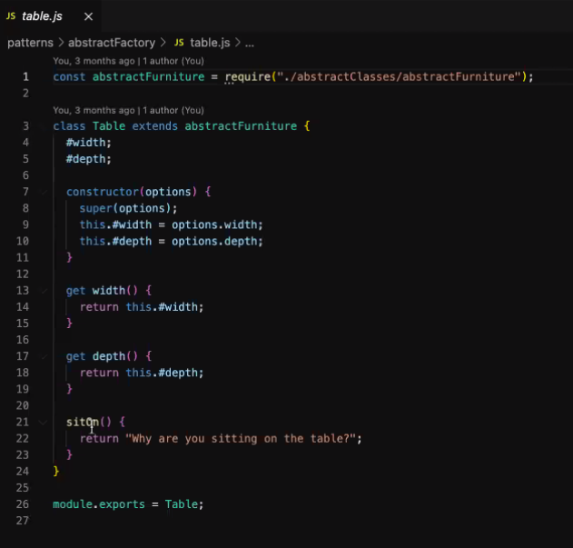
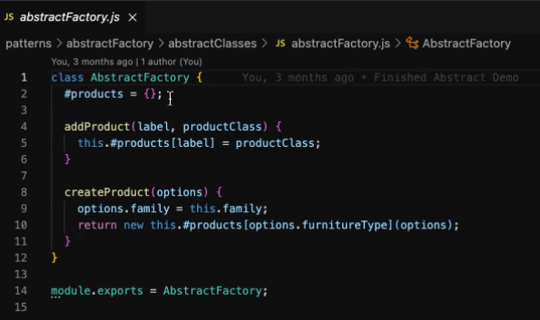
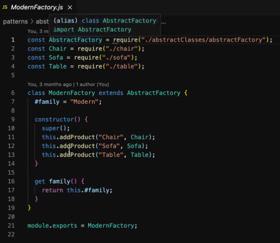
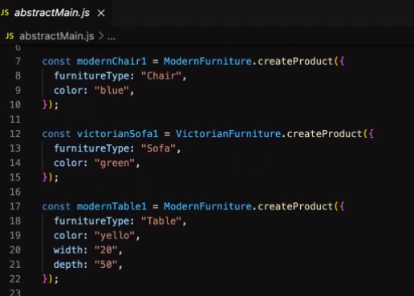

## Creational Patterns Summary

- Factory Method
  - Creates multiple types of objects

- Abstract Factory
  - Creates a factory for a family of objects

- Singleton
  - Creations just one instance of a class/object

## Structural Patterns

Concern class and object composition. They use inheritance to compose interfaces and define ways to compose objects to obtain new functionality.

### Adapter Class/Pattern

At the heart of the structural design pattern is the **adapter** class. Adapters allow the interface of an existing class to be used as another interface

Objects
  - Decorators
    - Adds responsibilities ot objects dynamically.
  - Proxy
    - An object representing another object

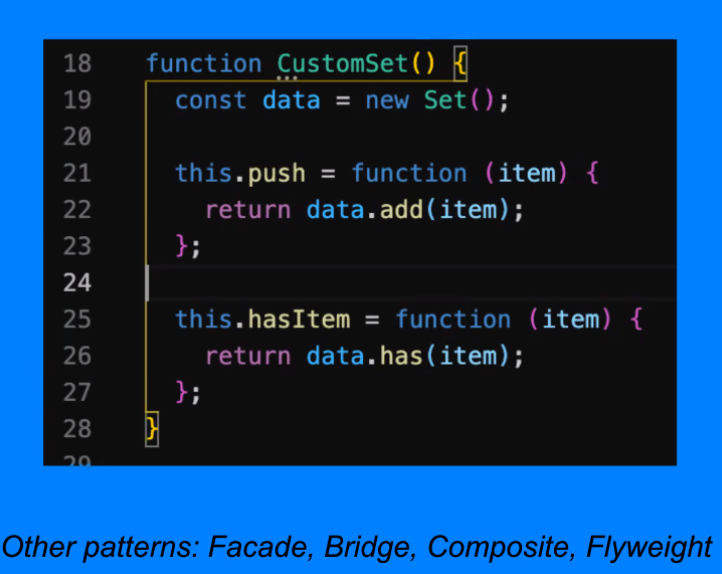

### Decorator pattern

The Decorator pattern extends (**decorates**) an object's behaviour dynamically. The ability to add new behaviour at **runtime** is accomplished with an object which 'wraps itself' around another object.

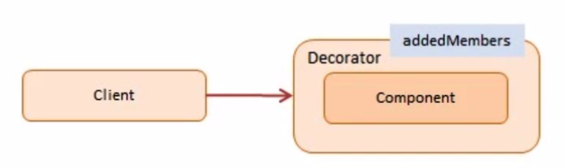

- E.g. react-redux's connect()
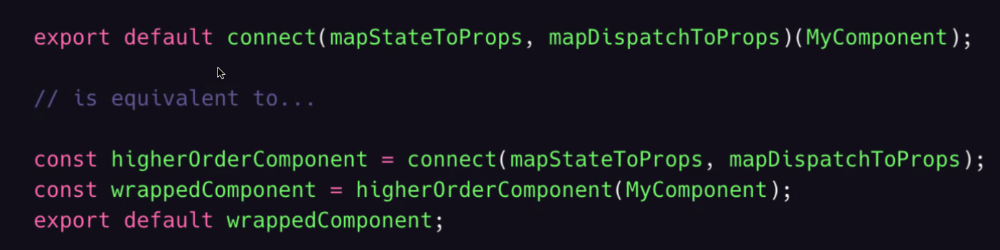

### Proxy

The Proxy pattern provides a surrogate or placeholder object another object and controls access to this other object.

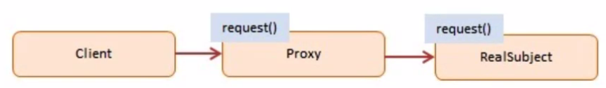

- E.g. lazy loading.

A check or bank draft is a proxy for funds in an account.
A check can be used in place of cash for making purchases and ultimately controls access to cash in the issuer's account.

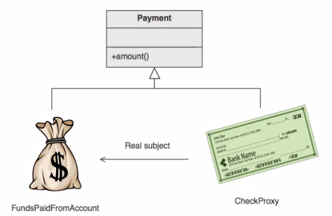

## Behavioural Patterns

Behavioral patterns are specifically concerned with communication between objects.

### Interpreter & Template Method Classes

At the heart of the behavioural design pattern is the **Interpreter** and **Template Method** classes.

Objects:
  - Observer
    - A way of notifying change to an number of classes
  - Mediator
    - Defines simplified communication between classes.

Other patterns:
  Command, Memento, State, Strategy, Visitor

## Observer

The observer pattern offers a subscription model in which objects subscribe to an event and get notified when the event occurs.

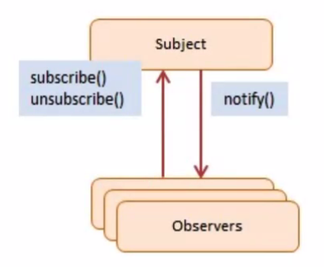

Also known as the published, subscribed method.

- E.g. Slack - a bunch of users subscribe to a channel, the channel published new messages
- Also redux

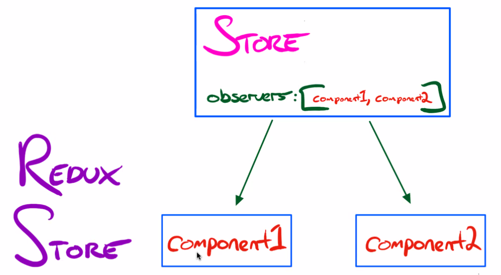
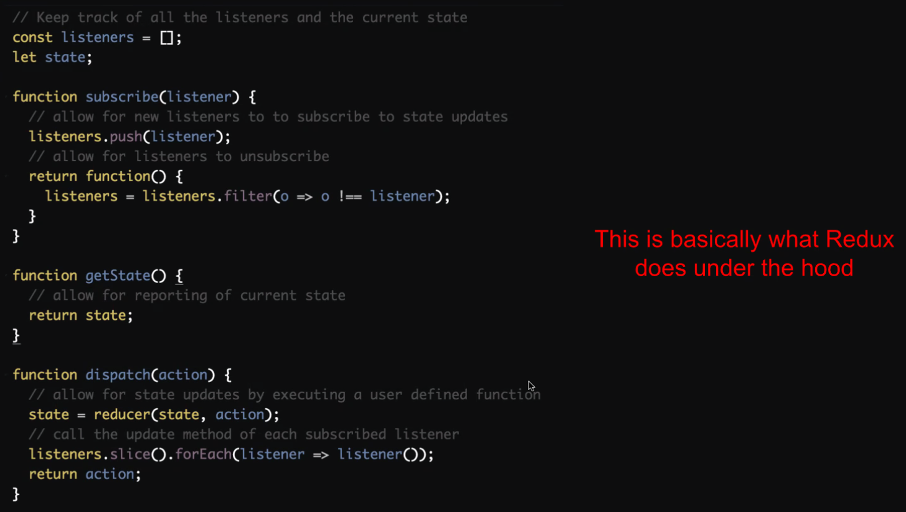

## Mediator

The Mediator pattern provides central authority over a group of objects, and manages their state by encapsulating how these objects interact.

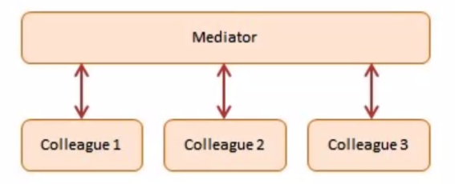

- The control tower at an airport demonstrates this pattern.

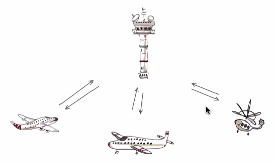

### Message Brokers (Queues)

Queues are used to effectively manage requests in a large-scale distributed system. They allow us to decouple our processes and distribute/throttle processing load.

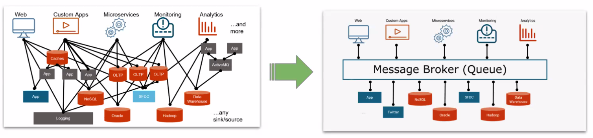

- Can be done with the observer, but often is done with the mediator pattern.
- Observer often doesn't know who the subscribers are, whereas the mediator usually knows everything it is mediating between.

## Summary

1. Understanding design patterns will help you write code in an organized way.
  - It's all about being able to identify a common solution when a particular problem presents itself.
2. Most frameworks are built on top of design patterns.
3. You can write your own libraries using design patterns.
