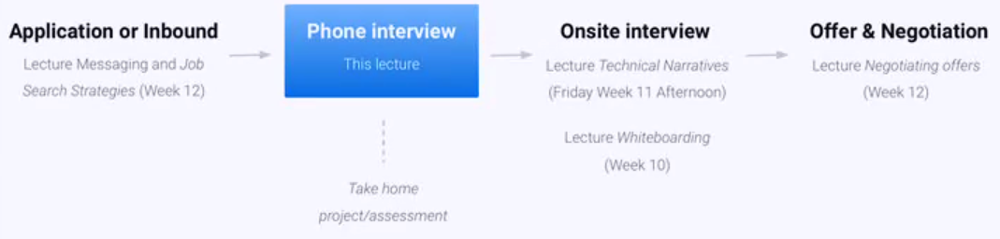
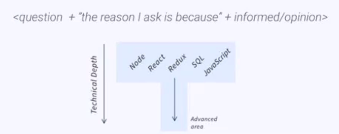
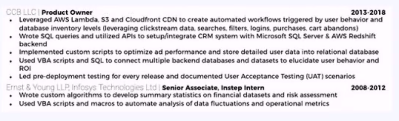

# Guide to Interviewing - Phillip Troutman

- Disclaimer:
  - Especially for the PTRI program. You have being going through the program for 9 months. It's easy to be distracted now. Now is not the time to take your foot off the gas.
  - NOW IS THE TIME TO DOUBLE DOWN.

Everything that we are covering over the next two weeks is equally important to all the technical lectures, though this is all the course of just 2 weeks.

NOW IS THE TIME TO FOCUS.

What makes a good engineer:
- The ability to solve problems. => Everything you have learnt so far.
- Being able to speak to technologies. => Everything you will learn now.

## Tell me about yourself...

- Usually a lot of stuff is mentioned which is not actually relevant.
- You need to understand your context as an engineer.

- Should look like
  - My name is Tom, and let me tell you about all the reasons I am an amazing engineer

- Someone will volunteer to mock interview with Phillip

## Companies do not know how to assess your engineering ability

Interviewers have a rough sense they want someone who is:
- Smart, get things done and is a good fit.

But how to reliably assess this in 20 mins
- It's almost impossible

So interviewers fall back on:
- Heuristics (simplified mental models) | Credentials | How polished your answers are | Your confidence | (and worst of all) gut instinct
- You need to know how to navigate this criteria

- Heuristics
  - E.g. the resume
    - Quickly scan the left margin
    - Look for all the technological phrases and key words (buzz words)
    - Heuristic that plays out, I see those things in his resume
    - He must be a credible interviewer
      - OR
    - I look at a resume, 6 pages long, triple space between the lines, beautiful cursive font, 3x4 inch picture of your face
    - Heuristic, this person may be trying to overcompensate for a lack of substance with a very flowy resume
      - OR
    - Did you go to an Ivy League school?
    - Did you go to a prestigious tech company before?

## You are *highly* effective software engineers ready for mid and senior roles

- Problem solving autonomy
  - Can build a feature whether or not you've encountered the tech before
  - Builders not students
  - Core engineering fundamentals > memorizing code

- Technical communication
  - Can talk through code or problem with clarity and precision
  - Can explain projects, technical decisions at a high level
  - Precise responses to technical questions

- JS Framework & CS knowledge
  - Under-the-hood JS knowledge (closure, event loop, OOP, etc)
  - Specialists in core high-value tech - Node, React
  - Versatile programmers (computer science, object-oriented and functional paradigms, dev-ops)

- Cultural fit & non-technical communication
  - Creative, empathetic people who help others
  - Thoughtful effective communicators - of code, ideas and passion

## New York times workshop

A lot of engineers are very prideful people. Asking people to introduce themselves:
  - My name is Aaron, I worked for these companies, I have a computer science degree and I am a senior engineer.
  - This type of response belittles and intimidates other people.

Asked everyone to introduce themselves at the New York times. Specifically ask them just to say 2 things:
  - Name
  - Their favorite JavaScript resource.

- It comes round to the 3rd guy:
  - Hi my name is Chris, I have been working at the New York times for 4 years, for the past 2 years I have been a senior engineer... yadada

- Asks Chris to say what is happening on line 1.
- Chris stutters and says 'variable'.
  - He was a Senior Engineer at one of the most prestigious companies.
    - Half of the room didn't know what was going on under the hood.
    - The half didn't know how to communicate.

## Now you have to learn how to be an effective job searcher (a whole new skill set)

The techniques in the hiring program will make you an effective job searcher
- Resume development
- Development of technical narrative & online profiles
- Application process
- Interview strategies
  - Phone screens and general questions
  - Technical questions
  - Whiteboarding and code challenges
- Offers and negotiations

Today we cover a comprehensive set of **interview strategies**.

## The job search process

1. Application or Inbound
   - Lecture: Messaging and Job search Strategies
2. Phone interview
   - This lecture
   - Take home project/assessment
3. Onsite interview
   - Lecture: Whiteboarding
4. Offer & Negotiation
   - Lecutre: Negotiating offers

## Anatomy of a phone screen (from recruiter or engineer)

- General questions
  - "Tell me your background" (focus of this workshop)
- Questions about experience with key technologies
  - High level if with recruiter "What is your experience with Node.js"
  - Deeper if with engineer "Explain to me hwo the event loop works"
- (Sometimes) Algorithms or specific JavaScript technology questions
  - Focus of this *Guide to Answer Technical Questions* lecture

## The recruiter's mindset (Or why recruiters ask your 'years of experience' but engineers don't)

- Recruiters goal: Impress their boss (e.g. VP of Engineering)
- How?
  - Not by assessing actual technical ability (the recruiter is non-technical and has almost no understanding of the work you have done)

Instead, by an *impression* of you being 'credible' (sounding like other people the VP of Eng hired)
1. **Ideal scenario:** Send candidate who comes across as credible
2. **Next best:** Send candidate who does not come across as credible but has multiple years of experience in tech of job description
3. **No go:** Candidate not credible & insufficient experience.

If the recruiter asks your 'years of experience' you have not come across sufficiently credible and they're offering a lifeline.

The recruiter is the gateway to the conversation you really want to have.

## How to show you area highly **credible candidate** in interview (or how to control the interview)

1. Volunteer advanced technical stories and focus on mature engineering decisions.
   - E.g. Why did you use React?
     - Wonderful question interviewer. I love using React because the uni-directional data flow is easier to follow and debug.

2. Focus on ares of your expertise (T-shaped developer)
   - If you can demonstrate you have deeper expertise in one area, they will assume you are solid in all the basics. 

3. Always speak to the bigger picture and provide context
    - Tell me about your experience with React
      - Incredible question. I like to think of myself as more a framework and library agnostic developer. For small projects I would normally write my own rendering and DOM manipulation methods. However larger projects I like to consider the different libraries and frameworks available.
 
4. Have opinions but talk about trade-offs
   - Opinions must be sane, and you have to understand the tradeoffs of your opinions 

5. Know the company, space, interviewer - link your comments to them
   - 

6. Ask 'informed opinion-questions' (never end an answer without a question) - Conversational style - these are not simple questions, they're comments that leave an opening for a response from the other party
   - `<question + "the reason I ask is because" + informed/opinion>`
   - E.g.
     - 'What is your teams code review process like, the reason I ask is because, I saw you recently had an ex-Facebook engineer join the team. The reason I ask is because Facebook has an interesting double blind code review process, and I wondered whether they brought that over to the team?'.

## How to not to show you are a highly credible candidate in interview

1. Not making it a conversation (Procedural interviewee)
   - Short answers with the interviewer leading. You face more and more tough questions as the interviewer tries to find something to talk about

2. Using undersell terms 'I've only been doing this for...'

3. Focusing on non-technical experience (know your context)
   - Hi my name is this. I am a great engineer because of this. Focus on engineering first!

4. Presenting yourself as a learner, not an active contributor
   - Oh I am so excited to learn from you and the team...
     - DON'T want to hear this.
     - Want to hear you are excited about contributing to the team.
     - Be cool about it.

5. Having low energy and physical cues
   - Turn it up!

(95% of interviewees fall into this category)

Every question is an opportunity to provide value, to demonstrate context and experience.

## What do you need to show you are a credible candidate? (It's less than you think - You already have it)

What do you need on the job?
- Ability to work with technologies in which you don't yet have expertise in

What do you need in interview?
- Expertise in an area and the ability to speak to it well
- 'Interview-polished' answers to core technologies
- Growth mentality to polish concepts that you were unpolished on in previous interviews (more to come on this)
- High level general knowledge of most topics such that you can speak to them in a general manner

What do you *absolutely not* need in interview?
- Expertise in every topic that you would be expected to do on the job

## Emphasizing your areas of expertise is entirely appropriate

It's exactly what Dan Abramov did when he interviewed successfully for Facebook

- Dan Abramov doesn't know
  - Low-level languages
  - Networking stack
  - Containers
  - Serverless
  - Microservices
  - Python
  - Node back-ends
  - Native platforms
  - Algorithms

During my Facebook interview, I was stuck for 5 minutes because I couldn't swap two items in an array.

## Pre-interview checklist (these are 3 questions you must answer before (or during) every interview)

1. **What is the engineering background fo the team, interviewer and leader** (companies, schools, technologies, talks, culture of teams they've worked for)
2. **What is the companies stack** - how and why would/did they choose these technologies? What trade-offs are faced with these technologies
3. **What makes the company/product/engineering/culture distinctive** (engineering culture, general culture, difference with market)

Find answers on:
- Company Website
- Wappalyzer | stackshare.io
- Angellist/LinkedIn
- Job description
- HN.algolia.com & Medium
- Messaging with companies team members

## How not to improve at interviewing - Feedback rom interviewers is largely unhelpful

The only feedback you will receive is: "Not enough experience" or "Not enough experience with [a technology on the job description]".

This can mean 3 radically different things:

1. **Legitimate:** Job description required management or system architect skills
2. **Avoidance:** They did not click with you (cultural fit) or some other reason they can't tell you
3. **Empowering:** You answered 4 out of 10 questions well, they wanted 6 out of 10

The only way to improve is through the self-reflective iterative process.

## Preparing your narrative about you as a software engineer - The goal is to make ita conversation about engineering as soon as possible

Main story

1. Introductory overview with focus on most recent work (production product)
   a. Including your current focus (production project) and how the role/company fits in

After (1) you should be already turning it into a **conversation about engineering**

**Other parts to prepare** (not mandatory but good to haves)

2. Anchor point
3. Prior experience
4. Why Codesmith

## Part 1: Your opening - The introductory overview

Includes:
- (a) General statement of field of work and expertise (keep it relevant to stack fo the company)
- (b) Credentials (humble confidence)
  - University, prominent companies you worked with, etc.
- (c) Why interested in company & their engineering culture
- (d) Informed-opinion question to transition into a conversation

Basic generic example:
"[Add nice comment about company and/or interviewer] I'm an engineer working day-to-day on [CORE TECH]. I'm currently working on [Production project] but actually it's interesting you use [tech X] because my specialism is [ADVANCED AREA - typically production project focus area]. [insert informed/opinionated comment or question about company]:"

## Part 2: Your Anchor point - Bring this up in the first few minutes

Your goal is to give yourself a technical lineage (and avoid teh bias against career changers):
- Web dev/CS/math/analytical courses at college
- Early Programming/(HTML/CSS experience, building computers etc.)
- Technical work or coding in an earlier role

## Part 3: Your prior experience - By default your production project work but can include prior roles

Reference technical experience (use your resume as guidance) in your prior role

Example: "I've worked with CCB where I worked across the stack - particularly AWS Lambda, S3 and Cloudfront. In response to users behaviour, database inventory levels, cart abandons etc. I also developed workflows that automated platform responses".

## Part 4: Your time at Codesmith

Identify your personal reason but ensure it doesn't undersell you
- Community/network of other experienced engineers
- Opportunity to give back - mentorship of other developers
- Want to contribute to the open source community through OSLabs (reference your production project and other successful production projects)
- The chance to build alongside engineers from every field (reference classmates expertise)
- Want to develop expertise around system design, computer science (other advanced aspects of the program)

## Live Workshop - Developing your narrative - Practice in a supportive space with feedback

1. Choose a company, role (and interviewer)
2. Identify specifics of company/role/interviewer
3. Prepare the four parts to your story
4. Tailor your general story to this specific company/role and interviewer
    - prepare your comments/questions for them to make it a conversation from the start
5. Be prepared for a live mock interview and feedback

## Final notes

Reach out to Annie or Phillip Troutman for more personal advice.

### To Do

- Add tech pro's and cons to Anki
