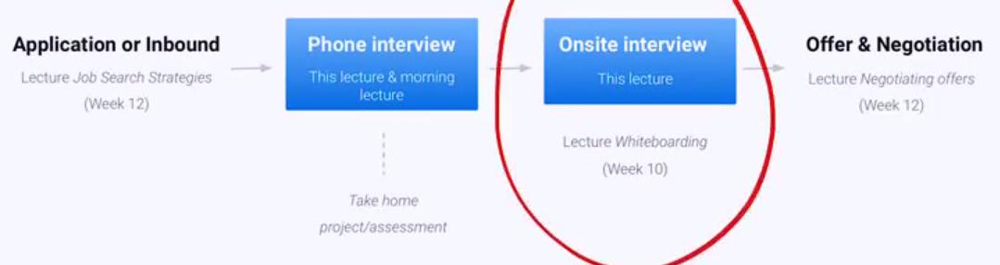
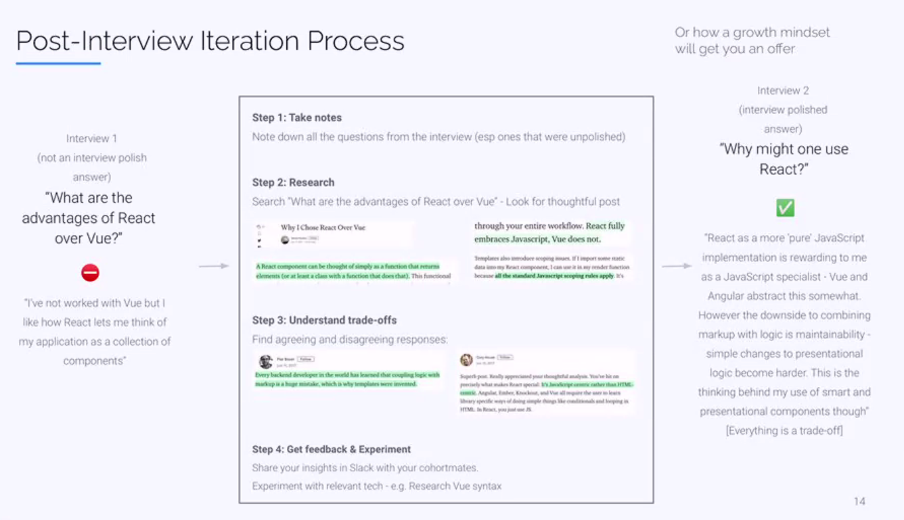
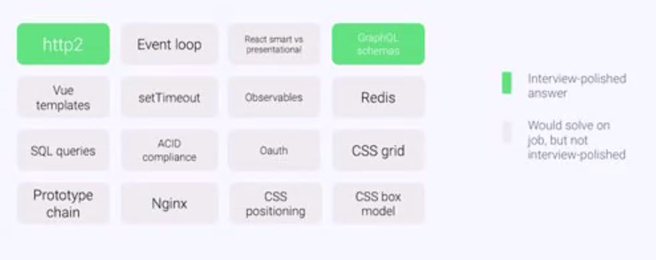

# Guide to Answering Technical Questions

## The Job Search Process

## What kinds of technical questions can you be asked?

### Less narrative based

- What does this code log to the console?
- How could we add a method to an object without directly mutation the object?
- How does the virtual DOM work?
- How does the event loop work?
- What is a JS class?
- What is a closure?

### More narrative based

- What's your experience with Node?
- Tell me your frontend dev experience?
- How much have you worked with databases?
- How do you work on a team effectively?
- How do you build reliable systems?

## Goal of interviewer asking technical questions - both more and less narrative 

An attempt to assess your experience and readiness to contribute on the job.

You answers are an opportunity for you to show your:
- Expertise in certain technologies
  - T-Shaped developer shows you can become expert - this is high value
- Mature engineering judgment (best practices)
  - I built it in React because that's all I know...
- You have to be your own promoter but in a sensitive way (Credible But Humble)

## 5 steps to answering technical narrative questions

1. (Before interview) Prepare
* 2. Make the interviewer care about your answer - MOST DIFFICULT
3. Formulate a structured answer with good judgments
4. Volunteer a question or opinion
5. Review & follow interview iteration process

### Step 1: Prepare - before the interview starts

- Go through the pre-interview checklist:
1. What is the background of the team, interviewer and leadership
2. What's the company's stack
3. What makes the company or engineering culture distinctive
- Prepare your answers beforehand (but be ready to adjust them to each question)

1. Write your prepared answers down
2. Get em down pat! - drill yourself through repetition
3. Make them your own through repetition (but just reading them) - Get rid of the script!

#### Questions you are likely to be asked:

- Tell me about yourself
- Tell me about your React experience
- Tell me about your Node experience
- Tell me about your Database experience

### Step 2: Make the interviewer care about your answer - by linking it to a situation and explaining its significance/seriousness

Make your answer powerful by relating it to your work or project
- Tell me your experience with Node?
  - Describe a specific project in which you used Node
- How does closure work?
  - Share a situation in which you used closure

Details of project
- Team & technologies
- Why did you build the project - share your motivation as an engineer

What made the project significant?
- Important problem for developers
- Groundbreaking technology
- Traction (users/dev engagement)
  - Reddit discussions, direct feedback from engineers, stars, claps on medium articles, etc.

e.g.

I was building out a Vue prototyping application. There were some constraints around building out component based architectures with Vue. I realized there are plenty of prototyping tools out there for React, but nothing for generating Vue code on the fly. So I wanted to build it myself. So a team of engineers and myself had to choose what we were going to build the backend of this application in. This also became much more of a concern to us since the developer response to this tools have be very positive (several hundred stars in the first few days). All that to say, we had to choose a backend language/framework. We had a few different options we could have gone with Node, Ruby, PHP. We went with Node...

### Step 3: Structure answer & provide good judgments

**(a) Structure your answers with numbers:**
- There are 3 main goals I have when choosing a UI framework and that led me to choose React...

**(b) Focus on mature engineering judgment calls and motivations**
- React abstracts my interaction with DOM and lets me think of state changes throughout the render lifecycle
- Diagramming
- Remember client optimizations vs developer optimizations

**(c) Relate your answer to the company/role/interviewer**
- Has your team thought about incorporating hooks?

**(d) Identify the shortcomings before your interviewer does** and talk through them to demonstrate that you know why they are shortcomings.
- Had we forseen the scale we achieved I'd have done X
- Redux was probably not necessary in hindsight

### Step 3: Some good examples of engineering motivations

- Improved User Experience (Client Optimizations) - INTERVIEWER CAN ARGUE WITH YOU
  - Improved render time
  - Reduced server latency
  - Consistency of UX
  - Accessibility
  - Improved device performance

- Improved Dev Experience - INTERVIEWER CAN'T ARGUE WITH YOU
  - Modularized code
  - Easier debugging
  - Easier testing
  - Code maintainability
  - Improved error handling
  - Reduce 'ramp-up' time

### Step 4: Volunteer a question or opinion (check in)

- Share an opinion-question:
  - What's been your team's experience with Node and debugging around asynchronicity? I ask because I've found promises effective, but also, actually understanding the event loop and task queue setup is most effective.
  - I know your team is in the processes of refactoring your app in React. How has that experience been for you? I've found that React's declarative architecture does remove some of the direct control you have as an engineering team, but in an easily manageable way.

- Offer to go into further depth
  - I'm happy to go into more depth if you like

## Live Workshop - Practicing technical answers in a supportive space with feedback

1. Prepare steps 1 through 4 to answer:
   a. What's your experience with Node?
   b. Tell me about your React experience
   c. How much have you worked with databases?
2. Prepare for live mock interviews and supportive feedback :)

## Post Interview Iteration Process

- Interview 1 - not a polished answer
  - What are the advantages of React over Vue
    - I've not worked with Vue I like how React lets me think of my application as a collection of components 

- **Step 1: Takes Notes**
  - Note down all the questions from the interview (esp ones that were unpolished)

- **Step 2: Research**
  - Search "What are the advantages of React over Vue" - Look for thoughtful posts

- **Step 3: Understand trade-offs**
  - Find agreeing and disagreeing responses

- **Step 4: Get feedback & Experiment**
  - Share your insights in Slack with your Cohort mates
  - Experiment with relevant tech - e.g. Research Vue syntax

- Interview 2 - interview polished answer
  - Why might one use React?
    - React as a more 'pure' JavaScript implementation is rewarding to me as a JavaScript specialist - Vue and Angular abstract this somewhat. However the downside is combining markup with logic is maintainability - simple changes to presentational logic become harder. This is the thinking behind my use of smart and presentational components though". (Everything is a trade-off)

## How to improve at interviewing

The example above is not about your engineering ability - it was about how polished your interview answers are.

1. Increase # of topics that are green - interview-polished by going through the Post-interview research & experiment process
2. Lead the interview and bring up where possible your green areas
3. Interview a lot - you can never get all topics to green so you need some luck too
4. Have a growth mindset - do not let interview dings get you down

## What makes a great answer

- Technical communication
  - Precise and specific
  - Give context for you audience
- Keep it conversational by asking questions (step 3/4)
  - Volunteer further depth - you can always share more
- Have opinions but be sure to provide context or hedge
- Show passion and excitement

## What to avoid in answers

- Undersell words: 'I only touched x', 'As beginners it was hard, I kinda did x'
- Short answers - although remember to check with the interviewer if they want you to keep diving in
- 'I've never worked with that' => volunteer a story related

## Other tips

### Things you don't know the answer to

If you get a question about something you don't know:
  - E.g. do you have experience in Angular

- DO NOT SAY => I don't know/I have none
- Say
  - Recently I was doing a project and we had to decide between Angular, React and Vue. In the end we decided to go with React for 3 main reasons...

### Handling why are you moving job now?

- Show the passion and the excitement about the company => the mission of what they do. Reiterate part of their mission statement.

### Do you have any questions for me?

- Ask question about testing infrastructure - it shows engineering maturity

- Categories 
  - The team
  - The organizational structure
    - Tickets
    - Organization
    - Expectations
  - Engineering culture
    - Do you value collaboration, transparency etc.?
  - Product
    - What is the product road map like?
  - Expectations
    - What do you want from me
    - How can I help you?
    - Over 30, 60, 90 days
