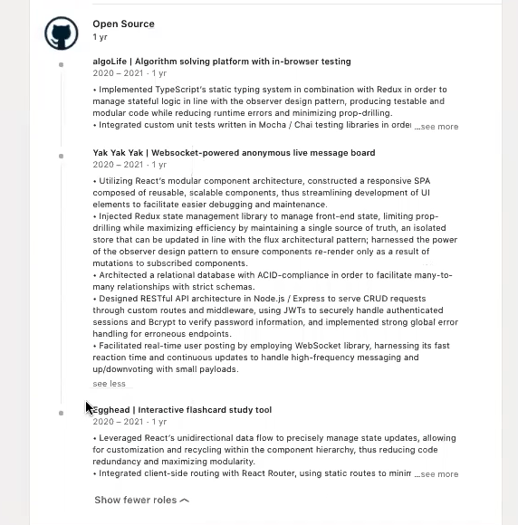

# LinkedIn

## To Do

- Get high quality photo taken
- Get more connections => 500+
- Link blog posts in the featured posts section
- Be consistent with periods at the end of sentences
- Get recommendations
- Get skill upvotes

## About

- Snappy 3-5 lines that distinguishes you from other devs 
  - Major technologies 
  - Advanced concepts => the stem of the T => before the fold (aka shows without clicking see more) 
  - Reference a standout achievement
  - Link to other online profiles

## Experience Section

- Copy and paste resume
  - The same bullet points
- Nothing should be on your linkedIn that is not on your resume.
- Create a company page with logo for each project
  - Mention it is an open source tools in the company page

- Scratch, solo projects etc. should be listed as Company - Open Source in your linkedIn
  - Each project name can have a title

## Education History

- Same as on resume
- Include Computer Science related coursework

## Skills section

- Should be 95% technologies and languages that you've worked in
- Top 3 skills should be JavaScript skills/skills you want to work in in your next role.
  - MAKE SURE EACH SKILL IS SPELLED CORRECTLY
- Get 15+ recommendations on each
