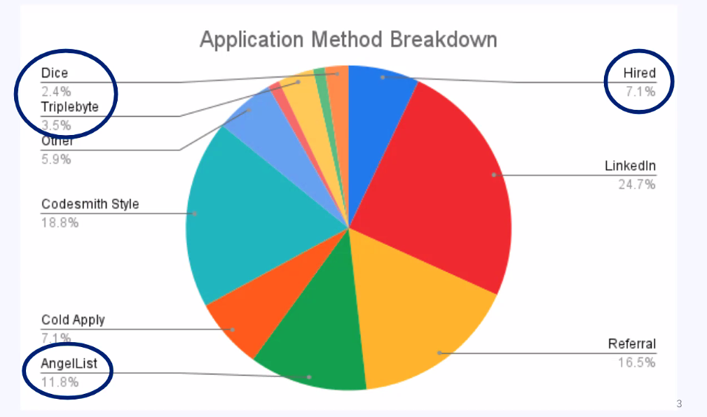
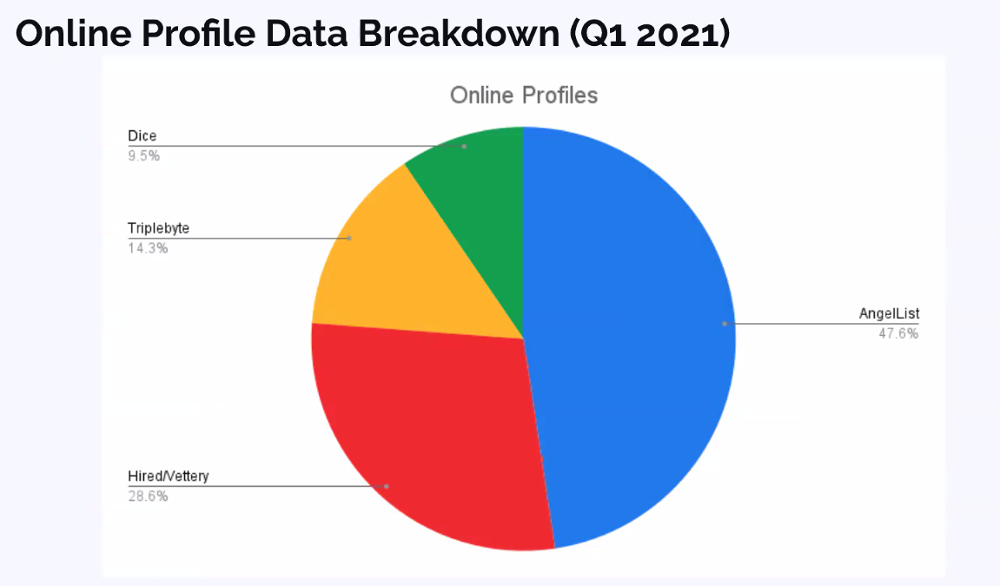
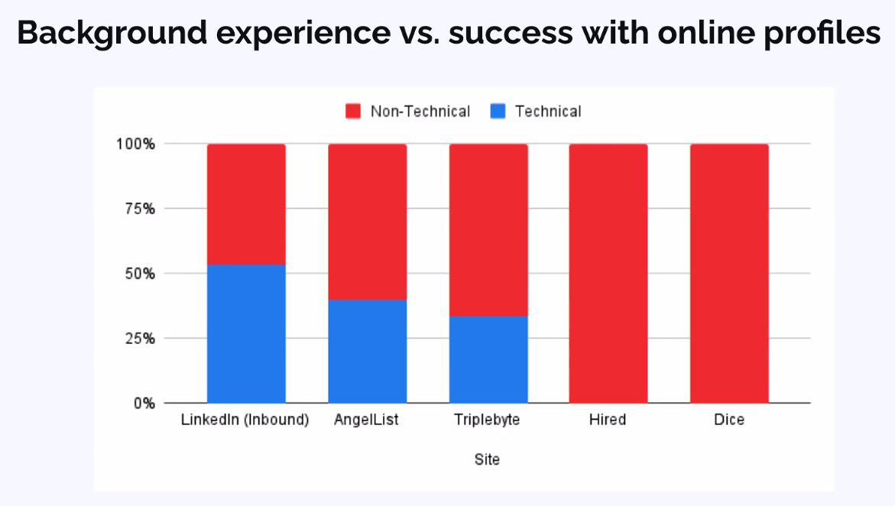
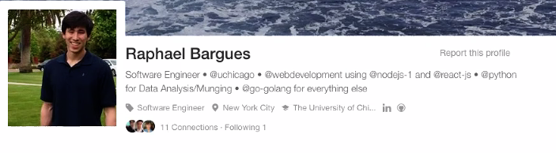
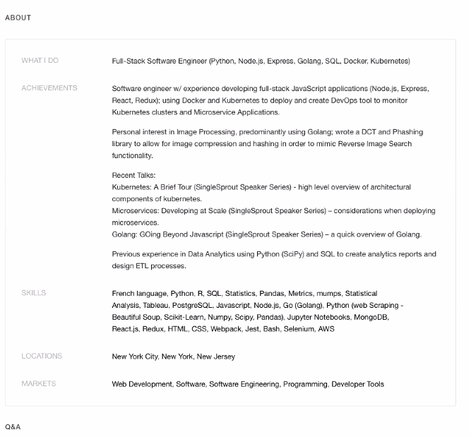
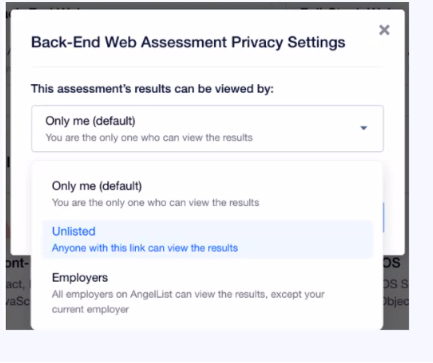

# Online Profiles

## Sites

- **Hired** - 2nd most hires
- Triplebyte
- **AngelList** - most hires
- Dice.com
- BuiltIn

Grads have success with 1-2 more sites than the others, but it varies with each person! It's important you sign up for **all** (maybe not Dice) to increase your likelihood of success.

## Where Codesmith grads applied for jobs & accepted offers

- 24.8% of job offers in Q12021 came from these online profiles!

## Online Profile Data Breakdown - Q1 2021

## Background experience vs success with online profiles

## Hired

### Signup Process

- Location: NYC/LA or largest metropolitan area
- Current role: Software Engineer or Software Engineer @___
- What are your specialities? frontend, backend, fullstack
- Years of experience
- Other work experience & education: fill out like LinkedIn
  - Note: you might have to make these bullets more concise
- Add 5 top skills + 10 additional skills in other techs
  - JavaScript, React, Node, ~CSS/HTML
  - Consider your open source product technologies
- Add your LinkedIn, Github, contact info
- Select READY TO INTERVIEW
- Markets: put 3-4 locations and mark if you're interested in remote or contract work
- Salary: put a number towards the top of your range, one you'd be happy to accept right now

If you put say ~$160k they will reach out to you for more senior positions

### The Hired Wishlist

- These are a set of priorities that you can rank by importance - helps match you with a company that fits what you're looking for
- If you're not getting inbounds after 2 weeks, switch them up

### Assessments

- Take all the relevant assessments!
  - Frontend, fullstack - backend if you are interested, programming fundamentals, mobile if you are interested
  - Budget about 1 hour per test

- Reach out to Josh => he has the list of questions!

#### Tips

- Set your availability to "Ready to interview and actively searching"
- Take the assessments: these can level the playing field
- Have cohort mates leave recommendations (provide their emails and they can send them in)

### Hired Outcomes

- New York Times
- Medium
- Axios
- BeautyCounter

## Triplebyte

### Signup Process

- About section
- Ice-Breakers
- Composite Score (aggregate score from assessments)
- Pick as many markets as possible (up to 8)
- Years of Experience
- Add your technologies and experience
  - Should match your LinkedIn
  - Prioritize core stack and open source product technologies
- Add your resume + LinkedIn + Github

### Optional but helpful!

- Company preferences
- Role preferences
  - Pick a salary near the top of your range that you'd be happy with accepting
- Workplace attributes

### Quiz

- Do the 'Practice problems'
- Quizzes can be challenging
  - General Engineering + Language Specific
  - Be cautious of the machine learning cheating mechanism
    - Don't take on the same IP address with a similar email address - lowers score
  - Adaptive - gets harder/easier depending on how you do
- You can update your skills

#### Tips

- Codesmith/TripleByte Partnership
  - Contributes $20 to a scholarship fund
- If you get matched, you do a non-technical phone call with the company, then directly to an onsite if it goes well
- Set up your profile in  the same format as linkedin
- ...

### Outcomes

- Avvir
- Shogun Enterprises

## Angellist

- Start with a strong tagline:

- Add social profiles - stackoverflow, github, LinkedIn
- use @symbols to make your company/school stand out in your header
- avoid cookie-cutter phrases
- Transfer resume experience section into AngelList experience

- Put your production project in experience alongside work experience
  - Everything else can go in the projects section
  - Put a little screen shot of what your project is

### About Section

- Achievements section is the first section that companies/recruiters see when you apply for roles
  - Construct like your LinkedIn About section but longer/bulkier
  - DO NOT fill out the What I Do section - put all of that in achievements
- Skills: fill out like your resume and LinkedIn
- Markets - as many as possible
- Locations - large tech hubs

### Projects

- Describe projects with lots of references to tech stack
- use screen shots

### Assessments

- New feature
  - 25 mins long
  - can retake every 90 days
  - Take them all
  - you can hide them
  - Default is they are hidden
  - Anglelist features pre-assessed candidates!

### Video Resume (optional)

- Focus on technical challenges
- Record yourself before uploading
- This is a great way to practice your narrative speaking skills

### Tips

- Startup space
- Able to connect with each other
- Open Source Product + other projects
  - Open Source Product under experience
    - Length limit so may have to make things more concise
  - Put your scratch, iteration etc. under projects
  - Lke your cohort mates
  - Add your cohort mates as collaborators
- References

### Outcomes

- Airtable
- Northwestern Mutual

## Dice.com

- External recruiters
- Inbound only
- Can be very spammy
- Don't sign up if you don't like getting a tonne of phone calls! Like 5-6-7 a day.
- Good way to practice your narrative and go through that first phone screen.

### Tips

- used by recruiters
- be sure to vet your recruiters!
  - Google their name & their recruiting firm
  - What types of roles have you placed candidates with recently?
  - What companies have you placed candidates in recently?

### Outcomes

- Cigna
- Mastercard

## Built In

- Enter location
- pick top 3 values
- select are of your core expertise
  - dev/engineer
  - yoe
- pick skills based on resume
- select areas you're willing to work
- add experience (resume and linkedIn)

## Tips

- Feature tech jobs in major metropolitan cities
  - Focused on up and coming companies and startups
- Can utilize it as a job board site and go direct to the company websites
- Can look for only remote jobs => there are loads!
- can search by
  - job category
  - experience level
  - ...

### Questions
