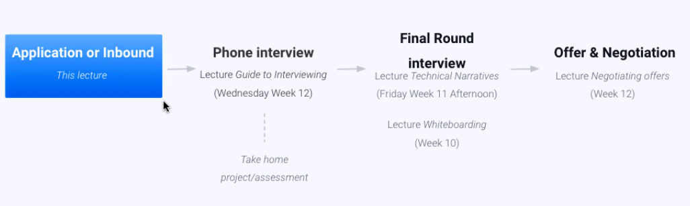
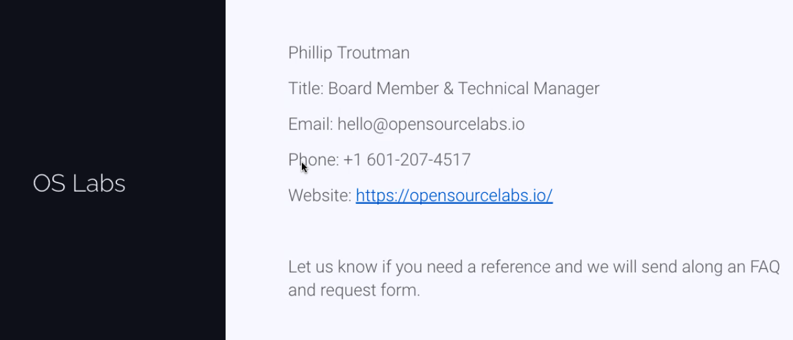

# The Job Search Process

## How to maximize conversion ratios

- **Min 20% conversion**

1. Apply on LinkedIn/Company website with strong profile and resume
2. Apply with a Credible & personal application message (sometimes known as a cover letter)
3. Send a double-down email the same day
4. Send a follow-up email 4 days later

- **Phone interview** to **Final round**
  - Review Guide to Interviewing lectures

- **Final Round** to **Offer**
  - Review Guid to Interviewing lectures

## Step 3: Send a double-down email

Most of the time companies did not see your application because:
- Too many applications to review
- Filter by years of experience, prestige background, introductions
- Irregular review of applications
- Recruiters who can't recognize your ability

What can we do? Answer: **The double-down email**

### Example

Hi Victoria - I just wanted to send a quick note over. I've applied for the senior dev role with Handy on Angellist but wanted to let you know directly - here's the message I shared there just you have it. Looking forward to hearing from you. Will

[Copy/Paste original application message]

Why? If your application is:
- Above the threshold - it is now seen and you are invited to phone screen
- At threshold - you now stand out by bringing it to the company's attention
- Below the threshold - you have shown sincere interest and tenacity which may raise you above threshold

### Who to send it to?

(Inversely proportional to the company sized, mid-large => engineering leads ideally for the specific team, small startup => CEO, small-mid => CTO/Engineering leads)

- Senior leadership or engineering management in startups and mid-sized companies
- Anyone you have a connection with (identity, school alum, company)
- Recruiter/Talent management/Hiring managers (LinkedIn in-mail)
- For big 20 tech companies - better to connect with someone for coffee

**When to send double-down?** Same day you apply

Subject line: 'Software engineering role', 'Handy dev role', 'engineering role follow-up'

Step 1: https://hunter.io / Clearbit / apollo.io / rocket reach
- If you find the email address - great
- If not, use the example email addresses from the company to guess standard format e.g. firstname@company.io

Step 2: Fall back to hello@ and info@ or hiring@ email addresses
- Or LinkedIn inmail (or add on LinkedIn to get their email)

You can still get through on the double down even if it's done on a later day.

## Step 4: Send a follow-up email

**4-5 days after you applied**: send a follow-up email, to the person you sent your double down to.

- The email should be short, direct - you can use your signature to add more value/credibility. Should be a reply to existing email thread.
- Ideally send on Tuesday/Wednesday/Thursday.
- Don't send on holidays
  - Mon => people are focused on getting going
  - Fri => people are focusing on finishing up

Use mixmax.com / boomerang / yesware to set up a reminder to do the follow-up for each application

**Example follow-up email:**

Hi Victoria - did you get a chance to read this - let me know if you did. All good either way - Best,
Joanne Hernandez

---

Joanne Hernandez | LinkedIn | Github

Speaker on "Scaling with Bigtable on Google Cloud"

## Summary: 4 steps

Each of these steps is worth 5% conversion from application to phone interview:
1. Apply on LinkedIn/Company website with a strong profile and/or resume
2. Apply with a personalized-credible message
3. Send a double-down email the same day
4. Send a follow-up email 4-5 days later

## Other ways to stand up

Referrals (ordered by effectiveness):
1. Intro by engineer or leader on their team
2. Non-engineer on their team
3. Outside person connected to engineer/leader on their team

Networking Calls/Virtual Coffee
- Email about 'learning' and 'career path' - but then in person - all the standard rules about credibility signals apply
- Most people are open to this - people very rarely ask for these coffees
  - People want to pay forward in fixed time amounts
- Focus on people with wom you have an 'in' (school, identity) but you can contact anyone at the company - focus on leaders and engineers (avoid hiring process people)
- Prepare thoughtful (informed-opinion) questions but also focus on conversational and warm style
- Ask for guidance on the application process & if they can let the team know you're applying
- **Especially effective when applying to large companies (substitute for Double-down email**

## What if you didn't have to apply at all?

- Ensure your public online profiles (Angellist, LinkedIn) are perfect
  - Add profile to HN Who's Searching (monthly post), Stackoverflow
- Apply for private online job platforms (Triplebyte, Hired, Angellist)
  - Pre-vet you for companies
  - Make sure to prepare for your applications as you would any application
- Blog posts - submit to JSDaily, FreeCodeCamp, Hackernoon
- Speak at (virtual) meetups (use your tech talks & don't doubt yourself)
- Elegant Personal site (seasoned engineer look, not bootcamp grad portfolio site)
- Connecting directly with internal recruiters & talent acquisition on LinkedIn, **Engineering team decision-makers (e.g. CTOs)**
  - E.g. willsentance.com

## How to work with recruiters

- Internal and external are radically different

Internal recruiters
- Look for terms like: Talent acquisition, Hiring manager, Recruiter @comapny
- An important part of your application process - often handle the phone screen
- Think back to the lecture about phone interviews and the goals of recruiters (to impress their boss) but how hard that is from a non-technical background - your task is to make it easier for them
  - How? By coming across as credible

External Recruiters
- Mostly doing the same as you - submitting your resume to companies where they have no decision-making power.
  - But they're doing it without any of hte Codesmith Hiring Program approaches - at best it's 25% as effective as applying yourself
- Not only that, they will promise you a list of companies they work with - creating a false sense of pipeline

## Take home assignments

What you must do:
- Testing
- Complete all features
- Submit on time (or communicate that you have timeline/work pressures to navigate)
- Use this as the chance to practice your core technologies
- Contact your cohort mates or Codesmith team for code review

What you must not do:
- Have someone else complete the assignment
- Give up before you've talked with a team member

## Other things to do when you're exhausted by applying

- Codesmith curriculum
  - Skill builders and assignments
  - Hack hours (add in Codewars, Hackerrank, Interviewcake, Alumni Hack Hour)
  - Frontend Masters

- Production project
  - Handle pull requests & stretch features
  - It's powerful in interview to be working daily on your open source contributions

- Take homes
  - Use these instead of tutorials to push you to cement core technologies

- And most important of all: **iterate on previous interview questions**

## References

- Who to ask?
  - Phil (OS Labs), Production Project Mentors/Fellows, Prior Employers
- Brief your referee
  - What have you communicated to the company
  - What's the company really focused on (care about)
  - Must provide:
    - 1. What engineering achievements do you want the referee to stress - you need 3
    - 2. What are your strengths/weaknesses
    - 3. How do you work in teams

- How to be a good reference
  - Focus on engineering achievements and team dynamics - everything 

## OS Labs

### Tips

- Go verbose on your LinkedIn
- Can be more to the point on your Resume
