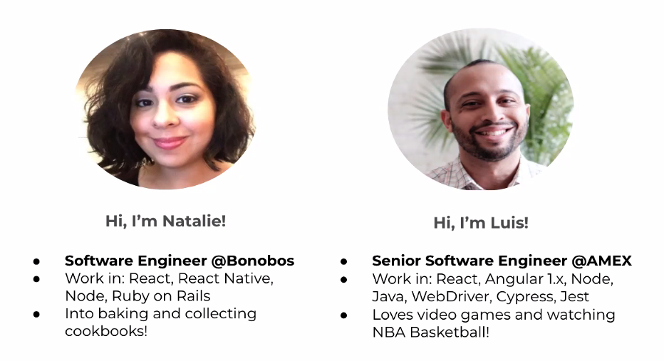
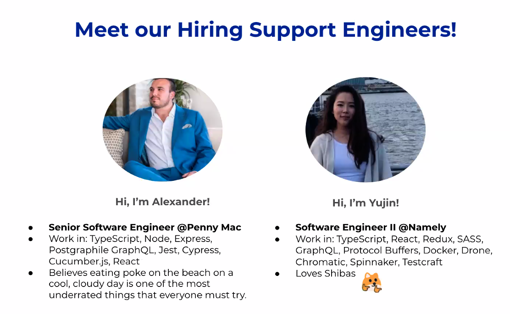

# Post Codesmith

- Methods of support
  - Supporting one another
  - Support from Codesmith
  - Resources
- Hiring Support Engineers
- Offers and Negotiation

## Hiring Groups

Your hiring group is a consistent support system for you to work with!
- Schedule daily stand-ups
- Report back in your team channel at least once each week to provide an update
- Post-Grad Kick-off scheduled with hiring support engineer

## Hiring Support Channels

- Use when in need of advice, to provide updates, or if you need a pep talk!
- Hiring channels are checked regularly. If it is extremely urgent send a text.
- Resume/Cover Letter Review
  - Less than 15% Conversion Rate
  - At least 50 Applications out
  - Send resume + 2-3 application messages to your channel (Google Doc)

## Check-Ins

- You will have 2 cohort wide check-ins: 2 weeks after graduation
- Scheduled for Friday around 11:30AM
  - Be prepared to discuss:
    - What is going well, what isn't going well
    - Any questions you have so far in the hiring process

## Office Hours

- Bi-Weekly Office Hours with Eric
  - Every other Wednesday at 10:30am PT/1:30 PM ET
  - Always welcome, just let us know you'd like to attend!

## Job Search Check-In Form

- Once a month, the team will send out a form to check in on your pipeline and process.
- The more information you provide, the more we can support you!
- Organization is key in filling out the form accurately.

## Channels

cohort channel:
- #interviews

alumni slack:
- #have-you-interviewed-at
- #interview-questions
- #job-postings-and-referrals

## Hiring Support Engineers

## Considerations for Scheduling Hiring Support

- Consider the stage you are at when scheduling
  - For example, not getting to phone screen? Schedule a resume review
- Schedule is open 2 weeks at a time
  - If no sessions are available check back the next day, as they tend to fill up quickly on calendly

## Offer To-Do List

- Let us know about the offer in your hiring support channel!
- Send the expedite interviews email to all companies in your pipeline (even a scheduled initial phone screen)
- Use the salary negotiation script
- Let us know when the offer is secured
- We'll send you a form to fill out and schedule an exit interview

## Expedite Interviews template

Hi Hattie - I hope all is well.
I wanted to shoot over a quick heads-up that I received an offer from a different company today, and it's one that I have to respond to relatively soon. 
I know you have a hiring process that surely works well for you, but if there's any way to expedite that process, I'd definitely make myself available at whatever time/location works for you and your team.
Should our conversations potentially lead to an offer, I'd love to be able to consider that offer fully.

Again - very sorry to ask, but if there's any way to move things up, I'd appreciate it greatly.

Thank you!

-Tom

## Turning Down an Offer

Hi Sarah,

Hope you had a great weekend.

I wanted to say thanks again for the opportunity to be a part of the team at XYZ. It's been amazing to learn about the product you're building and the direction of the company, both from a business and an engineering perspective.

After a lot of thought, I've decided that although it is a great opportunity to be part of a small, dynamic team - ultimately, it's not the right fit for me at this time. However, I would like to recommend another engineer that I've worked with who I think would be a great fit for the role. I have attached their resume below.

Thanks again for your time and best of luck.

Best,
Shanda

## Final Tips

- Work together, support each other, and schedule time to chat about your experiences!
- The entire team is here to support you!
- Look at the "bird's eye view" - this is a short chapter of a long and fulfilling career
- Use frontend masters

## Tips

- Send out a calendly when using the expedite interviews email

## To do

Ask for numbers:

Cassandra Socco
Annie
Salary negotiation video
