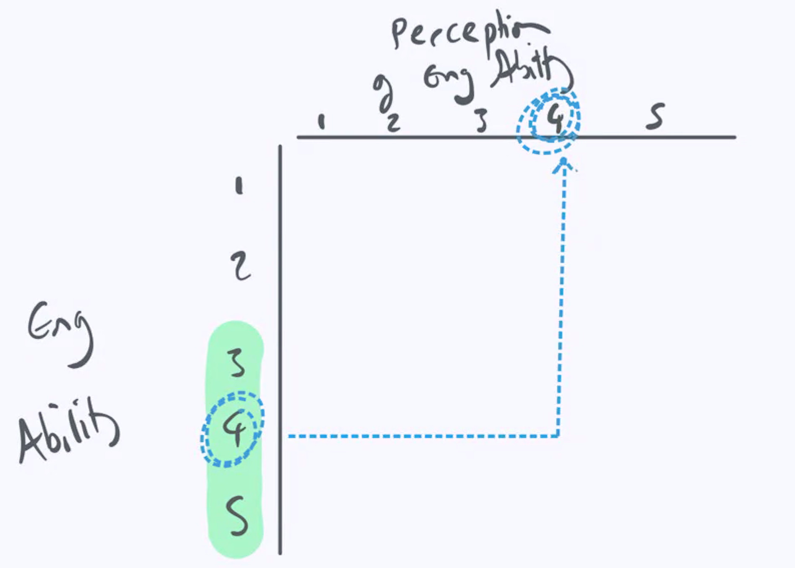
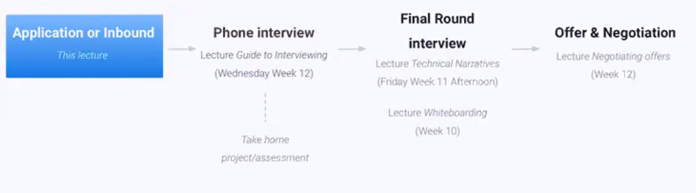
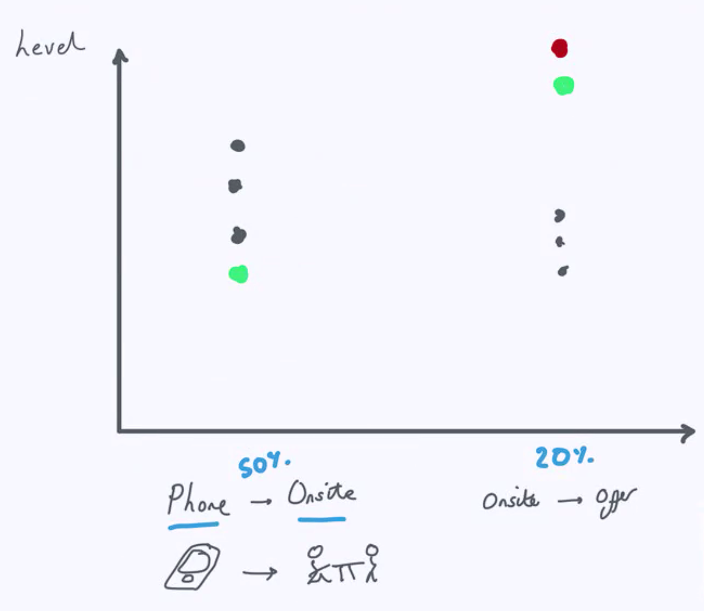
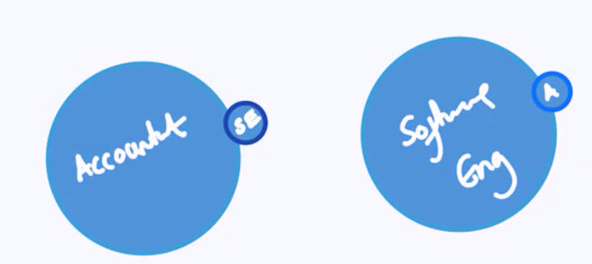
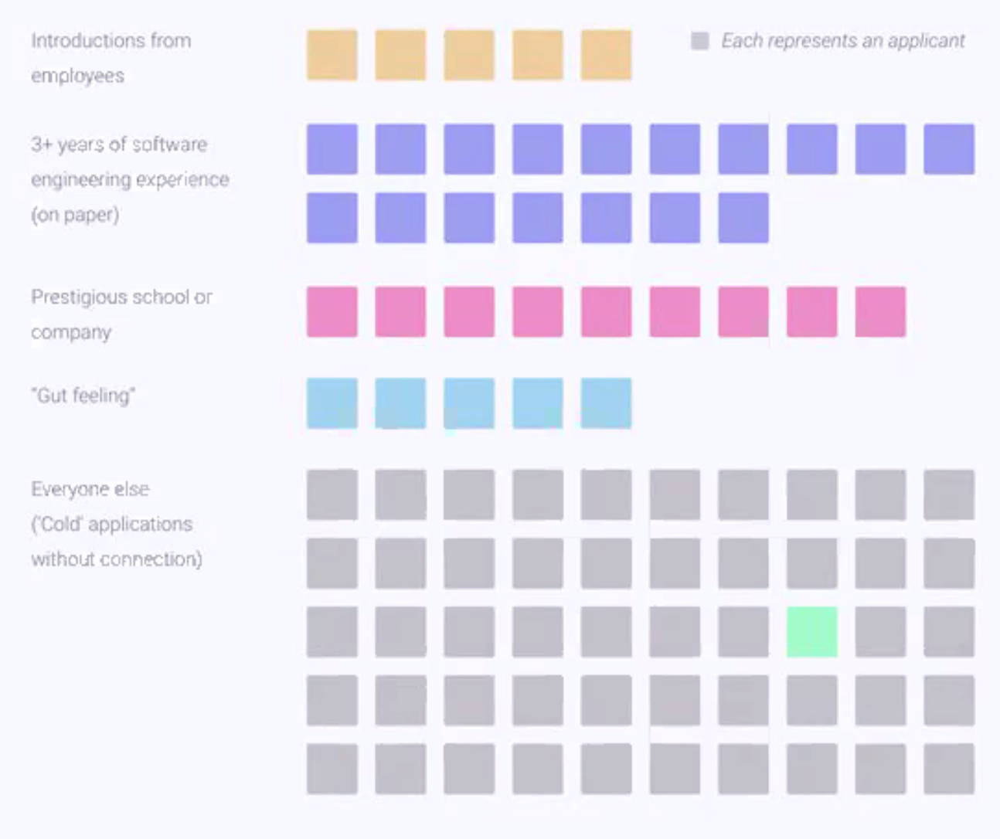
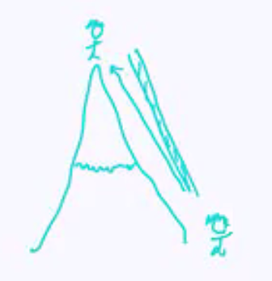
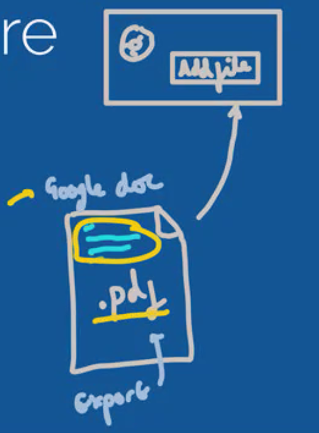
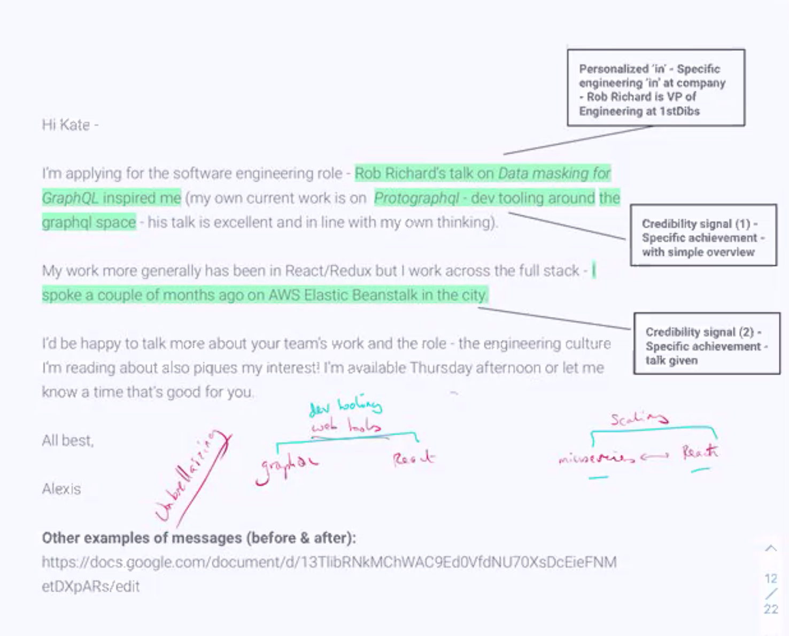

# Messaging - Will Sentance

How to communicate I am a high value engineer in a message.

- The ability to write a message so that someone is compelled to say, lets take them to phone screen.
- You have to somehow show them in 120 words that you are a great engineer.

## Structure

1. Understanding how the pipelines of applications work. 
   - Follow it to maximize the conversion rates so 50 applications become 1 offer.
   - Application to phone screen should be ~20%.
   - Phone screen => offsite should be ~50%.
2. 4 parts process
  - to communicate 
    - I am a credible engineer (by showing them) and I am also sincerely interested in you.
3. Closing stuff about how to approach the job search.

~20% of top of Codesmith with get a Senior role

## The job search process

- Application inbound
  - This lecture
- Phone interview
  - Lecture: Guide to Interviewing
  - Take home project/assessment
- Final round interview
  - Lecture: Technical Narratives
- Offer & Negotiation
  - Lecture: Negotiating offers

The style of writing in your message will determine whether you get past the first stage.

If you write "Dear, Sir, Madamme" you're out!

## Key Slide 1 - The job search process is a pipeline and all the about the conversion ratios

This example is for a Codesmith graduate with:

- No prior software engineering experience
- No degree
- But who is following the **full Codesmith job search approach**

- Rate drops to 20% for final round interview because you couldn't be beaten by someone who is just amazing.
- It goes from cardinal to ordinal
  - Cardinal: it matters if you are above a certain line
  - Ordinal: top person/people win

- Don't tell the story with
  - I was an accountant
  - Then I became a Software Engineer

- If you are converting at a lower level, you need to make a tweak.

1. Apply a lot and max out conversion ratios
2. Iterate to achieve minimum conversion rates 20/50/20
3. Work with the team if you are not hitting those rates

- If you went to Oxford, you will get a 70% conversion rate on the first step.

## Your initial application: the company's perspective

Your job is to `stand out` from all the other 'cold' applications as the rare person who (despite limited years of experiences) has:
- **Credible** engineering ability
- **Sincere interest** in the company

- They need to look up to you going WOW what an amazing engineer
- And you throw them down a ladder and say, I really love your engineering culture
  - They need to feel your sincere engineering interest in their engineering team

## How can you maximize your conversion ratios from cold applications

There are 4 main strategies to get a **minimum 20% conversion** from Application to Phone interview

- **Application** to **Phone Interview**
  1. Apply on Linkedin/Company website with a strong profile and resume [5%]
  2. Apply with a Credible & personal application message (sometimes known as a 'cover letter') [5%]
  3. Send a double-down email the same day [5%]
  4. Send a follow-up email 4 days later [5%]

- **Phone interview** to **Final Round**
  - Review *Guide to Interviewing* lectures
- **Final Round** to **Offer**
  - Review *Guide to Interviewing* lectures

## Step 1: Apply on LinkedIn or company website with a strong online profile or resume

Overall goal: Your application seen by decision maker who can recognize your software engineering ability % invite you to phone interview

**Choose your application platform carefully**:
- YES: LinkedIn/AngelList/Company website - most likely to be seen by *internal recruiters*
  - They have the *decision making power* to *invite you to phone interview*
- NO: indeed.com, ziprecruiter, dice - lots of external recruiters without decision making power

Get your online profiles to perfection:
- Separate lecture and sign-off process

Bonus: Stand out with a referral (more coming up on this)

GET YOUR PROFILES POLISHED

## Step 2: Credible & personal application message

You must **absolutely never apply without an application message** (sometimes known as a cover letter)

On LinkedIn **'Add Message'**. On Company Website **'Add Cover Letter'** (and sometimes there are questions to answer)

### 4 parts of any application

a. Engineering credibility signal (2x)
b Your personalized "in" (a personal sincere connection to the engineering team/culture/company) (1x)
c. Call to action and logistics
d. Overall style

### An example message (we'll see more)

Hi Calley, ther frontend dev role in React at nfl.com caught my eye. I've really appreciated how early you took on React in the team (I've kept tabs since ~2016) so I'd be fascinated to hear how you've scaled it over time. I actually spoke at SoCal React on optimizing systems at scale with webpack a week ago.

Most of my work day to day is in React/Redux/Node architecture with specialization in the broader flux paradigm. Anyway I'd be happy to talk more about the challenges you are working on if you're still looking for folk for the role. I'm available Wednesday afternoon next week or let me know a time that's good for you.

All best - Will

LinkedIn | Github | Resume

- Save it as a PDF in a google doc when they want an uploaded cover letter.
  - Don't try and write a cover letter, just use the same message

### Analysis

- Credibility
  - Spoke at SoCal React on a serious topic
  - React/Redux/Node architecture with specialization in the broader flux paradigm.
    - Demonstrating your T shape - mentioning something advanced within that subset
      - Show you are broad and deep
  - Asking how they've scaled over the time - advanced question
  - Talk about the challenges you are working on

- "In"
  - Appreciated how early you took on React in the team.

### (a) Credibility Signal x2

How can you expose your credibility

- [Best] Production project: (and its name)
  - Snappy 5 word sophisticated description of it
  - Seriousness of the problem it solved
  - "Response of the dev community has been thrilling"
- [Best] Talks or publications - "Invited to speak at the Single Sprout Speaker Series in Software Engineering" (include talk title)
- Provide mature authoritative opinion or inquiry on their work or a technology system they use (focus on advanced areas)
  - Scaling, infrastructure (AWS specifics), design patterns etc
- (If you have it - but no worries if not) Prestigious school (or CS degree) or prior company or multiple years of experience

### (b) a personal sincere connection/interest in the *engineering* at the company (your in) x1

Not so effective:
- Something obvious on the job description
- A non-technical or non-engineering interest/connection
  - That can be a bonus after a quality engineering in

Effective:
- (Best) Blog post, talks or publications (by company or team member) or glassdoor on engineering culture
- (Best) Team: History and background (previous engineering team of employees)
- More unusual tech decisions made/stack (or history of stack) (wappalyzer.com)
- LIkely technical challenge/decision they had to make given their stack or domain
- Personal connection (shared identity with leadership or values of company, school, culture) - but weave in a more 'technical/engineering in'.

I was super inspired/excited to see the engineering background working as a Staff Engineer at Microsoft. It was so inspiring to see the VPs priority of scaling the company and mentorship.

When it comes to people in leadership, you need to be super earnest.

### (c) Call to action and logistics

Application message needs:
- A strong call to action - suggestion of specific availability but also show flexibility
  - "I'm availble Tues/Wed next week or let me know good times for you"
- No references to resume/linkedin in message body
  - Appears 'needy'
  - Add links in signature instead
    - Linkedin | Resume | Github
- Make reference to the specific role - usually opening so no ambiguity that you're actually applying for the role

### (d) Overall written style of application

Application message must have the tone of a busy engineer who is:
- Confident enough to write a **comfortable** (not casual) email
- Sincerely interested enough to have a specific non-obvious 'in' to the company (can't feel like the message was copy/pasted)

Stylistically this can mean:
- Abbreviations are preferred (AWS, dev)
  - (& minimize proper noun repetitions)
- Lower case (but also title case) can be effective
  - Shows you wrote it by hand
  - Title case pulls attention to it (e.g. talk title)
- Phrases like 'All best', 'cheers'
- Italicizing key pieces (e.g. talk title and production project name)
- If you don't know name, use 'Hi there' / 'Hi team' / 'Hi googlers'
- Idioms 'ahead of the game', 'struck a chord', 'brought home for me'
- Grammar may be more informal (Dashes & parentheses rather than semi-colons)
- BUT - spelling and grammar should be correct
- Max length: 150 words (Target: 120 words)
- Parenthetical Credibility inserts
  - Humble-confidence "actually, I was just invited to speak..."
  - "Umbrellaizing" - common thread between your 'in' and your 'credibility signal'
  - You start a sentence by talking about them, then in brackets, say your credibility booster.

## An exemplary application message

Hi Kate -

I'm applying for the software engineering role - Bob Richard's talk on Data masking for GraphQL inspired me (my own current work is on Protographql - dev tools around the graphql space - his talk is excellent and in line with my own thinking).

My work more generally has been in React/Redux but I work across the full stack - I spoke a couple of months ago on AWS Elastic Beanstalk in the city.

I'd be happy to talk more about your team's work and the role - the engineering culture I'm reading about also piques my interest! I'm available Thursday afternoon or let me know a time that's good for you.

All the best,

Alexis

## Summary - 4 steps

Each of these steps is worth 5% conversion from application to phone interview

1. Apply on Linkedin/Company website with strong profile and/or resume (5%)
2. **Apply with a personalized-credible message (5%)**
3. Send a double-down email the same day (5%)
   - Hey, here is the message I applied with incase you missed it.
4. Send a follow-up email 4 days later (5%)

## Workshop - Developing your full application

Choose a company and role
1. Identify the **platform/site on which to apply**
2. Prepare you **application message**. Ensure your message has:
   a. Credibility signal 2x
   b. personalized interest in the company 1x
   c. Call to action and logistics
   d. style of writing
  BONUS:
3. Prepare **double-down email** (Find the email address of someone at the company)
4. Prepare the **follow-up email**

Be ready for live review and supportive feedback. <3

### Random

Watch Clarkson's Farm, white lotus, man in the high castle

## Will

Had degrees of OCD tendencies. Started having anxiety and panic attacks.

Took 10 grams of psilocybin. Committed with his partner.

His siblings went to Oxford/Harvard/LSE. That was due to his parents vision.

When he was at Harvard, these people were the snorty of the snortiest. People from Harvard were wondering, how do I be like them? Those Software Engineers, who don't even have college degrees, how do I be like them?

Gave hard parts lecture at BBC (his favorite organization), people doing iPlayer. They didn't know how `setTimeout` works.

### Questions
