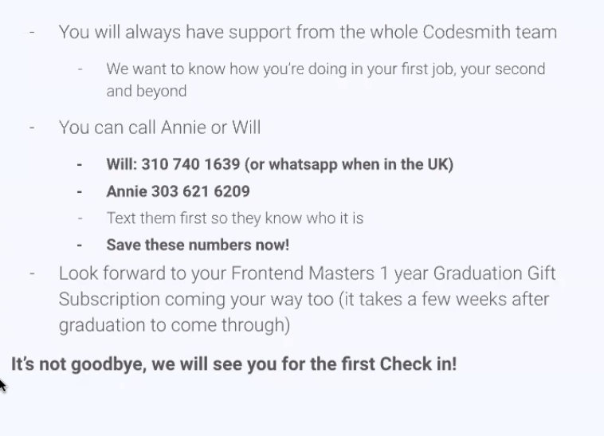

# Messaging 2

- Add draft messages here: https://docs.google.com/document/d/1oy-Zkd8v16x0f-ImlmmtnyJ0BSORhSa4HVuLncXxrD4/edit

Average salary of $122.2k => 1 below $100k.
Highest offer received => $175k. They took a $165k.
Highest offers outside of PTRI: $300K. Someone took a $182 with an $82k signing bonus (AWS)- highest offer $312k.
AWS, Mixpanel, Facebook, Square, Ticktok, Microsoft, Amazon, New York Times. Big money in big brand name companies.

Smaller companies that paid well => Crossbeam, Brightback, Prominade, Hello Alfred, Mantium, Cargo, Change Healthcare, YCMA retirement fund => $160k. Source point technologies, intuit, app omni.

## My message

Hi Zack -

I'm applying for a Software Engineering role at Google and it made me think of you - listening to your talk on machine learning at Makers Academy really inspired me. 

In fact your encouragement motivated me to give my own talk. Most recently I was speaking at the Single Sprout Speaker Series on The Evolution of State Management in React.

This has been an area of passion for me. In fact, recently I have been working on AtomiQL, a new GraphQL client that uses Atomic State Management to manage cached data in a more performant manner, though I work more generally in the React, TypeScript and Node ecosystem.

It would be great if we could catch up sometime (I'm available at 5pm on Wednesday), but let me know if another time works better for you!

All the best,
Tom

## How not to approach the job search

- Stop communicating
  - Including because you feel ashamed by lack of progress - we're here for you and we know how it feels
  - Fly solo (not connect with your cohort mates)
- Stop referring back to these slides
- Listen to outside advice at the expense of the Codesmith approach
- Think you need to stop and study before you apply - you have the ability, now you need to practice interviewing
  - Take homes will provide you motivation to build the right sort of projects that cement your abilities if necessary
- Think you're not as capable as other alums and unable to receive an offer
- Think you can't get better through iteration (a fixed mindset)

## How to handle the job search blues

- Work as pairs and teams - pair-apply
- Understand that applying and interviewing is 95% an additional skill to being a great engineer
- Create a routine for yourself
- Set daily, weekly and monthly targets
- Use productivity techniques (Freedom app, RescueTime, ScreenTime, SelfControl, **ColdTurkeyWriter**, Pomodoro timer)
- Enjoy the take home assignments and be creative with them
- Recognize you are no a journey for the rest of your pro career and this is a short period on that journey
- Realize that there have been people just like you

## Offers & Negotiations & Salary expectations

- If you're asked for salary expectations
  - "The roles I'm in conversations with are in the range of $110-140k"
- Do no accept offers immediately, NEGOTIATE
- Immediately let Eric know so he can help with negotiation
  - Use strategies that are thoughtful and respectful
- Remember, Codesmith alumni average job requires 3+ years of experience and has a $115k salary in LA and $120k in NY (CIRR, 2019H2 - Covid era)
  - It's not about the salary - it's just that this is the level where the work is really interesting and exciting

## Building and working with your network

- Give each other feedback on interview questions and approaches
- Conduct mock interviews together
- Give talks on topics that have come up in interviews - learn through teaching
- Referrals: Great to work with other Codesmith alums + referral bonuses :)
- If you receive an offer you turn down - recommend a Codesmith cohort mate to your contact at the company
- Get involved in the alumni community
- Attend JSHP and other workshops online

## One or two last things

- You will always have support from the whole Codesmith team
  - We want to know how you're doing in your first job, your second and beyond

- You can call Annie or Will

## Book

The Joy of JavaScript

## Notable Alumns

Daniel King:
https://www.linkedin.com/in/daniel-oliver-king/
