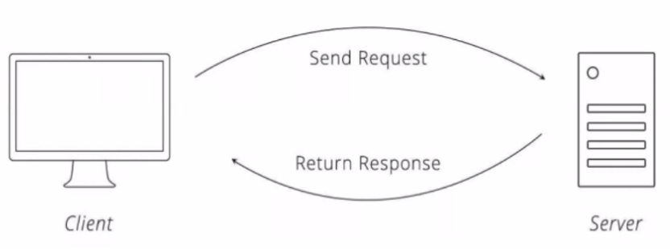
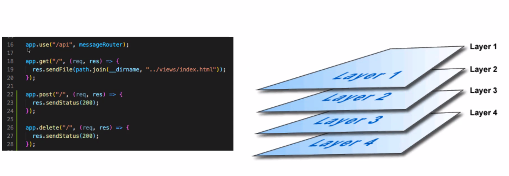

# Express approach lecture

A streamlined way for building servers

## What we'll get into today:

- Flow between client and server
  - How does the client communicate to the server?
  - How does the server communicate to the client?
  - What is the request/response cycle?

- Express
  - Middlewhat?
  - Req, Response, Errors

- Code Time

## Client and Server Relationship

- Navigation to a URL in our browser or sending a fetch to our server from the frontend sends an HTTP request.
- This request hits an endpoint on our server and our server's middleware logic for that endpoint is executed.
- The server sends a response back to the client containing the results of the server's operations.



## The Request: where it all begins

We can send a HTTP request by providing a URL and a method. When you enter a URL into a browser, you are automatically sending a GET request.
So, when we navigate to:
- `http://localhost:3000/`

We're sending a GET request to localhost with the port 3000 and the endpoint of '/' (the default option).

## What's in a request

```JavaScript
fetch('endpoint' {
  method: 'HTTP Method',
  headers {
    header: 'property'
  },
  body: JSON.stringify({
    dataToTransmit: 'for the server...'
  })
});
```
- Endpoint: API url
- Method: HTTP verb

## Common HTTP Methods/verbs

- GET
- POST
- PUT
- DELETE

## How does our server 'catch' the request?

In Vanilla Node:
```JavaScript
if (request.method === 'GET' && request.url === '/') {
  // do stuff
}
```
In Express:
```JavaScript
app.get('/', /* Do stuff */)
```

## Middleware



Works in layers:

```JavaScript
app.use('/api', messageRouter);

app.get('/', (req, res) => {
  res.sendFile(path.join(__dirname, './file'));
  // and so on
})
```

## Some built-in Express middleware

- express.json()
  - parses the body of our http request object from JSON into JavaScript
- express.urlencoded()
  - parses the media type 'application/urlencoded' - mainly seen in submission from forms.
- express.static()
  - serves up a directory of static files.

## Create your own middleware

- (req, res, next) => {/* do stuff */}
  - can take 2-4 predefined arguments.
    - If you are creating an error handler - (err, req, res, next)
- Endpoint can have as many middleware functions as are needed, but must have at least one.
- Middleware must invoke next() to hand control to the next middleware (unless we are done and want to send our response).
- You should end your request by sending a response to your client.
- You have access to the request and response objects throughout the current request/response cycle.

## What's req and res?

```JavaScript
app.post('/shoutout', (req, res) => {
  return res.status(200).json({ shoutout: res.locals.shoutout });
})
```

They're objects!

- req is an object that contains info sent from the client.
- res is ALSO an object in which the server can store information to be eventually sent back to the client.

## req.params

```JavaScript
app.use('/api/favs', favsRouter);

const router = express.Router();

router.post('/:id',
fileController.getFavs,
fileController.addFav,
(req, res) => {
  return res.status(200).json({ favs: res.locals.favs });
});

module.exports = router;
```

## Accessing our stored response values

```JavaScript
app.post('/shoutout', cohortController.validateCohort, (req, res) => {
  return res.status(200).json({ shoutout: res.locals.shoutout });
});
```

## What if there's an error?

```JavaScript
app.use((err, req, res, next) => {});
```

- If next is ever invoked with an argument, the Express library understands that an error is thrown and will execute the global error handler.

## Request/response cycle

1. Client sends a request to the server
2. Server receives the request and route sit
3. Server runs through relevant middleware
4. Server resolves the request.

### .env file

- Add api keys and such into your `.env` file.

```
PORT=3000
```

```JavaScript
const PORT = process.env.PORT;
```

## Server.js

```JavaScript
const express = require('express');

// handle parsing request body
app.use(express.json())
app.use(express.urlencoded({extended: true}));
// handle requests for static assets
app.use('/assets', express.static(path.join(__dirname, '../client/assets')))
```


### Questions

what is express.urlencoded();

Why can only stringified data be sent?