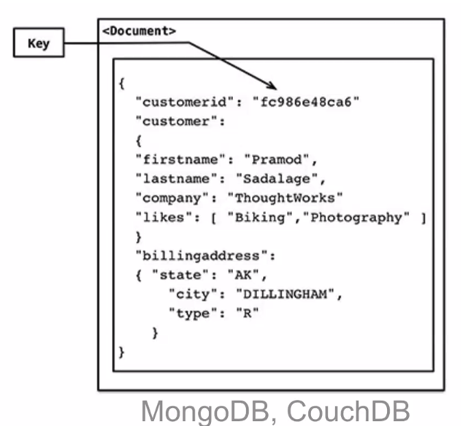
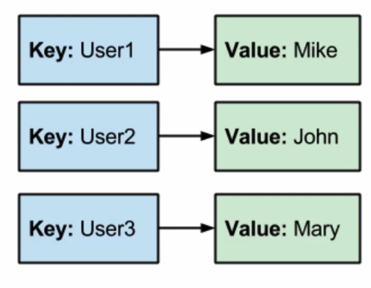
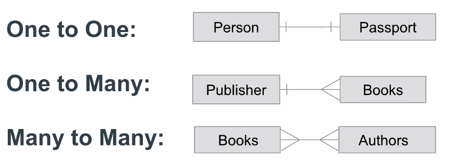
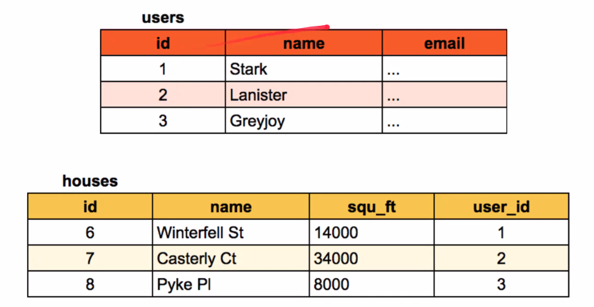
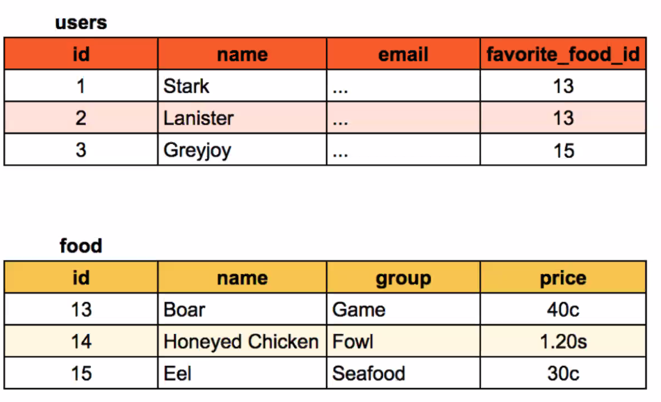
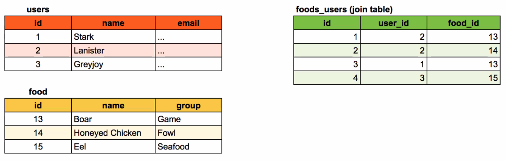

# Intro to Databases

## What is a Database?

Just a way to store data (data storage).

- The simplest DB's: RAM, file system, localStorage.
- Stores data for a lifetime longer than a session.
- Usually has some software with it, a database management system (DBMS).

- localStorage
  - Stored in the browser

## Development

- All on your local machine:
  - Client/Server/DB

- Use a third party to run the database
  - Client/Server <-> Database

## Production

- Separate concerns
  - Client <-> Server <-> Database

## Types of Databases

There are many types of data stores, but let's talk about the following types:

- Tables (SQL)
- Documents (NoSQL)
- Key-Value
  - No nesting in this type

We'll primarily focus on PostgreSQL and MongoDB (NoSQL).

- SQL means structured query language.

## How Databases Work

### Table Stores

1. A relational database (SQL) is composed of tables.
2. A table has columns.
   - **Columns** don't change (they are defined in a schema).
3. A table has rows.
   - **Rows** are instances of new records.
   - Rows are added continuously.

You can't have a table inside of a table. But you can reference other tables through ids.

### Relational DB (SQL)

- E.F Codd.

1. Organization is based on the **relational model** of data, as proposed by E.F Codd in 1970.
2. **Model** is defined as one or more tables, consisting of columns and rows.
3. Columns are also known as **attributes** or **fields**.
4. Rows are also known as **records**.
5. SQL used consistently across databases.

Relational databases are time-tested and proven.

### PostgreSQL

1. PostgreSQL is a relationship database system with an emphasis on extensibility and standards-compliance.
2. Postgres was originally developed in 1980's at Cal Berkeley, then released sa open-source with SQL support in the mid-90's.
3. PostgreSQL is **ACID compliant**, supporting industry best practices.

### ACID - Four Properties for DB Reliability

- Atomicity
  - Requires that a transaction be all or nothing. If one part fails, the whole transaction fails and db state is unchanged.
- Consistency
  - Any data written to the db must be valid according to implemented rules (constraints, cascades, triggers, etc). We set up these rules in a **schema**.
- Isolation
  - Concurrency control. Concurrent execution of transactions result in a state that would be obtained if they were run one after the other.
- Durability
  - Once a transaction is committed, it will remain so, even if there is a crash or power loss.

- Schema stands for schematic. A representational diagram.

## Document Stores (NoSQL)

1. Very close to JSON (a JavaScript object).
2. Instead of tables, you have a **collection** of **documents**.
  a. Each document is a JavaScript object.
  b. You have the ability to **nest** arbitrarily deep.
3. Built with an emphasis on **speed**.

Nesting in a document has some pros and cons.

]

## NoSQL

1. NoSQL databases are increasingly used in **big data** and **real-time** web applications.
2. Motivations include simplicity of design, simpler horizontal scaling of clusters of machines, and finer control over availability.
3. Generally considered "**fast**" and "**more flexible**".

## MongoDB

1. MongoDB (from humongous) is a free open-source cross-platform document-oriented database.
2. MongoDB uses JSON-like documents with dynamic schemas.
3. MongoDB was developed in 2007 by 10gen, then released as open-source in 2009.

Integrations of big data and real-time web applications are common use cases.

## MongoDB Features

1. **Indexing**: Any field in a Mongo document can be indexed.
2. **Replication**: Mongo stores data as a replica set of two or more copies.
3. **Load balancing**: Mongo scales horizontally using sharding.
4. **Aggregation**: MapReduce can be used for batch processing of data and aggregation operations.

## Key-Value Store

Keys and values without nesting.

Redis, Riak, localStorage.

Used often for data that does not need to be permanent.

It is super fast.

### Redis

1. Redis is an open-source **data structure server**.
2. Most popular key-value solution.
3. Redis holds its entire dataset in RAM, and syncs back to the disc every 2 seconds.
4. Redis is fast because data is memcached.

Redis is a good choice if you want a highly scalable data store shared by multiple processes or multiple applications.

## Popularity

1. Oracle
2. MySQL
3. MS SQL Server
4. Postgres
5. MongoDB

Top four are relational (SQL), followed by MongoDB in fifth place.

## Schemas

Database schemas enforce structure in your data store.

### What is a Schema?

A schema is a map of what your data looks like.

- It's where you define your data's attributes.
  - In SQL, it defines
  - ...

### Comparison

- Key-value does not have a schema.
- SQL:  Schema is strictly enforced.
- Document: can use a schema.

## Data Models

Data commonly references other data in a database.

## Relationships

You have relationships between your models

- One to One:   Person -|-|- Passport
- One to Many:  Publisher -|-< Books
- Many to Many: Books >-< Authors

## Foreign Keys

In Relational Databases, the linking of model to model happens by establishing relationships through the creation of foreign keys.

Often, ID fields are used for this, but any field is eligible, os long as the values of that field relate in some meaningful way.

## One to One

users
id | name | email
1  | stark | ...

houses
id |        name   |   squ_ft | user_id
6  | Winterfell St |   14000  | 1

## One to Many (SQL)

## Many to Many (SQL)

- Must use a join table, cannot use an array.

e.g.
We have a user that can have many favorite foods. And favorite foods that can have many users.

So:
- Food table
- foods_users (join table)
  - This table has two one to many relationships:
    - one food_users to many users
    - one food_users to many food
- food

## Summary

1. You'll encounter two types of DB at Codesmith, table and document.
2. Table stores (SQL) use a table structure to organize data.
3. Document stores (NoSQL)

### Questions

What is memcached? How we are keeping track of our cache in memory in redis.

What is horizontal and vertical scaling?
Horizontal - get more waterbottles
Verticle scaling - making the waterbottle bigger.

How reliable are SQL databases, do they ever go wrong?
- This is a system design thing.

How do we know which order in which to execute the requests?
