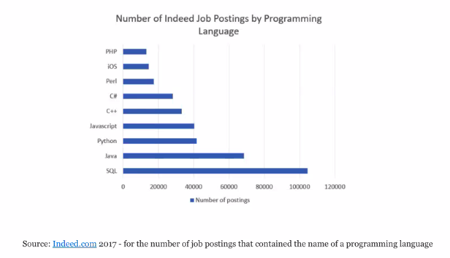
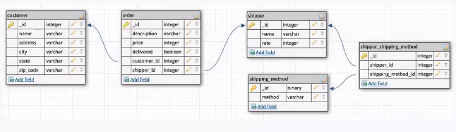
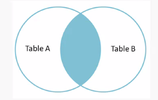
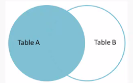
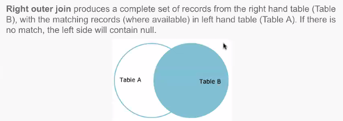
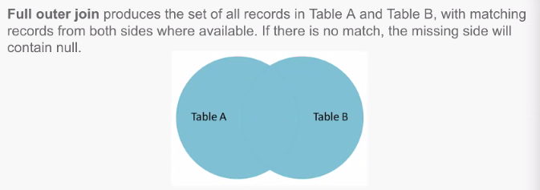
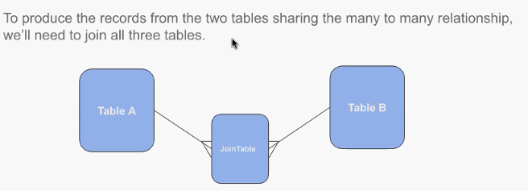

# Databases - SQL - Structured Query Language



SQL is very important to know!

## Roadmap

- Relational Database schemas and ER diagrams
- Basic CRUD operations
- Aggregate functions
- Sub-queries
- Joins

## ER - Entity Relationship Diagrams



[dbdesigner.net](https://www.dbdesigner.net/)

## SQL Syntax

- Create  - INSERT
- Read    - SELECT
- Update  - UPDATE
- Delete  - DELETE

## SQL Operators

=     check if they are equal
!=    check if they are not equal
<>    check if they are not equal
>     greater than
<     less than
AND   AND
OR    OR
NOT   negate operators

## Read (SELECT)

```sql
SELECT column-names
FROM table-name
WHERE condition
ORDER BY sort-order;
```

E.g.
```sql
SELECT name, city FROM customer
WHERE state = 'FL' ORDER BY name;
```

## We can use wildcards with the 'LIKE' keyword

How many customers do I have whose first name begins with 'E'?

`SELECT * FROM customer WHERE name LIKE 'E%';

How many customers do I have whose first name begins with 'E' - not case sensitive?

`SELECT * FROM customer WHERE name ILIKE 'E%';

Show us all customers whose first names are four letters long and begin with 'E'.

`SELECT * FROM customer WHERE name LIKE 'E___ %';

Show us all customers whose first names begin with anything other than 'E'.

`SELECT * FROM customers WHERE name NOT LIKE 'E%';

## Create (INSERT)

```sql
INSERT INTO table-name (column-names)
VALUES (column-values)
```

E.g.

```sql
INSERT INTO customer (name, address, city, state, zip_code)
VALUES ('Sadie Olsen', '514 Magnolia St', 'Orlando', 'FL', '32806')
```

## Update

```sql
UPDATE table-name
SET column-name = column-value
WHERE condition
```

E.g.

```sql
UPDATE item_order SET shipper_id = 3, delivered = true WHERE  _id = 8;
```

## Delete

```sql
DELETE FROM table-name
WHERE condition;
```

E.g.

```sql
DELETE FROM customer
WHERE _id = 44 OR _id = 45 OR _id = 6;
```

## Aggregate functions

- Must use `HAVING` instead of `WHERE` when using aggregate functions.

What's the sum of the price of all unshipped orders?

`SELECT sum(price) FROM item_order WHERE delivered = false;

How many customers do we have?

`SELECT count(*) AS cust_count FROM customer;`

How many customers are there in each state?

`SELECT state, count(*) FROM customer GROUP BY state;`

Which states, other than Georgia, have more than 2 customers?

`SELECT state, count(*) FROM customer WHERE state <> 'GA' GROUP BY state HAVING count(*) > 2`

## What if we need to make our criteria dynamic?

- Use sub queries!

Get the minimum price from the order table.

`SELECT min(price) FROM item_order;`

Select the least expensive item that has been ordered.

`SELECT description FROM item_order WHERE price = (SELECT min(price) FROM item_order);`

## What if we need data from more than one table?

### Inner Join

- Note the keyword `JOIN` defaults to `INNER JOIN`.

Inner joins return rows where the value of the specified column in left hand table (Table A) matches the value of the specified column in the right hand table (Table B);



Show the customer name along with the items they've purchased.

```sql
SELECT customer.name, item_order.description
FROM customer INNER JOIN item_order
ON item_order.customer_id = customer.id;
```

### Left Outer Join

Left outer join produces a complete set of (Table A) mixed with a partial set of (Table B) - i think...



Show us every customer name and id. If they've purchased items, show those details as well.

```sql
SELECT c._id, c.name i.*
FROM customer c LEFT OUTER JOIN item_order i
ON i.customer_id = c._id;
```

### Right Outer Join

- Opposite of the left outer join.



Show us every shipper name. If they've shipped items, show the description for those items.

```sql
SELECT i.description, s.name AS shipper
FROM item_order i RIGHT OUTER JOIN shipper s
ON i.shipper_id = s._id;
```

### Full Outer Join

Full set of both tables



Show us every shipper and every item.
```sql
SELECT i.description, s.name
FROM item_order i FULL OUTER JOIN shipper s
ON i.shipper_id = s._id;
```

### Finding what isn't there (in the other table)

What is in Table A that isn't in Table B.

```sql
SELECT c.name
FROM customer c LEFT OUTER JOIN item_order i
ON i.customer_id = c._id
WHERE i._id IS NULL;
```

## using a many-to-many relationship table



Show us all shippers and all shipping methods they use.

```sql
SELECT s.name, m.method
FROM shippers s
INNER JOIN shipper_shipping_method sm oN s._id = sm.shipper_id
INNER JOIN shipping_method m ON m._id = sm.shipping_method_id;
```

## Summary

- CRUD operations.
- Aggregate functions.
- sub-queries for dynamic criteria.
- User joins to combine data from more than one table.

## Command line commands Postgresql

psql -> enter Postgresql
\d -> see all tables

### Questions
