# Data Modeling - Unit 10 Databases

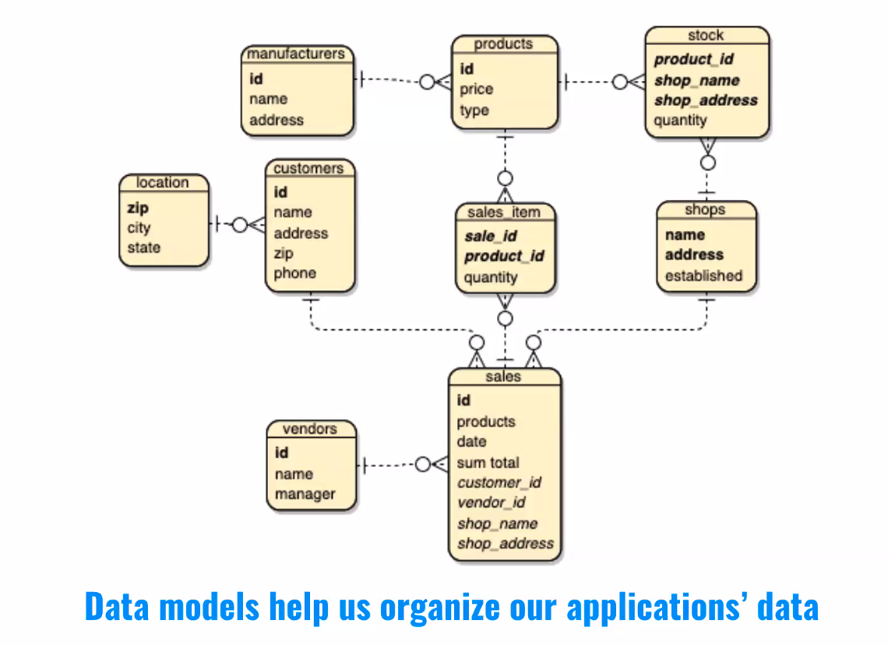

Data Models help us organize our applications data.

## How do I create a data model?

1. Identify Entities
2. Identify Relationships
3. Identify Attributes
4. Identify Keys
5. Normalization

## Identify Entities - Step 1

The types of information that are saved in the database are called entities. there are four types of entities:
- People
- Things
- Events
- Locations

Imagine that you are creating a website for a shop, what kind of information do you have to deal with? In a shop you sell you products to customers.

- The shop is a location.
- Sale is an event
- Products are things
- Customers are people.
- Vendors are people

## Identify Relationships - Step 2

The next step is to determine the relationships between the entities and to determine the nature of each relationship.

This concept is **cardinality**.

- Cardinality:
  - How tables to relate to each other.
  - Common cardinalities:
    - 1-1
    - 1-Many
    - Many-Many

Consider both sides of the relationship between entities

- Customers -> Sales
  - One to Many
- Customers -> Products
  - Many to Many
- Customer -> Shops
  - Many to Many
- Shops -> Products
  - Many to Many
- Shops -> Sales
  - One shop can make many sales
  - 1 sale can only be made in one shop.
  - One to Many
- Products -> sales
  - Many to many.

### ER diagram

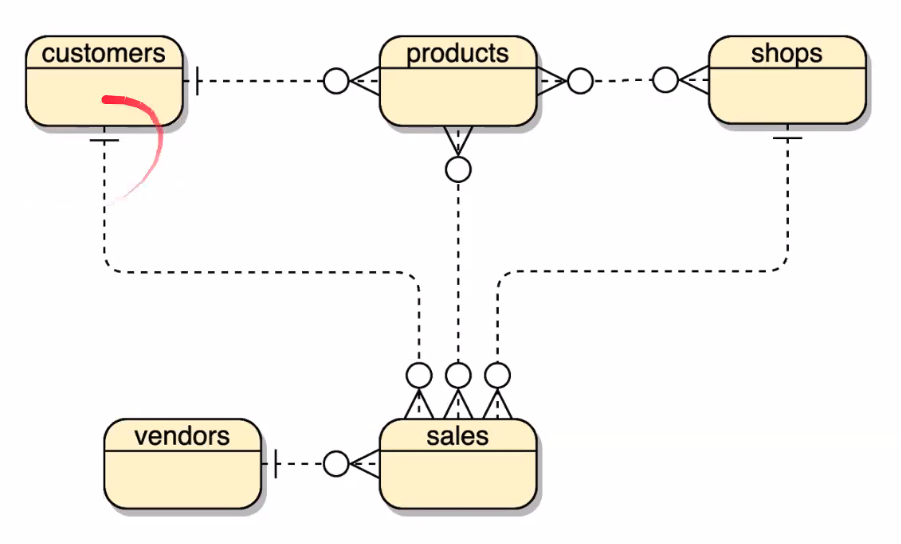

We can represent these one-to-many and many-to-many relations using **Barker notation** in an **ER diagram**.

Now that we see this visually, we can look for any **redundant relationships**, ones that are already indicated by other relationships, although not directly.

What is our redundant relationship in this example?

- Here it is `customers -< products`.

There is no relationship between customers and products except via a sale.
A customer only relates to a product, within the context of a sale.

However, a product does relate to a shop, outside of the context of a sale. Hence we will keep to `products >-< shops` relationship.

So now we can update the diagram:

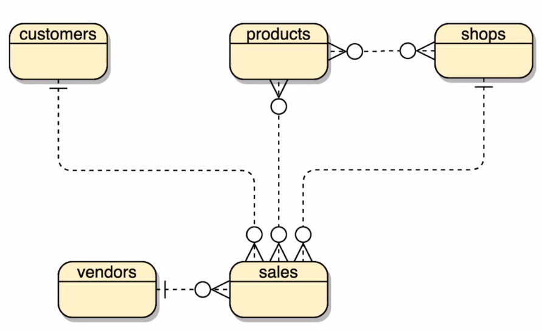

### Identify Attributes - Step 3

For the Products - Sales relationship, every sale may include multiple products. If we think of each individual product as a n item, the nwe can call this table sales_item (it could jsut as well be `product_sold` or `sales_detail`).

The Products - Shops relations

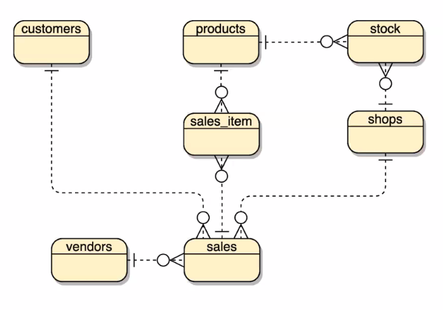

- Customers have addresses etc.
- We will add attributes to our join tables later when we look at normalizing our data

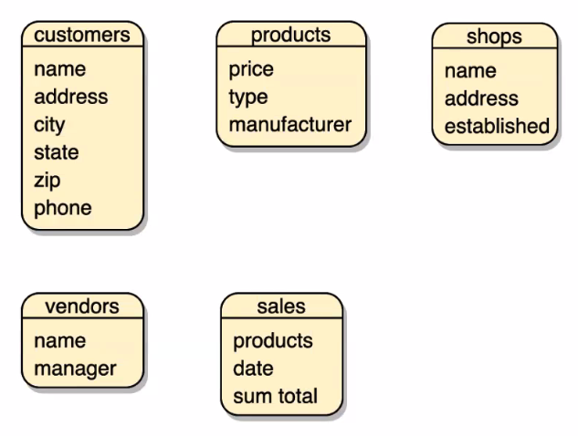

### Identify redundant data

As you list your attributes, you may discover that some would be best represented as different entities.

Consider the manufacture attribute of the products table.

### Derived Data

Derived data is the data that can be calculated from other data you have already saved.

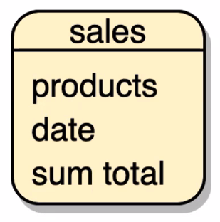

Take `sum total` here in sales. we could derive the total cost by calculating the price of each product. However, in this case, it actually makes sense to keep it.

Why?

The product price could change! So we should keep a static value.

### Assigning# Keys - Step 4

- Primary Keys
  - Anything can be used as a primary key as long as it is unique, and identifies each row in your table.
  - This can be done using a *composite key*, a combination of two attributes.

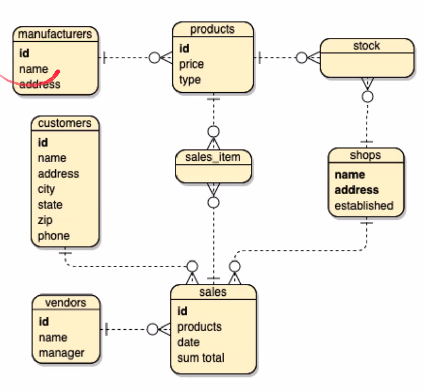

We've created id fields to uniquely identify most of our entities, and we might have done the same for shops. But note that we could uniquely identify a shop as a having a name at a particular address.

This is referred to as a composite key. Sometimes this is the ideal way to uniquely identify records. That's not necessarily the case here, but it's important to know that is something can you do.

This reduces the number of fields your database has.

### Foreign Keys

- Enforces **referential integrity**.

## Normalization - Step 5

The final step is about making our model flexible and reliable.

It comes in 3 forms:

### Normalization - the First Form

- There may be no repeating groups of columns in an entity.

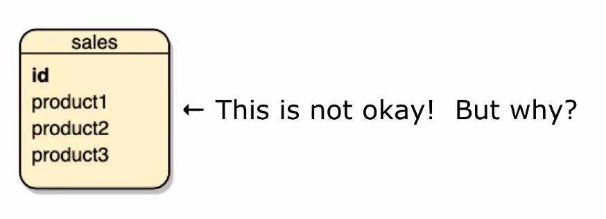

Sales
- id
- product1
- product2
- product3

We are artificially limiting the number of sales that we can have.

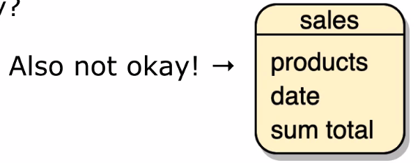

Sales
- products
- date
- sum total

Why? We cannot use an array! Unless we use mongoDB.

So anytime you wish you could use an array - create a new table and establish a link via a one-to-many relationship.

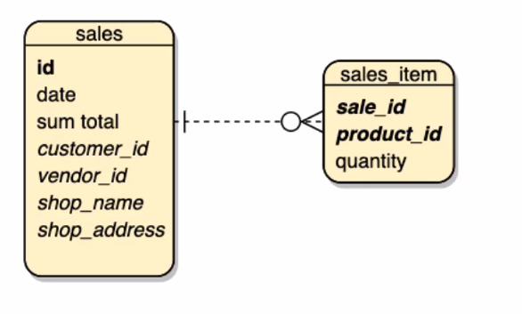

### Second Form of Normalization

- All attributes of an entity should be fully dependent on the whole Primary Key

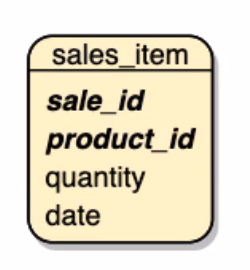

The date belongs in the sales table.

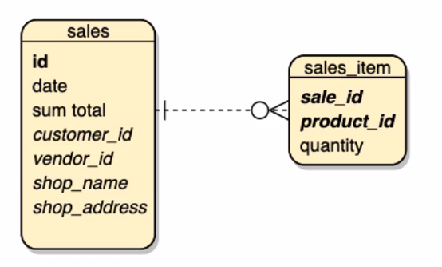

### The third Form

- All attributes need to be directly dependent on the primary key, and not on other attributes.

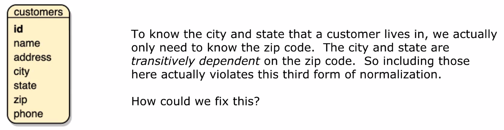

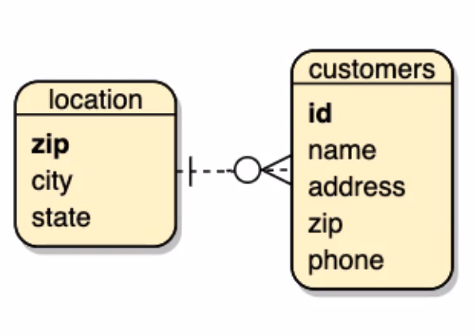

We could extract the city and state into the location table.

### Normalization the 3 forms

1. There may be no repeating groups of columns in an entity.
2. All attributes of an entity should be fully dependent on the whole primary key.
3. All attributes need to be directly dependent on the primary key and not other attributes.

## Can Normalization get out of hand?

Yes! There are times when a fully normalized database runs into performance issues. In our example you could argue to keep the database in second normal form, that the city/state to zip dependency isn't necessary if it's causing performance issues.

There are even times when you'll intentionally denormalize data. If you need to present summarized or complied data to a user, and that data is very time consuming or resource intensive to complete.

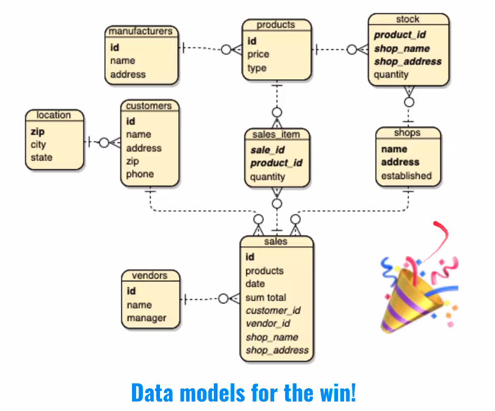