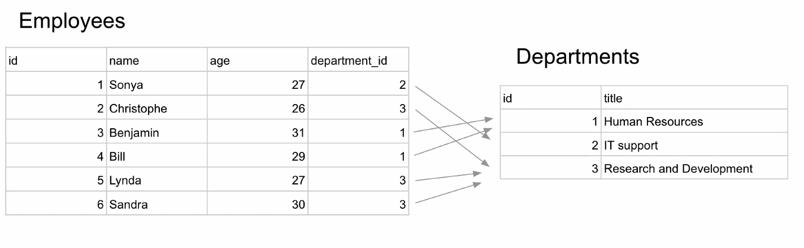
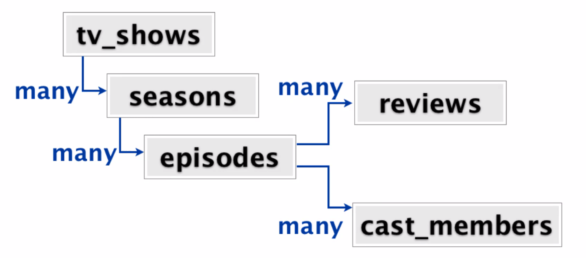

# Mongo DB - Unit 10: Non-relational databases

## MongoDB Document store

1. Everything is stored as JSON.
2. Instead of tables, you have **collections** of **documents**.
   - Each document is a JavaScript object
   - You can store **array** and **object** data types.
   - You have the ability to nest arbitrarily deep.
3. Build with an emphasis on **speed**.
4. Not equipped to handle complex relationships.

## ONEe to many relationship in SQL



One department can have many employees, but each employee only has one department.

## MongoDB Document Store

1. Ability to store array of items: this is **embedding** and is an alternative to foreign-key relationship.
2. Flexibility in field properties and nesting, just like JSON. Great for unstructured/nested data.

```JavaScript
{
  name: 'Kate Monster',
  ssn: '123-456-7890',
  addresses: [
    { street: '123 Sesame St', city: 'Anytown', cc: 'USA' },
    { street: '123 Avenue Q', city: 'New York', cc: 'USA' },
  ]
}
```

### Example: nesting



tv_show -many-> seasons -many-> episodes -many-> reviews
                                    |
                                    |----many-> cast_members

Much easier to get the cast members for a certain tv show.

What shows has a specific cast member appeared in? Harder to answer to JSON data.

Therefore it is not clear cut which is the best option.

## Mongoose

Mongoose is an ODM often used with MongoDB, which provides structure to raw MongoDB.

### Mongoose Library features

- Schema definitions and types:
  - String, Number, Date, Array, ObjectId, Mixed (any type)...
  - Custom types: allows validation, defaults, pre/post middleware
- Create a Schema instance, then create a Model to perform queries.

```JavaScript
const mongoose = require

const personSchema = new mongoose.Schema({
  name: {type: String, required: true},
  age: Number,
  quote: String,
  data: Mixed
});

const Person = mongoose.model('Person', personSchema); // This is kinda like a class?
```

Mongoose will do name cohesion, it will pluralize the collection name from 'Person' to 'Persons'.

### Mongoose library features

- After creating the Model, perform queries on it to CRUD items in the database.

```JavaScript
Person.find({
  age: { $gte: 20, $lt: 30 },
  name: 'Greg',
}, (err, people) => {
  // do stuff...
});
```

- Either callback-based or promise-based.

```JavaScript
// Callback style
Person.find({
  name: { $in: ['Anna', 'Bob', 'Clara'] }
}, (err, people) => {
  // do stuff...
});
```

```JavaScript
// Promise based
Person.find({
  name: {$in: ['Anna', 'Bob', 'Clara']}
}).then (people => {
  // do stuff...
}).catch(err => {
  // handle error...
})
```

## CRUD in Mongoose

### Read operations

- Find an array of items matching the conditions object

```JavaScript
// callback style
Model.find(conditions, [projection], [options], callback); // in square brackets, means it is an optional parameter.

// promise style
Model.find(conditions, [projection], [options]).then(...);
```

- Callback contains two parameters: the error object (which is just null if there's no error) and the docs array (which may be an empty array if nothing is found).

```JavaScript
Person.find({ name: 'Janice', country: 'Canada'},
  'name age', // projection -> just return these properties
  {limit: 10}, // options
  (err, people) => { });
```

### Model.find vs. Model.findOne

- Find a single item matching the conditions object

```JavaScript
// callback style
Model.findOne(conditions, [projection], [options], callback);

//promise style
Model.findOne(conditions, [projection], [options]).then(...);
```

- Callback contains tow parameters:
  - error object
  - doc object - first doc found or null
- The docs variable in Model find is always truthy! the doc variable in Model findOne may be false or truthy.

### Create operations

- Two syntax options: Model.prototype.save and Model.create

```JavaScript
// myCar is an instance of the Car model
const myCar = new Car({make: 'Honda', model: 'Civic', year: 2015, color: 'blue'});

myCar.save((err, car) => {
  // do stuff
});
```

```JavaScript
// shortcut for creating Car model instance and saving
Car.create({make: 'Honda', model: 'Civic', year: 2015, color: 'blue'},
  (err, car) => {
    // do stuff...
})
```
- Can use Model.create on an array of objects


```JavaScript
Person.create([{name: 'Kim', age: 28}, {name: 'Tim', age: 26}], 
  (err, people) => {
  // do stuff
})
```

### Delete Operations

- To find (obtain in the callback) a single document and delete it, use:
`Model.findOneAndDelete(conditions, [options], callback)
- To delete a single document without obtaining it for use in a callback use:
`Model.deleteOne(conditions, [options], callback)`
- TO delete many documents without obtaining them for use in a callback
`Model.remove(conditions, [options], callback)`
OR
`Model.deleteMany(conditions, [options], callback)`


```JavaScript
Car.findOneAndDelete({license: 'P2236917'},
  (err, car) -> {
    // car will be the just deleted car document,
    // showing make, model, color, licence, etc.
});

Car.deleteOne({license: 'P2236917'},
  (err) => {
    // no car object obtained as a callback after the deletion
});
```

### Update operations

- Model.findOneAndUpdate(conditions, update, [options], callback)

Warning: by default, the doc obtained in the callback will be the found object, not the updated object! To adjust this, specify `new: true` in the options object.

Helpful tool: if you want to upsert a document if not found, specify `upsert: true` in the options object. Upsert (aka update or insert) means update a document if it does exist, otherwise create it.


E.g.

- Take a shippers collection with three fields: shipper name, address and number of shipments.
- If an existing shipper just completed a shipment: increment the shipment number. If a new shipper (not in the database) just completed a shipment: insert the shipper.

```JavaScript
Shippers.findOneAndUpdate(
  {name: 'La Warehouse'},
  {$inc: {shipments: 1}}, // shipments doesn't exist, so $inc creates/sets it to 1
  {upsert: true, new: true},
  (err, shippers) => {
    // this shipper object has  had its number of shipments incremented!
  }
)
```

### Other Mongoose library features

- Allows regex. (Both underlying MongoDB and SQL support regex).

```JavaScript
Person.find({
  name: /Sarah?/
}, (err, people) => {
  // do stuff
})
```

- Mongoose middleware for pre/post/saving.
- Good for e.g. hashing passwords before saving them for security purposes.

```JavaScript
userSchema.pre('save', function(next) {
  // do stuff
  const user = this;
  hash(user.password).then(function(hashedPassword) {
    user.password = hashedPassword;
    next();
  });
})
```

## MongoDB vs SQL

SQL is generally used in the engineering world, but there are use cases for MongoDB.

### MongoDB

- Performance benefits.
- Often gets unwieldly as a main database for relational data.
- There are real uses cases:
  - E-commerce catalogs with inherently flexibly schema, e.g. a toy store where a toy has different kinds of parts.
  - For information where we solely want to: given the one, find the many (recall the movies site example)

e.g. Cataloguing a toy store (e-commerce)

- A toy truck might a no. of wheels and color as fields.
- A board game may have board size and meeples.

### Combining SQL and MongoDB for item catalogue

- Metadata for each toy is stored in mongoDB. Specify what fields we want.
  - Cars/trucks might have wheels, colour.
  - Jump ropes have length, bread/weighted etc.
  - Natural flexible JSON-like structure.
- In the mongo database, the various toys have unique generated ids. The SQL database then references these mongo id's.

### Conclusion

- SQL is the go-to for maintaining relational data and should be used as a main database. It is the primary industry standard.
- MongoDB (document store) is good as a supplement for specialized data:
  - Catalogues with semi-flexible schema
  - Data with a natural JSON-like representation.


### Questions

What is projection and options again?

Moving up vs down the chain of a JSON object?