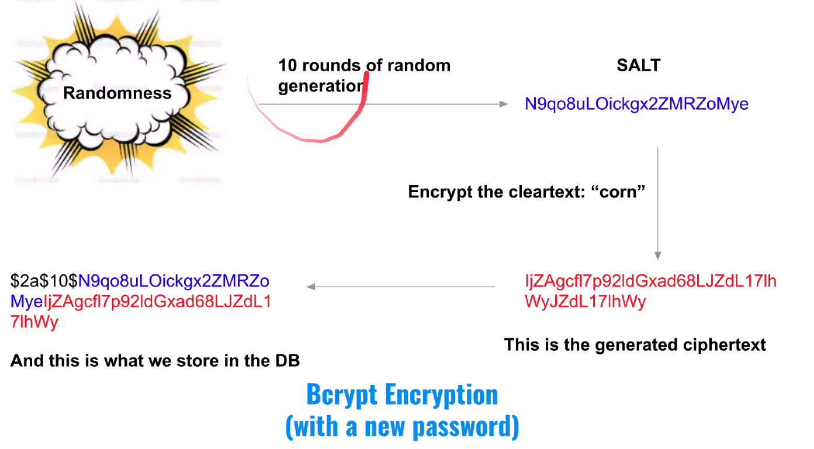

# Unit 11 - Authentication - Encryption & JWTs

JWT is pronounced JOT.

## Authentication Flow

- Browser makes a request to the server.
- Client checks credentials, stores a session.
- If verified sends a cookie to the Client.
- Client sends cookie back to Server.
- Server checks sessions table to validate cookie.

### Encryption

### Never Store Passwords as Cleartext

- **Cleartext** and **plaintext** is not encrypted.
- **Ciphertext** is encrypted.

### Using a cryptographic hash function

- Cryptographic hash functions are *one-way*.
- There is no inverse function to go from the hash back to the plain cleartext password.
- The only way to determine the stored hashed password is to hash a candidate password and see if it matches.

### Using a cryptographic hash function

Input -[cryptographic hash function]--> Digest/Ciphertext
Fox --> cryptographic hash function --> DFCD 3454 BBEA 788A 751A... etc.

### Attacking a password database

- Known hashing algos:
  - MD-5
  - SHA-1
  - SHA-2
- ***Dictionary attack*** utilizing a **lookup table**:
  - Make a list of common dictionary words or common passwords: 123456, password, password123, qwerty, starwars, admin, fuckyou, abc123, hello.
  - Make a lookup table that pre-computes hashes from all the standard hashing algorithms.
  - Go through the lookup table one-by-obe, and query the database for each hash. You will obtain all the users that have .e.g. the password qwerty if the hashing algorithm matches e.g. SHA-1.

### Mitigating a lookup table attack

- One possible way is to store a secret key on your server. Then when you store a password hash it in combination with the kye.

```JavaScript
hash('hello' + process.env.secret) --> '9as87df9as8d7f9as7df8as9'
```

### Bcrypt

- Bcrypt is a one-way hashing algorithm using a randomly generated **salt** to defend against a dictionary attack with lookup table.

- The bcrypt algorithm achieves two things:
  - Each stored password is stored with a unique salt. Because of this even two people with the same plaintext password will have different sotred passwords.
  - We can customize how slow Bcrypt performs the hash! THis protects against brute-forcing an individual user.
- Bcrypt then repeatedly hashes with the password + salt. The salt has, within it, a work factor property that indicates how many times it runs the hash.



Randomness - 10 rounds of random generation -> Salt (N2a9s8df7as9d89D98sd7fs9S8) - Encrypt the cleartext: "corn" -> 
98asd98df7SsdfDF7s9d87fyf7987dyfD - bcrypt -> $2a$10$N9qo8uLOickgx2ZMRZoMyelD98ydf9s8F - store in the db -> DB

What is stored in the database includes the salt! So we can reference the salt again!

### Attack Prevention

Bcrypt purposefully runs **slow**. In fact you can set how slow it runs as a parameter (i.e. the saltRounds);

- This makes it highly undesirable to run a dictionary attack. A lookup table is useless.

```JavaScript
// test 1
const bcrypt = require('bcryptjs');
const password = 'asdf';

console.ltime('salt10');
bcrypt.hash(password, 10, (error, hash) => {
  console.log('success! hash is:', hash);
  console.timeEnd('salt10');
})

/// test 2
const bcrypt = require("bcrypt");
const plainTextPassword1 = "DFGh5546*%^__90";

for (let saltRounds = 10; saltRounds < 21; saltRounds++) {
  console.time(`bcrypt | cost: ${saltRounds}, time to hash`);
  bcrypt.hashSync(plainTextPassword1, saltRounds);
  console.timeEnd(`bcrypt | cost: ${saltRounds}, time to hash`);
}
```

### Summary

- Bcrypt achieves two things:
  1. Each stored password will be stored with a unique salt. Therefore two people with the same password have different ciphers.
  2. We can customize how slow Bcrypt performs the hash!


### JWT's

- Provide a solution to locally storing user information.

### JSON Web Tokens (JWT)

- JSON Web Token is an open standard (RFC 7519) that defines a compact and self-contained way for transmitting info between parties as a JSON object.
- Allows us to verify if a user is logged in without having to consult a sessions table.
- This will save time as we don't have to lookup the sessions-table.

### JWT payload

- Contains:
  - Payload
    - Stored as a JSON object -> a string.
    - Sent as a cookie or within the authorization header.
  - Signature
    - A one-way hash of the payload plus a secret stored of the server.
    - Server is responsible for creating a JWT.
    - Verification of the JWT requires us to take the payload + the secret, hash it and compare it to the signature.
    - Since clients don't know the secret, they can't ever make a valid signature, and thus can't fake the JWT.

```JavaScript
{
  "name": "John Doe:,
  "admin": true
}
```

### JWT Signature

- Payload is easy to fake
- So we add a signature to the payload.
  - This is a one-way hash of the payload + a secret stored on the server.
  - The server is responsible for creating the JWT.

### JWT is Compact

- base64 encoded - smaller - transmission is fast.
- Can be sent through
  - URL string
  - POST
  - HTTP HEADER

### JWT Structure

- Consists of three parts separated by dots.

```
xxxxx.yyyyy.zzzzz
```
- Header - hashing algo name
- Payload - data in base 64
- Signature - encoded of version of header + payload + secret

```JavaScript
// Header: algorithm and token type
{
  'alg': 'HS256',
  'typ': 'JWT'
}
// Payload: data
{
  'sub': '12341543',
  'name': 'Tom',
  'admin': true
}
// Verify Signature
HMACSHA256(base64UrlEncode(header) + '.' + base64UrlEncode(payload), secret);
// Encoded:
// k3j4hg523lk45h23l5k4h.2kj4gh2k45g324k5g2k4.kj245hg3jk45hgqjk34g
```

### JWT Advantages

- Client has info about the user, expiry etc. in a signed JWT token.
- Server doesn't have to query a sessions table each time we make a request for an auth-protected resource, nor look into other tables to find pertinent user information.

## Conclusion

- One-way encryption keeps passwords safe.
- bCrypt library is used to store passwords more safely.
- Use JSON web tokens (JWTs) for quickly obtaining information about logged-in users without going to the database.
