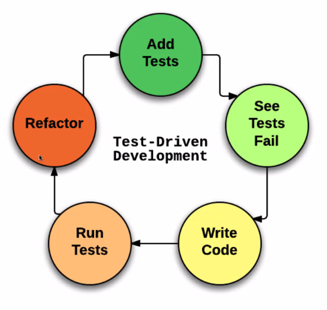

# Testing - Unit 12 - Test Driven Development

## Objectives

- Testing concepts.
- Technologies.

## Why Test?

1. We've learned how to write organized code.
2. We haven't learned how to verify the correctness of our code in an organized way. Over time the codebase becomes too large to hold in your mind at once.
3. New features can have unintended consequences.
4. It allows developers to iterate on code quickly and confidently.

## Testing Methodology

- TDD is an agile dev process.
- You write the tests before you add new code.
- Many argue that TDD results in more maintainable, readable, modular code.
- As the codebase grows, this coding style influences the architecture of the project in such a way that it can be more easily refactored, tested and iterated upon.

## TDD

1. Write a test.
2. Run the test. It should fail. If it doesn't fail, re-write it.
3. Write the min about of code required to make the test pass.
4. Run the test to check the new test passes.
5. Optionally refactor your code (for organization and clarity).
6. Repeat from 1



### Types of Tests

- Unit testes
  - Focuses on a single piece of code. Usually a function in an object or module. Isolated from other pieces.
- Integration tests
  - Multiple parts tested together. 
  - E.g. when I hit a certain http route, does that send me back what I need and store necessary info in the database?
  - This depends on multiple controllers/modules/functions.
- End-to-end (acceptance) tests
  - Test of a large part or entirety of application.
  - E.g. When I click a button A here and then hover over section B here, do I see the correct data on the screen.

### Testing framework features

- Coordination
  - Running 100-1000 tests require coordination. We want to be able to independently run tests and parallelize them.
- Assertion
  - Testing our expectations cleanly.
- Isolation
  - Failure should be clearly isolated and meaningful. Mocking and dependency injection help us make failures independent.

## Testing Frameworks

- Control the flow of tests
- Output format
- Diffing of expected results and found results

- We use Jest.

- Jest has:
  - global variables
  - describe
  - it
  - before
  - beforeEach
  - after
  - afterEach

- moCHA, JASMINE, quUnit, Mocha & Chai

### Why Jest?

- Feature rich
  - assertions, data mocking, clear console output.
- Verbose
- Tests run in parallel (*coordination*). Hence tests run faster.
- Provides tools like fake timers, spies. Other libraries need an additional library like Sinon.
- Jest also has frontend HTML DOM snapshots, where we can *snapshot* the HTML DOM and compare future results.

### Assertion Library

Jest
```JavaScript
const result = add(1,3);
expect(result).toEqual(4);
```

Other assertion libraries:
- Chai
- Should.js

## Code

- Files -> `jest_intro/__test__/reducer.test.js`
- `jest_intro/lib/reducer.js`

- package.json
```JSON
{

}
```


```JavaScript
const counterReducer = require('../lib/reducer.js');

describe('counterReducer', () => {
  let startState;
  const fakeAction = { type: 'NOT_A_REAL_ACTION' };

  beforeEach(() => {
    startState = {
      count: 0,
      fuzzies: { bears: [] },
    };
  });

  it('should provide a default state', () => {
    const result = counterReducer(undefined, fakeAction);
    // toEqual is loosely equals
    expect(result).toEqual({count: 0, fuzzies: { bears: [] }});
  });

  it('should return the same state object for unrecognized actions', () => {
    const result - counterReducer(startState, fakeAction);
    // toBe is it the same object in memory
    expect(result).toBe(startState);
  })

  describe('ADD_ONE', () => {
    let action;

    beforeEach(() => {
      action = { type: 'ADD_ONE' };
    });

    it('should increment count by one', () => {
      const result = counterReducer(startState, action);
      expect(result).toHaveProperty('count', 1);
    });

    it('should return a new state object', () => {
      const result = counterReducer(startState, action);
      expect(result).toBeTruthy();
      expect(result).not.toBe(startState);
    });
  });

  describe('CREATE_FUZZY', () => {
    let action;

    beforeEach(() => {
      action = { type: 'CREATE_FUZZY', payload: 'nice' };
    });

    it('should create a new bear', () => {
      const result = counterReducer(startState, action);
      expect(result.fuzzies.bears).toContain('nice');
    });      

    it('should immutably update the nested state object', () => {
      const result = counterReducer(startState, action);
      expect(result).toBeTruthy();
      expect(result).not.toBe(startState);
      expect(result.fuzzies).not.toBe(startState.fuzzies);
      expect(result.fuzzies.bears).not.toBe(startState.fuzzies.bears);
    });
  });
})
```

```JavaScript
const ADD_ONE = 'ADD_ONE';
const CREATE_FUZZY =  'CREATE_FUZZY';

const defaultState = {
  count: 0,
  fuzzies: { bears: [] },
};

function counterReducer(state = defaultState, action) {
  switch (action.type) {
    case (ADD_ONE): {
      return {...state, count: state.count + 1};
    }
    case (CREATE_FUZZY): {
      return {...state, fuzzies: {bears: state.fuzzies.bears.concat([action.payload])}};
    }
    default: {
      return state;
    }
  }
}

module.exports = counterReducer;
```

### Isolating Tests

The key writing good unit tests.

```JavaScript
// Actual dependency
// const dependency = require('../lib/dependency');
// Mock dependency
const dependency = function mock() {
  // hard code the result of dependency to be exactly what we would want it to return
}

function functionToTest(arg) {
  // do stuff
  return stuff;
}

const dependencyResult = dependency();

const result = functionToTest(dependencyResult);
expect(result).toEqual('something');
```

### Mocking Library

- Jest provides this out of the box

- A mock returns a stub
- Stub: the fake result that's returned from the mock.
- Spy: recording metadata for a test subject function, (i.e. spying on it);
- Fake timer: freeze time, increment time etc.

### Fixtures

- A representation of a program state, or set of data, that is used as a standard for the test to run against.

- Examples of fixtures.
  - A test database containing static, known data. We often have a prod database, dev database and test database.
- HTML of a page in your application after certain events have occurred. Jest lets us take a snapshot of our DOM, and compare subsequent test states against this snapshot.

### Testable Code

- Dependency Injection
  - Functions whose dependencies are passed in as parameters.
- Pure Functions
  - Functions which always produce the same output for a given input. We can test results without testing implementation.

```JavaScript
const dbModel = require('./db-model.js');
const sendEmail = require('./send-email-ni.js');

const userInfo = /* some info */
dbModel.save(userInfo)
  .then(() => {
    sendEmail();
  })
```

```JavaScript
const mailer = require('./lib/mailer-lib.js');
// Here is dependent code
const sendEmail = () => {
  mailer();
}
// Here is dependency injection
const sendEmail = (mailer) => {
  mailer();
}
module.exports = sendEmail;
```

### Headless Browser

For end-to-end or "acceptance" testing, we want the most realistic environment possible, i.e. a real browser.
We can automate these tests with a **headless browser** or **browser automator**.

Headless browsers: Puppeteer, PhantomJS, JSDOM
Browser Automation: Puppeteer, Selenium, Cypress.io

We use a headless browser to run front end tests when don't have a DOM provided by an actual browser.

These are intentionally light weight... just supplying the DOM.

### Testing React

### Enzyme

Enzyme is Airbnb's solution for making React testing more intuitive and straightforward.

Three approaches

- Shallows
- mount
- render

### Unit Testing React

### Enzyme: working with React Components

Enzyme is built on top of Jest.

- Note (from the docs): babel-jest is automatically installed when installing Jest and will automatically transform files if a babel configuration exists in your project. To avoid this behaviour you can explicitly reset the transform configuration options.

### Code

```JavaScript
import React from 'react';

const PeopleList = props => {
  const { people, title } = props;

  const peopleList = people.map(person => <Person person={person} key={person}>)
}
```

```JavaScript
import React from 'react';

const Person = props => {
  return (
    <li>
      {props.person}
    </li>
  );
};

export default Person;
```

```JavaScript
impot React from 'react';
import { configure, shallow, mount } from 'enzyme';
import Adaptor from 'enzyme-adaptor-react-16';

import PeopleList from '../PeopleList.js';
import Person from '../Person.js';

configure({ adaptor: new Adapter() });

describe('PeopleList', () => {
  let wrapper;
  const props = {
    title: 'Basketball players;,
    people: ['Stephen Curry', 'Kevin Durrant']
  };

  beforeAll(() => {
    // this is shallow, can't see each <People> component
    wrapper = shallow(<PeopleList {...props} />);
    // this is deeply nested
    wrapper = mount(<PeopleList {...props} />);
  });

  it('Renders title and components according to props', () => {
    expect(wrapper.find('h1').text()).toMatch('Basketball players');
    expect(wrapper.find(Person)).toHaveLength(2);
    expect(wrapper.find('li')).toHaveLength(0);
  });
});
```

### Server side testing

- Supertest: High-level abstraction for testing HTTP routes.
- Superagent: Underlying http request library used in supertest.

```JavaScript
describe('GET /user', function() {
  it('responds with json', function(done) {
    request(app)
      .get('/user')
      .set('Accept', 'application/json')
      .expect('Content-Type', /json/)
      .expect(200, done);
  });
});
```


### Summary

- Jest for FE
- Enzyme for React components.
- Puppeteer offers a headless browser, or browser automation.
- Supertest is good for http server integration testing.


### Questions

Accessing state?

When should I use a spy instead of a mock?

How exactly does toEqual work? do both object need the same properties, or could one of them have extra?

What would happen if I used math.random in a reducer.


Announcement about the lecture.
