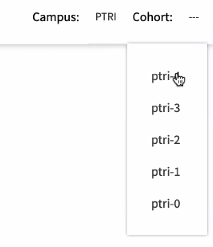

# Onboarding

## Core Concepts to Stress to Residents

- Support each other!
  - This is the most effective way to grow at Codesmith
- You're here to learn
  - Not to show off how much you already know!
- Trust the process
  - Codesmith has held the highest median starting salary for all CIRR-member schools for H1 and H2 of 2018
- You are here to do more than just learn to code
  - Our missions is to create the next generation of leaders in technology

- Encourage students to reach out to their cohort mates for support.

- We are not teaching students everything there is about react
  - We are teaching students how to learn and learn quickly
  - The best way to teach that is with minimal hand holding

- If they haven't googled the error:
  - Tell them to google the error and get off the help desk

## Help Desks

- THEY SHOULD SPEND AT LEAST 30-45 MINS BEFORE REACHING OUT ON HELP DESK
- DO NOT SPEND MORE THAN 45 MINS ON HELP DESK YOURSELF
- DO NOT GIVE A LECTURE

1. What's the problem?
2. What did I try?
3. What I expect to happen?
4. Why I suspect it's not working?

People will often not take the problem seriously.

### Why do we help desk?

- Builds autonomy in the residents
- Forces residents to become exceptional explainers
- Pushes you as Fellows (students ask tougher and tougher questions)

### Help desk requests are set up this way for a reason?

- Conditions residents to think through all these questions
- Establishes a rapport
- Gives you the space to prep
- Gives you the space to get flow

### Intro Questions

1. What's the error message?
2. What do you think this means?
  - If they haven't googled the error message, leave.

- Hey, hop in so and so's room, they have the same error

### Help Desk Process

- Process matters - no more than 5 min wait
- Realize that the problem you are solving not their problem. Your problem is how to lead them towards discovering the solution. Never give the answer!
- Take them back to the instructions/requirements and make sure they parsed them correctly
- "Talk me through line by line"
- Inspiring confidence
- Unending patience
- Confidence to step away

### Tough Help Desk Problems

- Don't let imposter syndrome catch you
- Inspire confidence in students. If you don't know the answer, work it out with them.
- Always have the solution code handy!

## Hack Hour & Approach Lectures

- You are scheduled to watch the 'How to give lectures at Codesmith' videos later this week (Responsibilities Doc)
- Select yoru Hack Hours & Approach Lectures Asana
- There are solutions to HH linked in your "Fellow Responsibilities" Doc
- Release HH (and Units) through the Release GUI
- Iterate and self-improve (through feedback) on your presentation style and explanatory ability - this will be a major contributor to your job search success

## Release GUI

[release.codesmith.io](https://release.codesmith.io/)

- Top right select `PTRI` and the cohort:

Then click and release the relevant hack hour/repo

- Don't release before stand up.

## Hack hour solutions

hack-hour-rewrite/solutions

## Hack Hour Strategies

https://drive.google.com/drive/folders/14YwE8BbJ0FRsRmZtyNHEa5QmHIjqv2z_

=> Fellow Curriculum => Hack Hour Strategy Lectures => video & slides

## Approach Solutions

challenge-solutions

- Checkout to the correct branch
- Choose the ones that say new, but not the ones that say advanced

In the google drive, there is a file called Approach Lectures each with
- The slides
- The recording

https://drive.google.com/drive/folders/14YwE8BbJ0FRsRmZtyNHEa5QmHIjqv2z_

=> Fellow Curriculum => Approach Lectures

## Instruction Best Practices

- Get setup at least 5 mins before you start presenting
- TURN THE CHAT OFF

How to handle:
- Lecture disruption
- Not engaging/cameras off
  - Please message me in the zoom chat why, so I know you are engaged and present
- "What if..."
  - "That is not within the scope of this conversation. But why don't you do some research and DM me (or share it with the group)! We can chat about this separately..."
  - "Happy to talk about it at the end of lecture"
- Resident asks a questions you don't know the answer to
  - "I don't know..."
  - If its a good question "... but I'd be happy to do the research and get back to you"
- Lateness/Starting on time
  - Start after 5 mins
- Residents "pushing back" against approaches
  - It's a solution, not the only solution
- See Cultural Issues Guidebook

## APCs - Academic Progress Check Ins (APCs)

- Should not be spending more than 45 mins. 1 hr MAX.

- They should come to the APC having tried to refactor their code
  - Hence they should be coming in with questions

- If they haven't refactored their code LEAVE. Then reschedule

- Sometimes it happens that you are just pair programming for 40-45 mins

- Encourage them
- Ask questions and guide them
- Reassure them they haven't failed their test, we are just checking in with their level of understanding

### APCs - How to track the student progress

- Read through the 'how to track students progress' doc
- Always fix the issues with the assessment prior to stepping in for the APC
- Have them walk through and technically communicate what is happening in their code. this will help you identify where their disconnect is.
- Should be scheduling in "down time". Ideally this should be lunches or dinners
- APC should take roughly 45 mins
- Should be completed by EOD Saturday
- Notes should be easy to send out by LTM
- If a student is not prepared for their APC, ask them to refactor and reschedule
  - If this is a continuous issue, reach out to Lead or PC

## Reminders for this week

- Similar to the program, it will be a firehose of information!
- Don't be afraid to ask questions and lean on your Fellows
- Check the Fellow Calendar for your schedule
- What Onboarding Videos together!

## Last day

November Sat 27th is the last day
