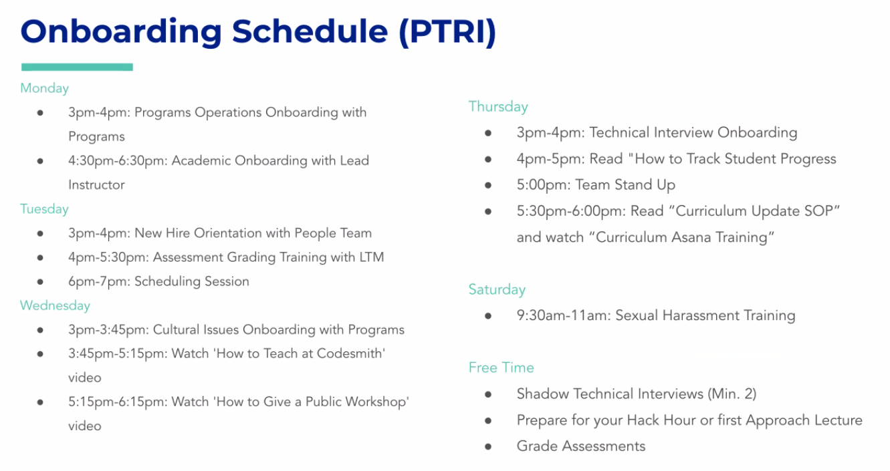
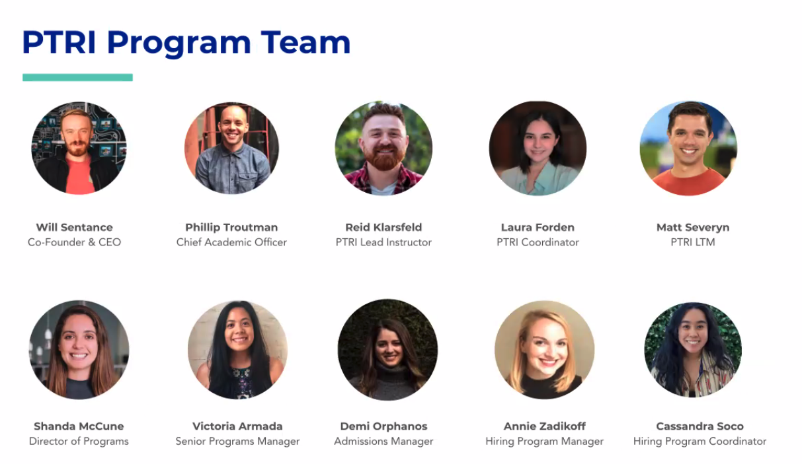
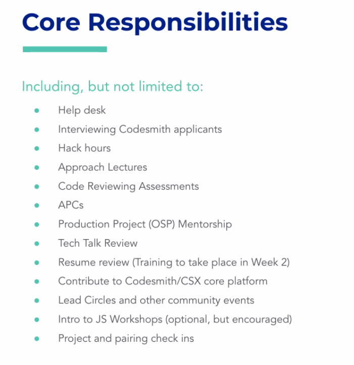
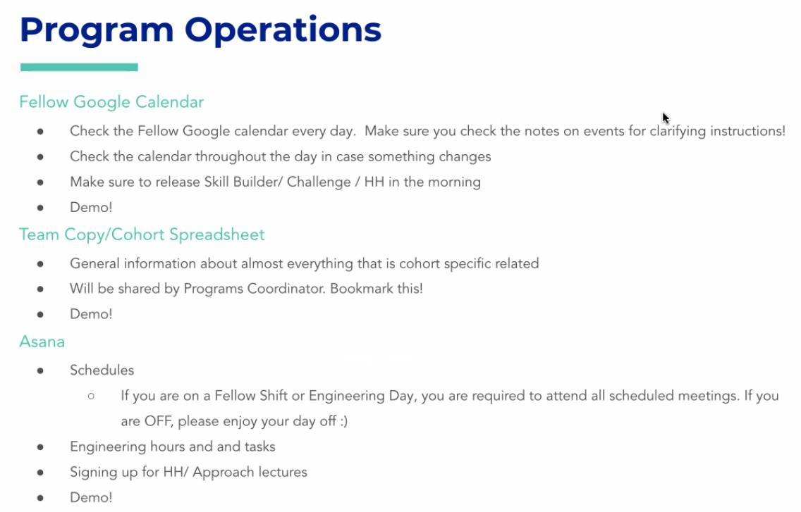
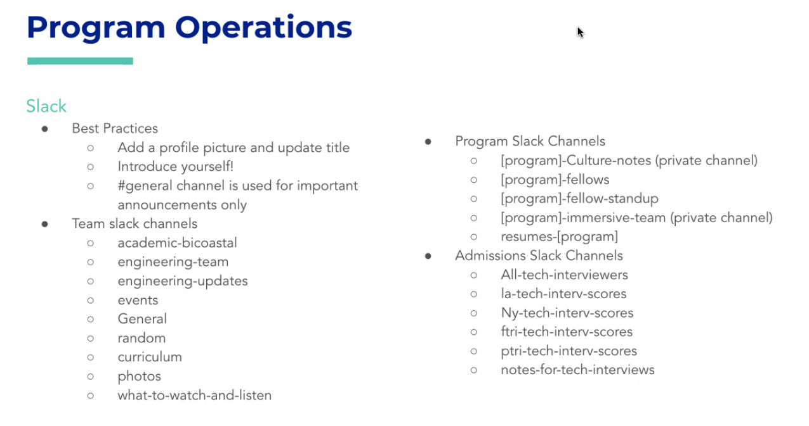
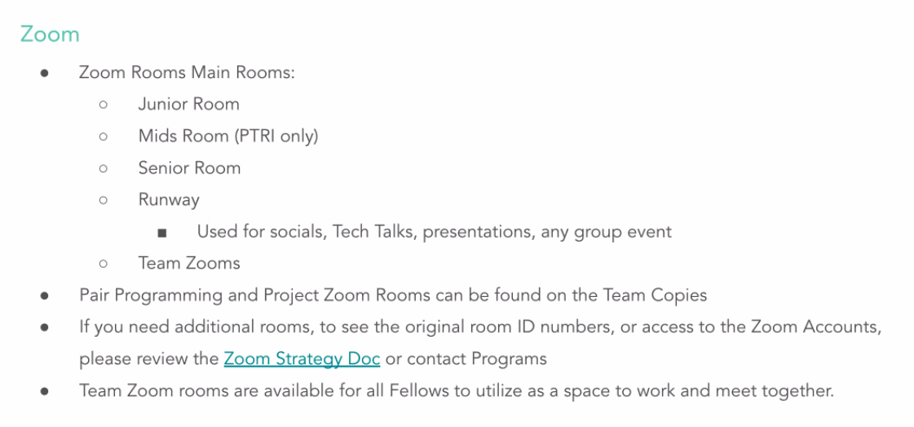
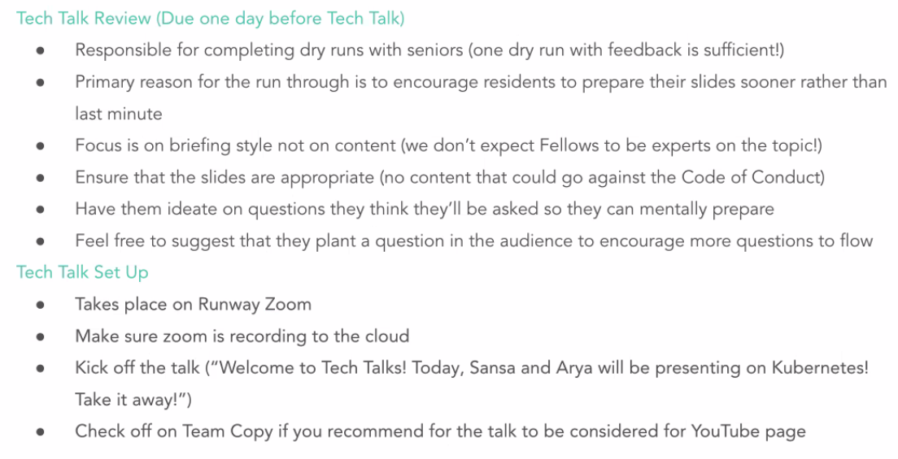

# Welcome to the Team - Laura Forden - Program Coordinator

PC = Program Coordinator (Laura)

Laura Hours => 9am => 6pm => 973-775-2493 => laura@codesmith.io

## Objective

- Explore responsibilities

## Onboarding Schedule

## PTRI Program Team

## Part Time Fellowship Overview

- Week 0
  - Onboarding Week!
  - Technical Interview Training
  - Grad Assessment Review/Training

- Week 1-12
  - Core Curriculum for Juniors
  - Help Desking
  - Preparation for Approach Lectures and HHs
  - Senior Resume Review Process
  - Production Project Mentorship
  - SDI Whiteboarding Preparation
  - Grading tr-weekly assessments & APCs (APC is a one on one with student who failed an assessment)
  - Scratch, Iteration, and Reinforcement Project Mentorship
  - Preparation for HHs
  - Join Hiring Program Lectures!

## Core Responsibilities

## Resources

- Fellow Tips and tricks => almanac.io => Codesmith resource google
- Fellow Program Ops
- Team Zoom Room
  - Hang out here whenever you'd like!
  - Can be found on Zoom Strategy Doc
- Codesmith Team and Senior Fellows!
  - Don't be afraid to ask questions
- Check ins with PCs, Leads, LTMs

## Program Operations

Recurring Meetings

- Daily Fellow Standups
  - Schedules and daily announcements
- Academic Standups
  - Come prepared with updates on your Production Project group, resumes, APCs/grading & cultural issues
- COdesmith MOnthly All Hands
- Academic Bicoastal
- Pramod's Office Hours (optional)
- Peach Tri

## Slack

- Update your profile picture
- Update title to Engineering Fellow

## Zoom

- Zoom Rooms Main Rooms:
  - Junior Room
  - Mids Room (PTRI only)
  - Senior Room
  - RUnway
    - Used for socials, Tech Talks, presentations, any group event
    - Team Zooms
  - Pair Programming and Project Zoom rrooms can be found on the Team Copies
  - If you need additional rooms...

## Tech Talks

Tech Talk Review (Due one day before Tech Talk)
- One dry run is sufficient
- Primary reason is to encourage them to prepare sooner rather than later
- Focus on style not content
- Ensure slides are appropriate
- Have them ideate on questions
- Feel free to suggest they plant a question in to the audience to encourage more questions to flow

Tech Talk Set Up
- Takes place on Runway Zoom
- Make sure zoom is recording to the cloud
- Kick off the talk ("Welcome to Tech Talks! Today, Sansa and Arya will be presenting on Kubernetes! Take it away!")
- Check off Team Copy if you recommend for the talk to be considered for YouTube page

## Community & Culture

Community Events/Responsibilities
- Junior Welcome Breakfast
- Team/Senior Intros
  - Emphasize to seniors that they must come up with something technical they can serve as a resource for
- Junior Welcome Party
- Family Dinner
- Circles
- Thursday Night Events
- Graduation/Final Shout Outs

Office Hours
- Check ins with students
Culture Notes (#culture-notes)
- Used to notate anything related to residents (Ex. imposter syndrome, good or bad group dynamics/PP sessions, APCs, missing from standups, etc)
  - Attendance
- Monitored by PC
Managing Cultural Issues
- Consult with Programs Coordinator
- Separate training on this later this week!
Resources
- Cultural Issues guidebook
- Code of Conduct

### Questions
