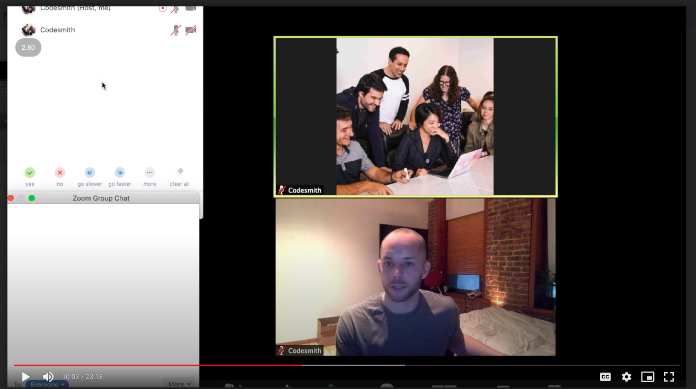

# Online Teaching

- Say 'Dave, ...[Question]' so they have time to unmute.

- Ask people to tune in. Do not tune out, You will do better if you listen!

- I'm going to call on James, Jenna, Zaio and Matt. Okay..
  - T them up ^^^

- Be more facially dynamic
- Intonation and inflection of voice

- Show people who you are
  - Show them around your room, where you are.

- Acknowledging people in different time zones

- Sign posting up the next section. In 5 minutes we will

- Find the mute all button

- Maximize size of other peoples video streams
- Open to the left the chat and manage people tabs

- Make sure the computer is the host

- Add in blank pages in between the slides where you want to diagram
- Use stickers for bits you need to reuse