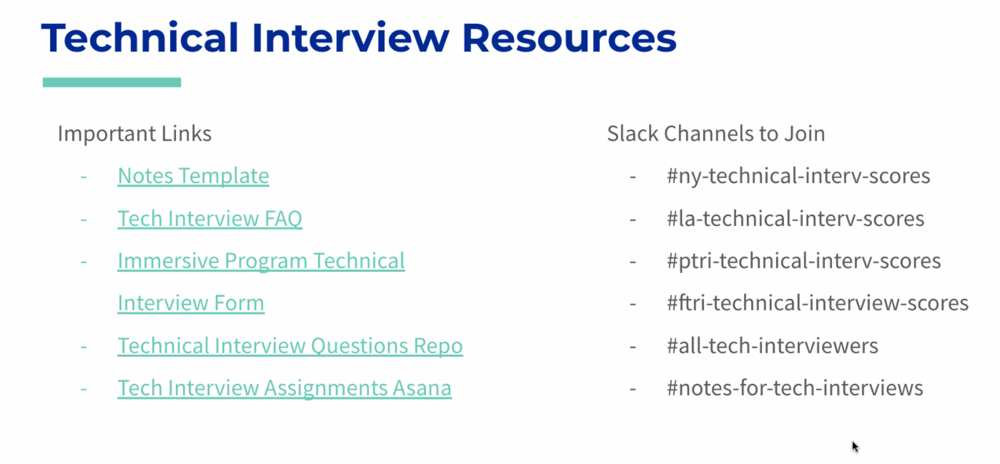
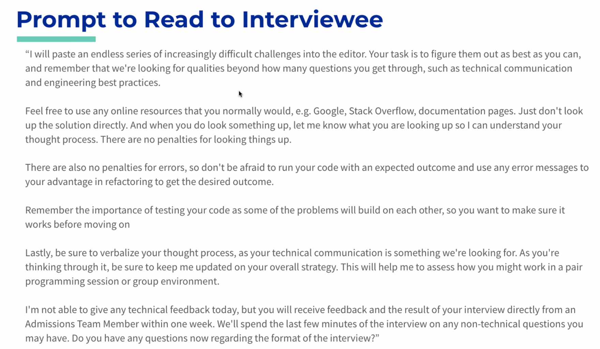
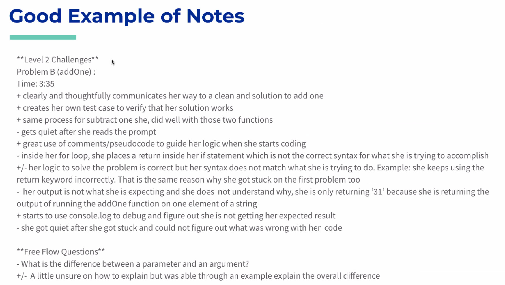
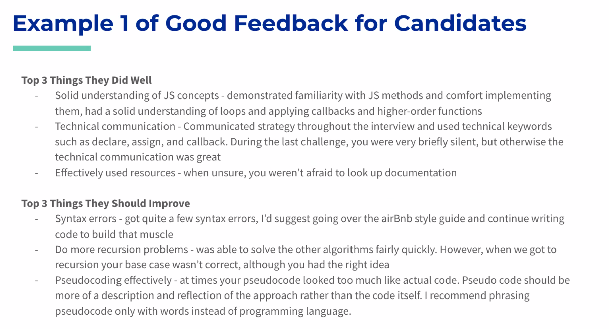

#  Technical Interviews Onboarding

- Interview Form
  - Fill in this form while you are conducting a technical interview

## Resources

- Post in
  - ny-technical-interv-scores
  - ptri-technical-interv-scores

## Important Admissions Team Contacts

- Admissions Coordinators:
  - NY: Elizabeth
  - LA: Anisha
  - PTRI: Laura
  - FTRI: Ashanti
- Admissions Manager: Demi

## Shadowing a Technical Interview

- Have the fellow start a zoom with you and share their screen and audio
- Make sure the shadowers are muted
- Interviewer should then join the google hangout

## Pre Interview

- Interviews are assigned in Asana
  - Codesmith Technical Interviews - Asana board
  - They are rescheduled regularly
    - Hence check before hand
  - Be prepared to help with interviews for all programs
  - Review the Tech Interview Onboarding doc
- Try not to have the same fellow interview the same person more than once
  - If you have already assigned yourself for a candidate, do no reassign yourself to them!
- Remember that you should start taking technical interviews no later than week 1 of the program
  - Take 2 interviews per week

## Accountability

- If an interview get rescheduled and you cant make it
  - Drop the interview
    - Let the admissions team know you've dropped it
    - If it's less than 2 business days away
      - Slack Laura/Ashanti to let them know
- If there are not enough interviews to go around
  - Don't be that person if you can avoid it.
- If you pick up an interview and need to drop it because of conflict:
  - If it's more than 2 business days away => remove yourself from asana
  - Less than 2 business days away => slack Ashanti/Laura
- The admissions team will review how many Technical Interviews you do

## Preparation

- Search #notes-for-tech-interviews channel for any notes on the applicant. Search by email
  - If you don't see notes, DM the Admissions Coordinator for the program to confirm that you are still starting the interview on level 1
  - OTHERWISE YOU WILL WASTE EVERYONE'S TIME
- Confirm whether the interview is onsite or remote
  - All interviews are currently remote
  - Remote = google hangouts link in the calendar

## Interview Setup

- Make sure the workspace is setup ahead of time
- csbin.io/interview/{{interviewee's name}}

## The Technical Interview

- Be kind and welcoming
- Read the 'How to Start An Interview' prompt to the interviewee - make sure to hit on EVERY piece
- Once you are done answering any questions, confirm the following:
  - Cohort Start Date ("What cohort are you aiming for?")
  - Interview Number ("I want to confirm this is your X technical interview?")

## Prompt to Read to Interviewee

## During the Interview - Flow of Questions

- Guidelines for releasing questions:
  - Level 1: start with one level 1 problem, then move on to level 2 if they easily solve the first question
    - Lvl 1 qs assess Variable & Functional Declaration, for loops & iteration
  - Level 2: the applicant should complete two level 2 problems before moving on to level 3 (unless otherwise noted by admission)
    - Lvl 2 assesses Control Flow & Logic, Callbacks & Higher Order Functions
  - Level 3: should complete two level 3 problems before moving on to level 4
    - Lvl 3 assesses closure & recursion
  - Level 4: very difficult questions involving complex logic, highest level given on the interview (similar to Senior Hack Hours)
    - Should really only be used so we can see applicants hit a tough block

## During the Interview - Best Practices

- If a candidate does not show up after 5 mins, you can logout and let the coordinator know
  - Post in PTRI tech interview scores - no show
- You can give "guided recommendations" to interviewees if they are really stuck
  - Good rule of thumb - if someone isn't going anywhere for 5-10 mins, thats a good time to jump in
  - Remember we are scoring on analytical problem solving and debugging, so use your best judgement
- If the interviewee is not communicating, you can let them know they should explain their thought process and code
- Make sure that the candidate hits a block/gets stuck in each interview
- Ask them free flow questions, can be from the list of your own questions based on their interview
  - This is good if there is not much time left, but say you want to know what their understanding of say clojure is

- You can put unicorn emojis on your review

## At the End of the Interview

- Make sure that the candidate learns something in each interview
  - Walk them through whatever they get stuck on, whiteboard etc.
- Do NOT give feedback directly to the student (even if they ask how they did)
- Ask if they have any questions about the program
  - If they start asking a lot of questions, it's okay to say 'I'll have the admissions team send you a link to schedule a call with an academic advisor'
- Try to keep interviews to 60-70 mins total (we don't want you spending two hours on one interview!)
  - Writing the notes should not take an additional 40 mins

## Pair Programming Technical Interview

- Will appear on Asana like a normal interview, but you can tell from the notes in the #notes-for-tech-interviews channel
- This means they have NOT been accepted yet
  - You fill out the technical interview form
  - Switch driver/navigator roles
  - Can use qs from from JS fundamentals
- There can several reasons for the interview to be conducted this way
  - Usually to assess technical communication
  - Cultural concerns
  - Deep dive on a certain topic
    - We also sometimes to do this to ease the nerves for the interviewer

## Pair Programming Session for Accepted Students

- Already accepted (ex/ NAME: Codesmith New York Immersive, Pair Programming for Accepted Students)
- No need to fill out the form
  - Still check #notes-for-tech-interviews channel
    - If you don't see any ping the Admissions Coordinator!
- Best practice to send notes (if you have any) from the session to Admissions Coordinator

## Admin: After the Interview

- Submit form in a timely manner
  - Include special circumstances in your notes e.g. bad internet connection
- After you have submitted it, post in #la/ny/ptri/ftri-tech-interview-scores channel
  - Samantha Salley (1st Interview) - 9/8/10/9/8 - Accept
  - Schno Mozingo (3rd Interview) - 6/7/7/5/4 - SR 4 weeks (SR means soft reject)
  - Phillip Troutman (1st Interview) - No Show

## Scoring

- THEY NEED 2 LEVEL 3 PROBLEMS SOLVED TO SCORE 8

- Score the interviewee in each of the following categories
  - JavaScript Experience
  - Technical Communication
  - Non-Technical Communication
  - Analytical Problem Solving
  - How Do They Handle Working Through Blocks
- Use the guidelines on the interview form when scoring for each category
  - Scores 8 and up are considered passing
  - If you are suggesting that an applicant be rejected off a category, make sure your scoring reflects that!

## Writing Your Notes from Interviews

Make sure to write notes in the following format - include:
- On-site or online
- Level: **Level 1 Challenges**
- Problem Letter: Problem A
- Problem Name: (addNumbers)
- Time: (can be the time into the interview or the actual time)
- + and - signs for notes (to indicate if something is positive => non technical people reviewing it)
- Free flow questions

## Good Example of NOtes

## Writing Your Additional Notes for Admissions

- This section is for you to speak directly to admissions team. If there was anything that happened during the interview they need to know let them know.

## Red Flags

- Let them know!

## Writing Your Feedback for Candidate

- This section will be sent directly to the candidate, and the admissions team will read this directly to the candidate on the phone. Please ensure that this is written as if you are speaking to the candidate (you can use "you"), and that the feedback will give the candidate the tools needed to pass their next interview.
  - Please write this out in list form
    - Top 3 Things they did well:
      - Focus on their technical strengths in the interview
    - Top 3 things they should improve on:
      - If a candidate scores a 6 or lower in any category, it should be included in this section

## Example 1 of Good Feedback for Candidates

### Questions

Where to post?

What does SR mean?
