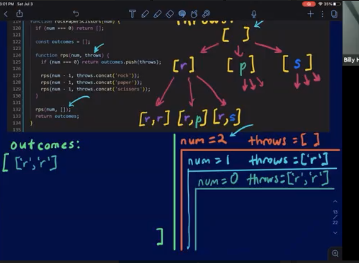
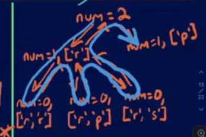
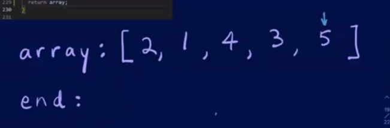
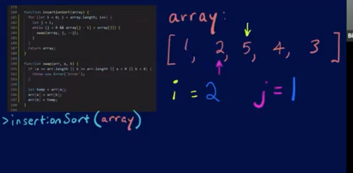
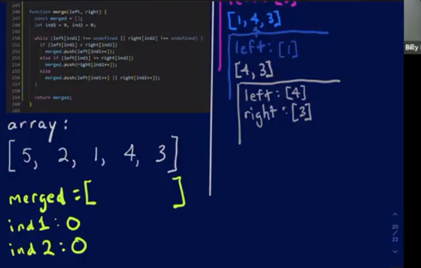

# Algorithms Approach Lecture Notes

## Objectives

- functionBind
- rockPaperScissors
- mergeSort
  - bubbleSort
  - insertionSort

## functionBind

this references the object that is currently calling the function

- PRACTICE THIS ONE LOTS

## rockPaperScissors

- Draw executions contexts

- Draw tree

## mergeSort

### bubbleSort - OPTIONAL

- Manually go through the array

## insertionSort - OPTIONAL

- Manually go through the array

## mergeSort

- bubbleSort and insertionSort => T O(n^2)
- mergeSort => T O(nlogn)

- Divide and conquer strategy

- Manually go through it

