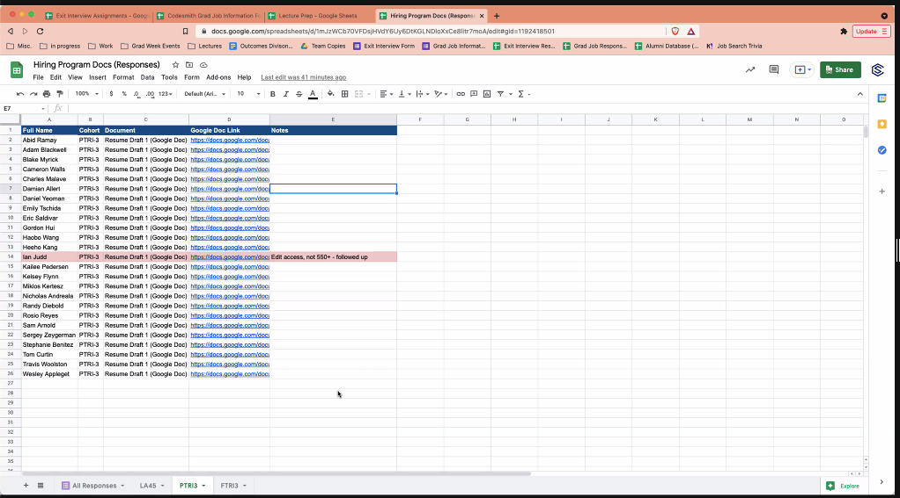

# Resume Grading

Most of the resumes aren't due for edits.

- 1st Draft
  - Due: Thur Oct 13th

- 2nd Draft
  - Draft 2: Due Oct 27th

- Be done by Mon nov 24th.
  - Due november 6th

Should take 30 mins to an hour.

You don't need to meet face to face with each student but it is recommended.

- What, how, why, why format.
- Convert last experience into the same format.
  - Every bullet should be formatted in the same way.
  - So pre-codesmith and post-codesmith looks the same
    - Doesn't look like a career change

- Can say just apply this throughout the document.
  - Don't rewrite it for them.
  - Give them suggestions, but let them do the re-writing.

- FINAL DUE DATE: NOV 6TH

- Watch the related videos

## Tips

- Use the comments very heavily, they like to see more comments than less.
- Talk with whoever you are reviewing, so you know who they are how they are representing themselves.
- Make sure they are showing engineering decision making.
- Leave some remarks about something => 'oh why didn't they include this?', 'why did you add this?', 'you are likely going to get asked about this in interview'.
- Thought provoking comments.

## Questions

- What, how, why, why?
  - What is it
    - How did you do it
      - Why on a micro scale
      - Why on a macro scale
  - See the resume prep doc

## Slack message

notes from today! Let me know if you have any questions & if you’d like the recording!
SUBMITTING RESUMES & WHERE TO FIND THEM
Hiring Program Docs Form: https://docs.google.com/forms/d/e/1FAIpQLSeutpw7ikQdS08Yshb2qecTryY-uRgpHR6-BlYv6YOxBCguEA/viewform
Hiring Program Docs (Responses): https://docs.google.com/spreadsheets/d/1mJzWCb70VFDsjHVdY6Uy6DtKGLNDloXxCe8litr7moA/edit#gid=1192418501: refer to the PTRI-3 tab at the bottom!
You MUST highlight a row red if resumes are not 550+ words and not begin grading yet (I will usually catch all of them before they get to you, but let me know if I missed one!)
Students will have until EOD Thursday (9/30) to meet the word requirement or they won’t get an edit on draft 1
DUE DATES
Lecture: Resume Development - Tuesday, September 14 at 5pm PT
Resume Draft 1 Development - Tuesday, September 14 at 6pm PT
Resume Draft 1 Due - Saturday, September 25 at 3pm PT
*Edits should be done by Thursday, October 14 at 4pm PT
Resume Draft 2 Iteration - Thursday, October 21 at 5pm PT
Resume Draft 2 Due - Wednesday, October 27 at 5pm PT
*Edits should be done by Monday, November 1 at 3pm PT
Sometime between November 4 and 6: Sit down with your open source product group and confirm all resumes are ready for final sign-off by the HSE. On November 6 - confirm everyone in your group has uploaded their final resume to the Hiring Program Docs Form.
Final Resume Iteration - Thursday, November 4 & Saturday November 6
Final Resume Due - Saturday, November 6 at 3pm PT
Final Resume Sign Off from HSE - Sunday to Thursday, November 7-11
BEST PRACTICES:
Each resume iteration will take between 30 mins-1 hour per resume
You don’t need to meet face to face with each student, but is incredibly helpful, especially during Draft 1 Edits and before submitting the final resume for sign-off
Focus on “what, how, why, why” on ALL bullet points
Watch out for “what, how, why, why” vs. old bullet points on prior experiences
Biggest area of coaching is on framing prior experience with residents, otherwise there is a huge distinction between pre and during Codesmith experience
Repetitive notes, mention this applies throughout the document
The idea is not to re-write the resume, but to guide on best practices, this may mean formatting a few bullet points well to direct the resident in the right direction
COMMUNICATION NORMS:
YOU fully manage the resume of each of your residents
Any questions direct to the #resumes-ptri  channel
If a student is behind or not following guidelines, flag in #resumes-ptri  channel
Final Resumes should be job application ready by the time they are submitted
RESOURCES TO REVIEW:
Codesmith Resume Guide (UPDATED): https://docs.google.com/document/d/14PctH57j3T5gzeNRipJdOfv-dWtY-VT5KTURcB_7jWM/edit
Resume Prep Doc: https://docs.google.com/document/d/12-4V44WkUCxqCHLc2vRkuMSRPs5XPHnsFFr6fyALOz4/edit
Fellowship Tip Sheet & Quick Links (List of action verbs): https://docs.google.com/document/d/1WPXnkRVWYY9Xxy2Hg_TYlKHx_5NK7ufUHQbC_So822g/edit
Resume Training Video: https://drive.google.com/file/d/18IyDwOP6IEV0J_iMlM0U-wTQnCffBy4n/view  (Watch until 0:29) - WATCH BEFORE EOW
Resume Training with Luis:  https://drive.google.com/file/d/1RIGrF1R6zSiHvC2P1Xtm4F4vmppdpgEl/view (WATCH BEFORE EOW!)