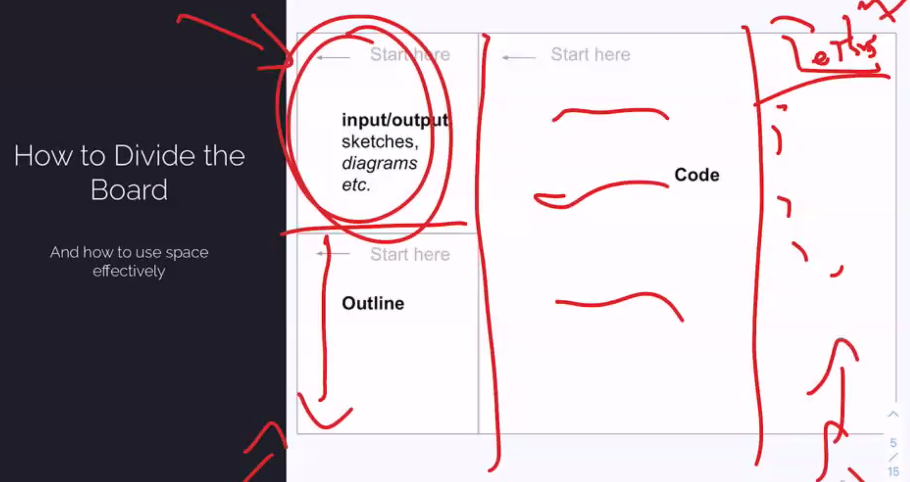
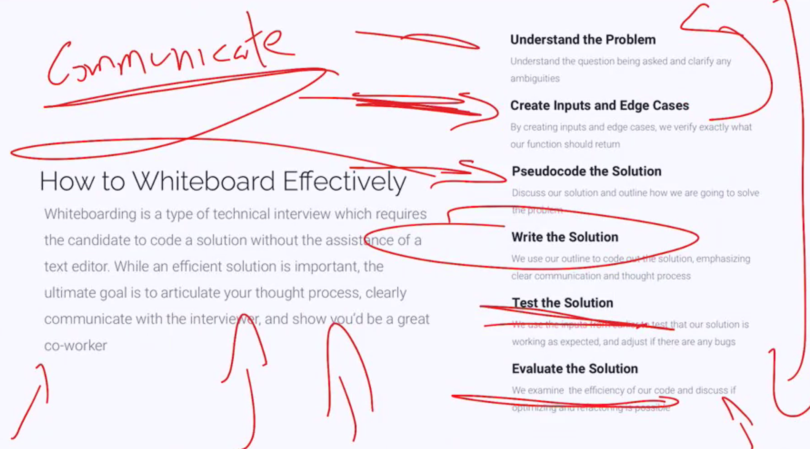

# Whiteboarding

## What is Whiteboarding

- A 1 on 1 with a software dev
- System design/algo
- Timed (usually 45 mins)
- No assistance of a text editor/web browser
- Completed by hand via whiteboard, tablet/paper

## What a whiteboarding interview is not

- A pass/fail

Rather it is trying to analyze:
- Your though process and ability to communicate
- How you break down a problem and handle a new challenge
- Soft skills
- Technical ability

## The Process

1. Understand the Problem
2. Create Inputs and Edge Cases
3. Pseudocode the Solution
4. Write the Solution
5. Test the Solution
6. Evaluate the Solution


## How to Divide the Board



## Understanding the Problem

- **Identify** inputs and outputs
- **Note** any obvious constraints
- **Repeat** the question back to the interviewer in **your own words**
- Ask **clarifying questions** that come to mind

E.g.

- What is the desired return value?
- Do punctuations and spaces count as chars?
- Should this case be considered? Are 'a' and 'A' duplicates
- Return the first duplicate char or all duplicate chars?

## Creating Inputs and Edge Cases

- Start with clearly defined I/O
- Think about edge cases
  - Which may causes a problem?

## Pseudocoding the Solution

- Interviews are about **communication** and **thought process**.
- The interviewer may poke holes in your solution. **Don't disregard their input**
- Outline your solution **on the board** before you write code.
- Understanding the problem, creating inputs and pseudocoding should take **33% of the total time**

## Writing the Solution

- Use your outline to communicate the code you are about to write
- Face the interviewer when talking
  - Face the board when writing code
...

## Testing the solution

- Use the test I/Os you wrote earlier.
- Going line by line and **saying each line aloud**
- Writing out any temp variables and updating them when they change
- If an error is caught, don't panic, explain the issue, and talk through the solution to the bug.

You are showcasing your **communication skills**

## Evaluate the Solution

- Time and space complexity
- Communicate how to optimise
  - If you cannot think of a more efficient solution, verbalize this to the interviewer, they may provide hints
- Be prepared to re-write code if asked.



```JavaScript
{
  [__typename]: [fieldName]
}