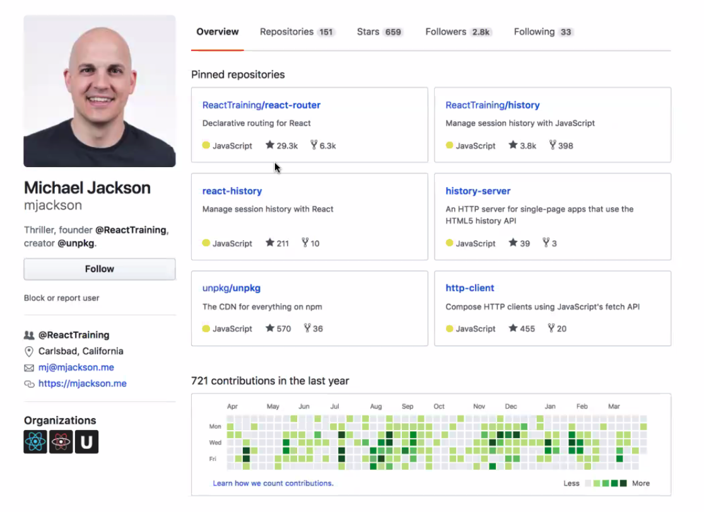

# GitHub Cleanup

## Overview

Make sure to follow best practices on your Github.

## Why do we care?

Your GitHub page should be clean ready for potential employers and colleagues to view.

Your page says a lot about who you are.

## Big Picture

People look at your contributions and your projects.

## Followers / Stars

Make sure that you have:

- Followed every one of your cohortmates.
- Starred 3+ of your cohortmates top projects (ask them which ones).
- Starred at least 10 major projects you like.
- Ensured all your cohortmates have followed you.
- Ensured all your cohortmates have starred your choices.

- Nothing too distracting
- Organizations -> with real logos on them.
- You should pin at least 3 projects that you are proud off.

## Projects

Make sure you have:

- Added a test folder to each of your top 3 most starred and 2 most recent projects (and have tests written for them).
- Commented your code in the top 3 projects.
- JSLinted your code for your top 3 projects (and include an eslintrc file or eq)
- A README.md in the root of each project directory.

## Tests

Your top 3 projects should have tests and show your ability to write test code.

- Are you someone who will easily integrate into a team?
- Can you work in TDD and BDD workflows?
- Does your coding approach promote validation of a spec per feature? Is it readable and clear?

## Comments

Make sure your code is commented in a clear and readable way.

## README.md

Include:
- Summary
- Screenshots
- How to get started
- How to run tests

## Other Suggestions

Logs
- Remove all embarrassing console log messages

Git Commit messages
- Clear and descriptive
- Individual files have different messages.
- Commit messages can be edited.

## To Do

Add Logos to GitHub Organizations.
