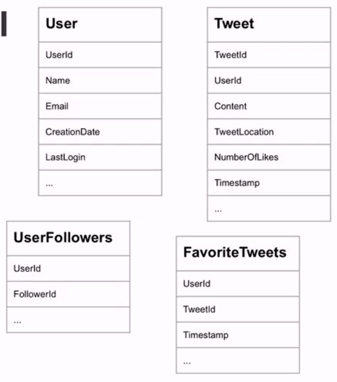
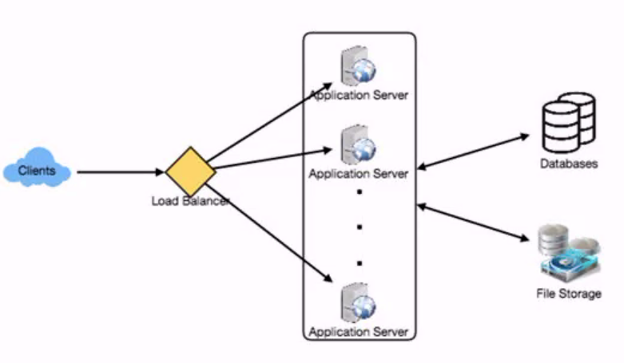
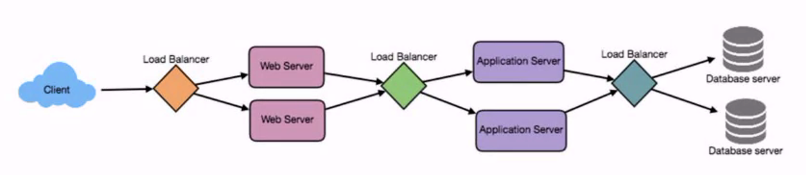
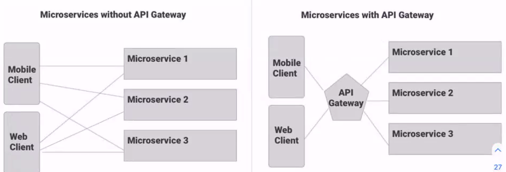
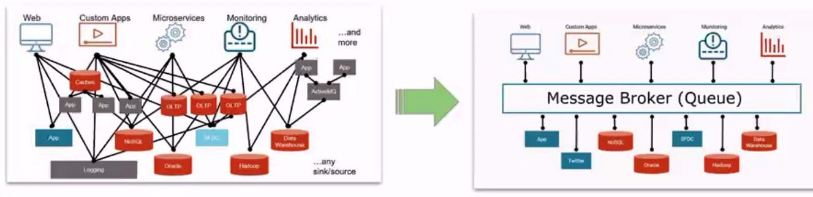
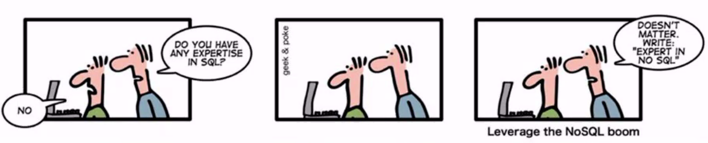
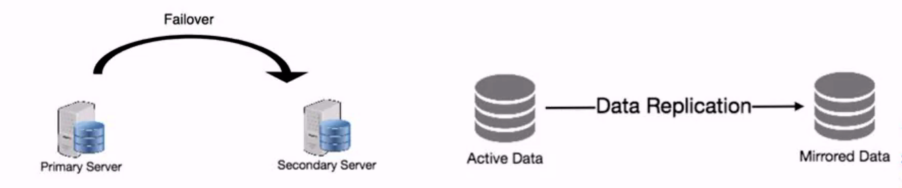
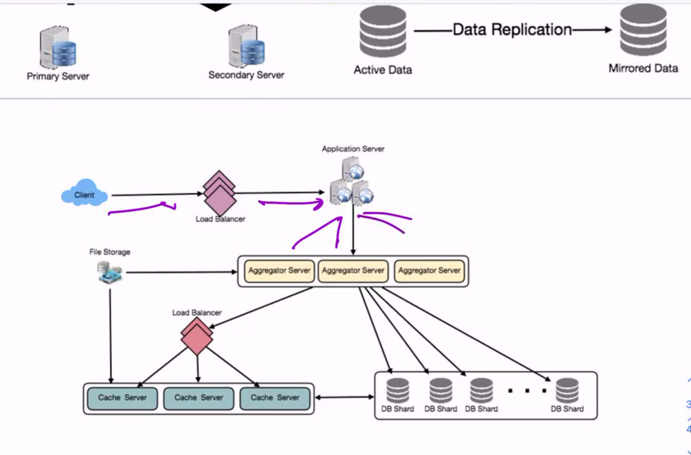

# System Design

- Preparing for System Design Interviews

## Why?

System Design interviews are becoming more and more frequent.

## We're going to do this in two steps

1. We'll go step 
2. We'll....

## What kind of System Design questions might we see?

- Build Netflix
- Build Twitter
- Build a web crawler
- Build Facebook
- Build Instagram
- Build Dropbox

(I'm gonna need you to create twitter in 45 mins)

- There is no one right answer, it's more thoughtful and conversationally based.
  - It's about discussing tradeoffs

## 3 Things

1. **Scoping the problem: Don't make assumptions**; Ask clarifying questions to understand the constraints and use cases.
2. **Sketching up an abstract design**: Illustrating the building blocks of the system and the relationships between then.
3. **Identifying and addressing the bottlenecks**: By using the fundamental principles of scalable system design.

## Scope the Problem

- Never dive straight in.
- Start out by asking questions.
  - Who are users and what are their needs?
  - What is the exact scope of the problem we're solving?
  - What are non-functional requirements?
  - What are our stretch goals?

Design questions are mostly open-ended and they don't have ONE correct answer, that's why clarifying ambiguities early in the interview is critical.

Candidates who spend enough time to clearly define the end goals of the system always have better chance to be successful in the interview.

### Ask Clarifying Questions

- How many total users do we expect? How many active users per day?
- Will users of our service be able to post tweets and follow other people?
- Should we also design to create and display user's timeline?
- Will tweets contain videos?

## 2. Get a rough estimate of scale (OPTIONAL)

It's always a good idea to estimate the scale of the system your're going to design. This would also help later when you'll be focusing on scaling, partitioning, load balancing and caching.

- What scale is expected from the system? Number of total users, number of daily active users, number of tweets, how many followers per user on average etc.
- How much storage would we need?
- What network bandwidth usage are we expecting?

From information we've received from our interviewer, we know that we have:
- 1 billion users
- 200 mil DAU
- 100 mil new tweets every day
- On average each user follows 200 people

Storage reqs: 140 chars per tweet and we need two bytes to store a char without compression. Let's assume we need 30 bytes to store metadata with each tweet (like ID, timestamp, user ID, etc.). Total storage we would need:

100M * (280 + 30) BYTES => 30GB/day

...

## Sketch up a mockup design

### 3. Mock out a basic UI (OPTIONAL)

This can be a very rough sketch. Consider what will be required for your user's to complete a single transaction, from initiation to feedback. What UI elements are required?

### 4. Define your data model

- This is where databases are chosen, as well as block storage for things like photos and videos.
- Defining the data model early will clarify how data will flow among different components of the system.
- Later, it will guide towards data partitioning and management.



### 5. Define your APIs

Define what APIs are expected from the system. This would not only establish the exact contract expected from the system, but would also ensure if you haven't gotten any requirements wrong.

```JavaScript
postTweet(userId, tweetData, tweetLocation, userLocation, timestamp, ...)
generateTimeline(userId, currentTime, userLocation, ...)
markTweetFavorite(userId, tweetId, timestamp, ...)
```

### 6. High Level Design

Draw a block diagram with 5-6 boxes representing core components of your system.

You should identify enough components that are needed to solve the actual problem from end-to-end.

Think of this as sketching out your MVP.



### 7. Detailed Design

Dig deeper into these high level components. Think through the challenges presented for each one. You should be able to provide different approaches, their pros and cons and why would you choose one.

- Since we'll be storing a huge amount of data, how should we partition our data to distribute it to multiple databases? Should we try to store all the data of a user on the same database? What issue can it cause?
- How would we handle VIP users who tweet a lot or follow lots of people?
- Since user's timeline will contain most recent (and relevant) tweets, should we try to store our data in such a way that is optimized to scan latest tweets?
- How much and at which layer should we introduce caches to speed things up?
- What components need better load balancing?

## Identify and address bottlenecks

### 8. Identify and Resolve Bottlenecks

Try to discuss as many bottlenecks and possible and different approaches to mitigate them.
- Is there any single point of failure in our system? What are we doing to mitigate it?
- Do we have enough replicas of the data so that if we lose a few servers, we can still serve our users?
- Similarly, do we have enough copies of different services running, such that a few failures will not cause total shut down of the system?
- ...

## Challenge:

We need to handle many client connections and many requests from those clients without overwhelming a single server?

## Load Balancers

- Loading Balancing works to **distribute load** across multiple resources.
- It also **keeps track of the status** of all the resources while distributing requests.
- It can be utilized at various points throughout the system.
- It can be achieved by '**smart clients**', **hardware** or hybrid **software** solutions.



## Challenge

We want to limit the number of times we're fetching data

### Caching

- Loading balancing helps you scale horizontally across an ever-increasing number of serves, but caching will enable you to make vastly better use of the resources you already have
- Caches take advantage of a simple principle: recently requested data is usually requested again.
- They are used in almost every laying of computing: hardware, software, firmware etc.

## Cache Invalidation

While caching is fantastic, it does require some maintenance for keeping cache coherent wih the source of truth (e.g. database).

1. Write-through cache: Under this scheme data is written into the cache and the corresponding database at the same time.
2. Write-back cache: Data is written to cache alone, and completion is immediately confirmed to the client. THe write to the permanent storage is done later, after specified intervals or under certain conditions.

## Challenge

We've got many types of clients (web/native) and our application handles many types of requests?

How do we provide a simplified point of access for clients?

### Gateway



Client's don't invoke specific services, they talk to the same gateway (simplifies client API code)

Reduce round trips per request

Drawback: Deployment schedule of gateway possibly coupled to individual deployments of services.

## Challenge

We've got a distributed system and there are so many messages going back and forth between servers on the network.

### Message Brokers (Queues)

Queues are used to effectively manage requests in a large-scale distributed system. They allow us to decouple our processes and distribute/throttle processing load.



## Distributed System Tool Summary

...

## Databases

- Relational 
  - Structured
  - Pre-defined schema
- Non-relational
  - Unstructured
  - Distributed
  - Dynamic Schema



### Choosing the right DB

### Relational

- Need to ensure ACID Compliance
- Your data is structured and unchanging.

Generally, NoSQL databases for scalability and processing speed, but for many e-commerce and financial applications, an ACID-compliant database remains the preferred option

### Non-Relational

- You need to store large volumes of data that require little to no structure
- Making the most of cloud computing and storage for horizontal scaling
- NoSQL is useful for rapid development as it doesn't need to be prepped ahead of time.

Big data is contributing to a large success for NoSQL databases, mainly because it handles data differently than traditional relational databases.

### Sharding

- Data partitioning (aka sharding)
  - a technique to break up a big database into many smaller parts. It is the process of splitting up a DB/table across multiple machines to improve the manageability, performance, availability and load balancing of an application.

- Horizontal partitioning:
  - Splitting it along a range of data.
  - Zip codes less than 1000 are stored in one instance, above are stored in another

- Vertical partitioning:
  - Splitting it across a feature.
  - All image and video information is partitioned to one instance, while user and follower data is on another.

- Directory partitioning:
  - A loosely coupled approach that abstracts away the partitioning scheme from the DB access code so the scheme can change without impacting your application.

Sharding does come with challenges around joins and referential integrity (you can't enforce foreign keys across database instances).

## Redundancy and Replication

- Redundancy means duplication of critical data or services with..





Flesh out your high level design with your chosen solution

## Resources

- 8 Things you need to know before an SDI
- Hired in Tech: System Design
- Palantir: How to ace their SDI


### To Anki

ACID meaning

Read through, write through caching

horizontal vertical scaling and sharding

Different Cache policies, time, least recently used
