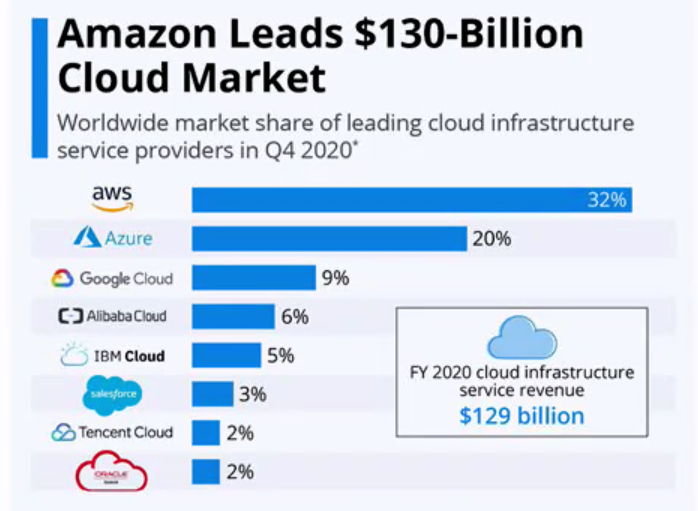
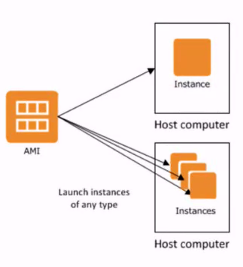
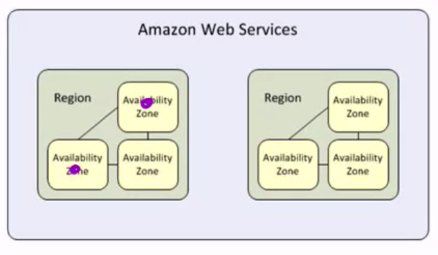
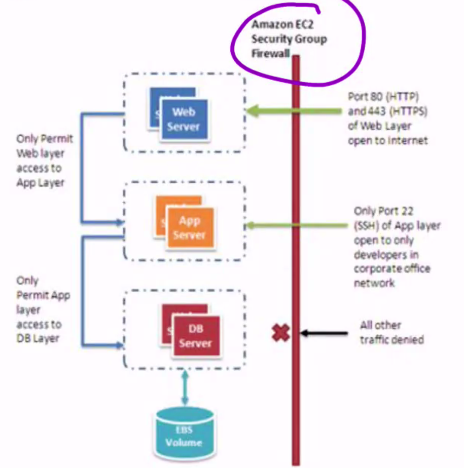
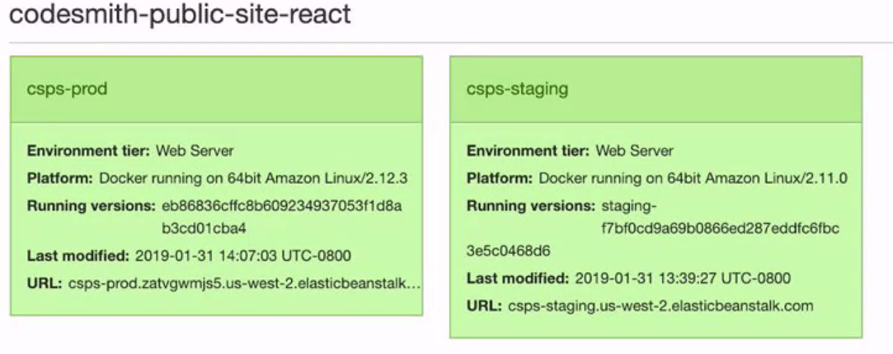
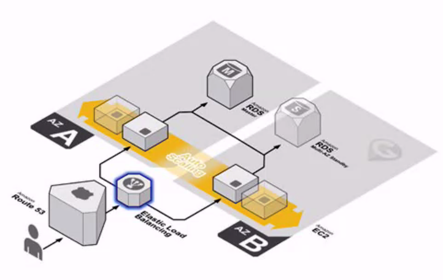
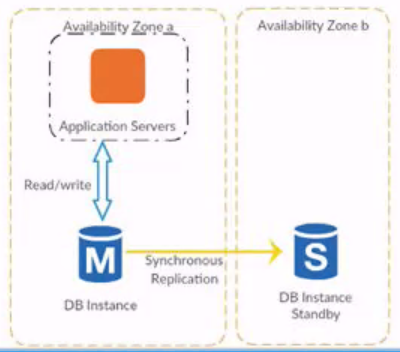
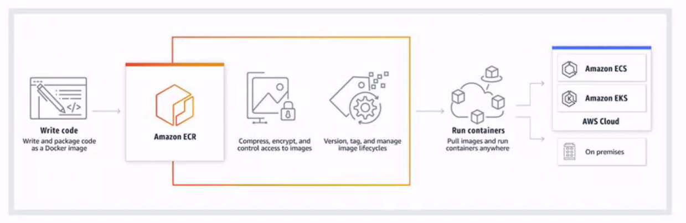

# AWS

## The Cloud

- Mostly using virtual machines, not docker containers.
- Amazon, Microsoft, Google.

## Why do we focus on AWS?

## Our Focus

- EC2
- Elastic Beanstalk
- S3
- RDS
- ECR
- IAM

## IAM - Identity & Access Manager

- Control account level security.
  - Control who can access what in your AWS account.

- Users
  - Individuals who can access your AWS resources
  - Users start out with no access permissions.
    - To assign permissions to a user, assign them in a group.
- Groups
  - Apply rules **(policies)** that govern access to AWS resources
- Roles
  - By default no AWS service has access to another AWS service. We use roles to enable these services to access other services within AWS.

The individual creating the account is known as the root user.
  - They cover the bill.

## EC2 - Elastic Compute Cloud

- EC2 is the workhorse of AWS. This service provides basic 'servers' where you can deploy and run your applications.
- You will use this for your node app.

### EC2 Features

- Instances: Virtual computing environments
- Amazon Machine Images (AMIs): Pre-configured templates of your instances.
- Instance  types: Various configurations of CUP, memory, storage and networking capacity for your instances.
- Regions & Availability Zones: Multiple physical locations for your resources, such as instances and EBS volumes
- Key Pairs: Provide secure login information for your instances with SSH (Secure Shell)
- Security groups: Firewall that enables you to specify the protocols, ports and IP ranges that can reach your instances.

## Compute Power: Amazon Machine Images & Instances

AMI - a template that contains a software configuration (e.g. an OS, an application server and applications).

From an AMI, you launch an EC2 instance, which is a copy of hte AMI running as a virtual server in the cloud. You can launch multiple instances of an AMI.

Instances can be run on various hardware configurations for CUP, RAM and network capacity options. These are configurations called instance types.

## Regions and Availability Zones

- Regions
  - Cluster of Availability zones
- Availability zones
  - Clusters of data farms

Each **region** is completely independent. Resources are not replicated across regions unless you do so specifically.

When you view your resources on the AWS console, you'll only see the resources tied to region you've specified.

Each **Availability Zone** is isolated, but the Availability Zones in a region are connected through low-latency links.

If you distribute your instances across multiple Availability Zones and one instance fails, you can design your application so that an instance in another Availability Zone can handle requests.

## Access Control: Security Groups

## Logging in: SHH with Key Pairs

EC2 makes use of public-key cryptography which uses public and private key pairs.

To login you must create a key pair, specify the name of the key pair when you launch the instance and provide the private key when you connect to the instance.

Amazon EC2 doesn't keep a copy of your private key; therefore if you lose a private key, there is no way to recover it!

## Elastic Beanstalk

Can be thought of as a wizard and a dashboard. It provides a simplified interface for setting up, accessing and monitoring AWS resources.

This is where you'll be setting up most of your application infrastructure.

With Elastic Beanstalk, you can quickly deploy and manage applications in the AWS Cloud without worrying about infrastructure that runs those applications. You simply configure it, upload your application, and Elastic Beanstalk automatically handles the details of capacity provisioning, load balancing, scaling and application health monitoring.

You can interact with Elastic Beanstalk by using the AWS Management Console and the AWS CLI.

You can setup multiple envs:

Elastic beanstalk also provides a nice GUI.

### Auto Scaling

This configures a **load balancer** into you infrastructure.

### Elastic Beanstalk warning

I you setup and create your database in the elastic beanstalk environment, it will be tied to the lifecycle within that environment.

Create it outside of Elastic Beanstalk and connect them.

## S3 - Simple Storage Service

Cheap static file storage.

In S3 data is stored in **objects** in **buckets** that can be accessed using a **key**.

For example if the object named photos/deadlybear.jpg is stored in the fuzzystuff bucket, then it is addressable using the URL
http://fuzzystuff.s3.amazonaws.com/photos/deadlybear.jpg

You can set permissions for any object in S3, making it available to your application or even in the public internet. In fact, if you have a static website with no API, you could host the whole site on S3.

## RDS - Relational Database Service

The way to spin up instances of a database via AWS.

- MySQL
- PostgreSQL
- MariaDB
- Oracle
- Microsoft SQLServer

### Backups

RDS makes it simple to schedule ongoing backups of your data. In case of data corruption, these backups can restore your database back to the most recent snapshot.

You can also setup a replica of your database ina separate Availability Zone (AZ) to act as a failover option in the event of a localized disaster.

## ECR - Elastic Container Registry

AWS version of Docker.

### Accessing Docker in AWS

Amazon Elastic Container Registry ECR is a fully-managed container registry that makes it easy for developers to store, manage and deploy container images.

## Summary

- AWS provides globally distributed infrastructure as a service (IaaS) that provides access to enterprise grade solutions for companies both large and small.
- AWS services cover a broad range of needs
  - IAM allows us to control who can do what in our AWS ecosystem
  - EC2 gives us basic servers
  - Elastic Beanstalk is one part configuration wizard, another part GUI
  - S3 provides static file serving
  - RDS gives us relational database platforms
  - ECR makes it easy to store, manage and deploy container images

### Questions

What if I wanted to use a non-relational database?
