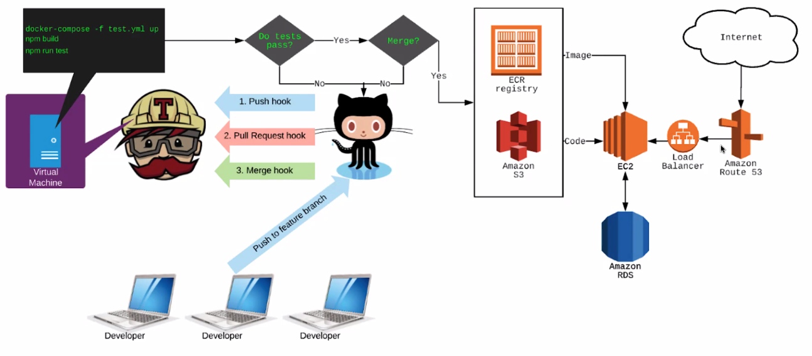

# Unit 13: DevOps - CI/CD

- CI
  - The process of automating the **build** and **testing** of code every time a team member commits changes to version control.
  - Emerged as a best practice because software developers often work in isolation, and then they need to integrate their changes with the rest of team's code base.
- CD
  - A strategy for software releases wherein any pull request that passes the automated testing (CI) phase and is subsequently merged into the master branch is then **automatically released into the production environment**, making changes that are visible to software's users.

## CI/CD Tools

- CircleCLI
- Travis CI
- Jenkins

## Travis CI

- One of the oldest CI/CD solutions in the industry and it has earned the trust of many engineering teams.

## How do we deploy containerized apps to AWS?

- We use a bash script

The .travis.yml file provides for simple configurations to deploy your application to S3 or Elastic Beanstalk. Since we are doing a slightly more sophisticated deployment that includes Docker containers, we'll be using a bash script to do the heavy lifting.

## How does AWS know to start our app with a container?

- Dockerrun.aws.json

When a Docker instance spins up in AWS, it looks for one of two things in order to start:

- Dockerrun.aws.json
- Dockerfile

With our bash file, we will build, tag and push our image up to ECR.

.

## Summary

- Travis-CI provides for CI/CD.
- Travis-CI watches our specified Github repo's using webhooks that trigger on Github events.
- Push and Pull requests result in running our test suite in Travis-CI.
- Merges run tests as well, but upon success also deploy our code to a destination.
- We use `.travis.yml` file to configure our repo for Travis-CI.
