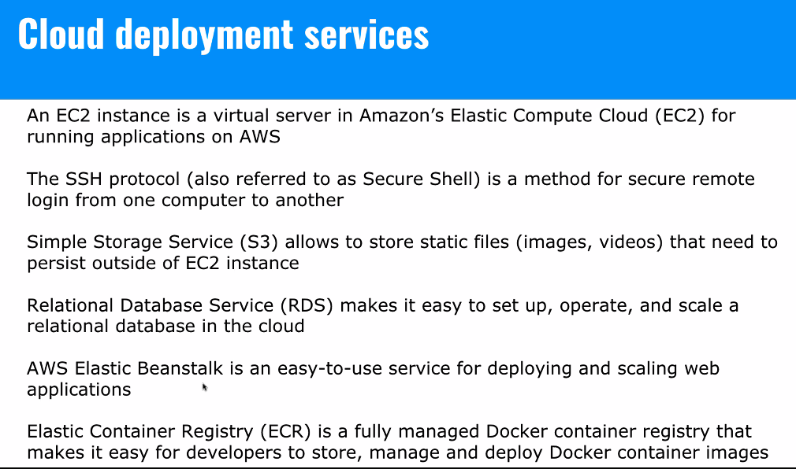

# Devops Approach

## Objectives

- Have an overview for
  - Building containers
  - Containerizing for development with compose
  - AWS
  - Travis CI

Get each developer in a team on the same page for library or dependency versions for an app.

```Dockerfile
FROM node:10.1 # Build the base layer of the image
WORKDIR /usr/src/app # Set a work directory in yoru container
COPY . # Copy files from your computer into the WORKDIR
RUN npm install
RUN npm run build
EXPOSE 3000 # Open a port
ENTRYPOINT ["node", "server/server.js"] # invokes node server/server.js, can use the CMD command
```

## Interacting with Containers

```Dockerfile
FROM node:10.1
WORKDIR /usr/src/app
COPY .
RUN npm install
RUN npm run build
EXPOSE 3000
```

```YAML
mongodb:
  image: mongo
  ports:
```

```YAML
version: "3"
  services:
    dev:
    image: tom/mm-dev
    container_name: mm-dev-hot
    ports:
      - 8080:8080
    volumes:
```





