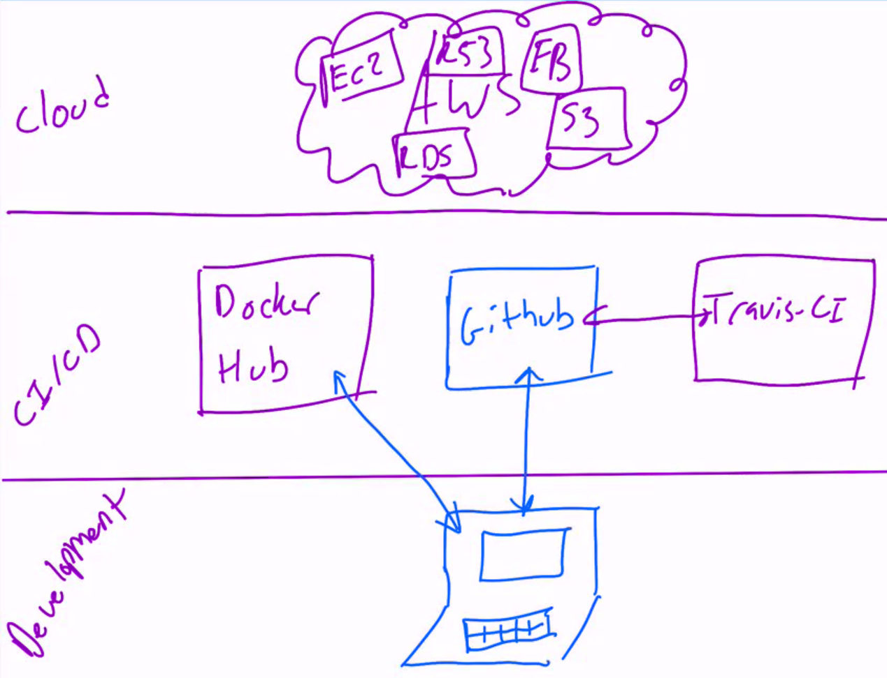
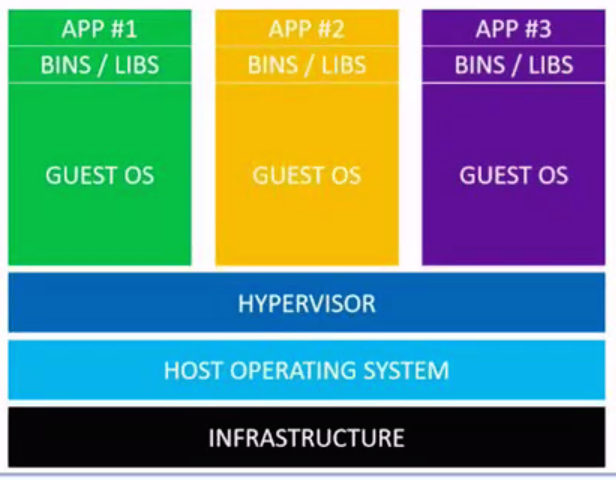
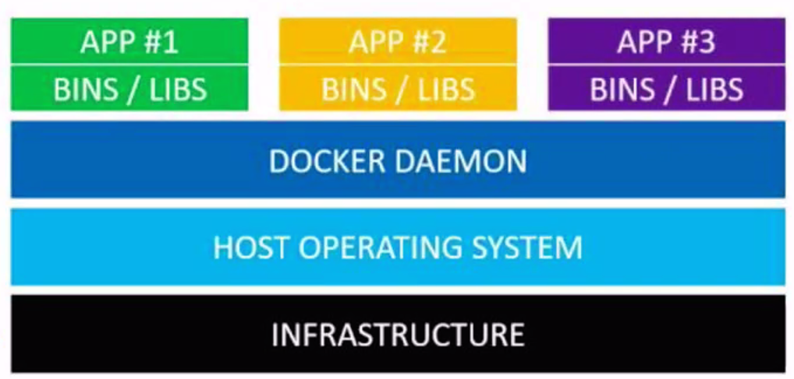
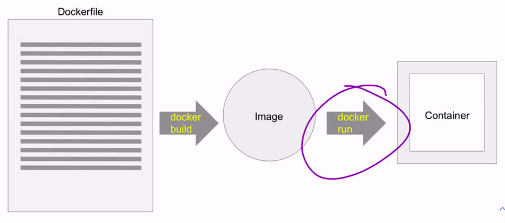
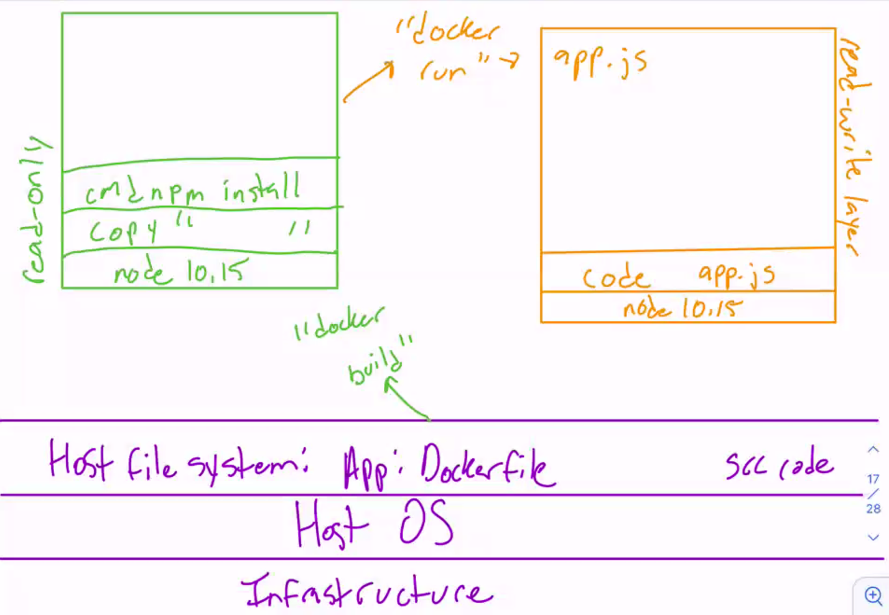
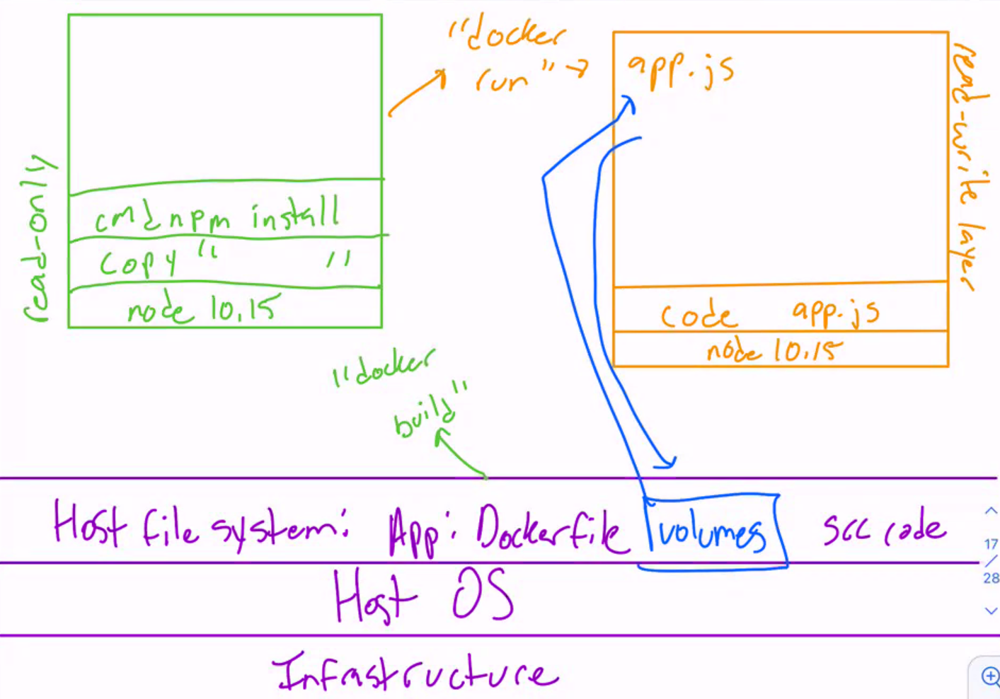
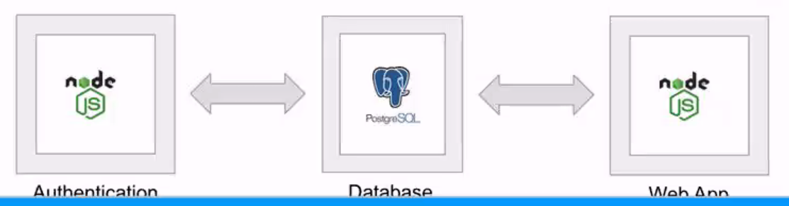

# Unit 13: DevOps - Docker



## What is DevOps?

- DevOps is the combination of cultural philosophies, practices and tools that increases an organization's ability to deliver applications and services at high velocity: evolving and improving products at a faster pace than organizations using traditional software development and infrastructure management processes.
- **TLDR:** Blurring the boundary between development and operations teams to allow for improved collaboration, speed, reliability and scalability.
- Engineers generally work across the entire application lifecycle.

## The Problem

When teams of developers are coding on their individual machines, each developer may be using slightly different versions of libraries, run time environments, database etc.

And then the production environment could be using a different version than all of them! This can lead to bugs that are difficult to resolve.

And this problem has led to...


## Docker

**Docker** is a tool designed to make it easier to *create*, *test* and *deploy* applications by using **containers**.

## Virtual Machines



- Instead of a physical server for each program.
- We have virtual computers within our computers.
- Each version of our application requires it's own operating system.
  - This is very memory intensive.

The job of the hypervisor is to pull resources from the host operating system, and give it to the virtual machine.

## Containers



Instead of the hypervisor, we have the `Docker Daemon`.

- Now our applications no longer needs a guest OS for each instance of your applications.
  - This saves lots of resources (particularly memory).

- This is highly **scalable** and **portable**.

## Images

**Images** are **read-only** templates for containers. These images can be kept in a repository and shared freely between developers on a team.

If everyone in an application's ecosystem is using a container instantiated from the same image, they're all guaranteed to be using the same dependencies.

### Image Layers

Each of the files that makes up a Docker image is known as a **layer**.

In most cases the first layer of a Docker container is called a **parent image**.

## How do we create an image? A: Dockerfile

To define a docker image, we create a text file called Dockerfile, where we'll provide the details about our image and execute it with **docker build**.

Let's say we want to build our application on top of node version 10.15 -- all we need to add onto that layer is start off our Dockerfile with the FROM keyword...

```Dockerfile
FROM node:10.15
WORKDIR /usr/src/app
COPY package.json /usr/src/app
RUN npm install
COPY . /usr/src/app
CMD node index.js
EXPOSE 3000
```

- `FROM node:10.15` is the the **parent image**.
- `package.json` is file on your computer.
- `/usr/src/app` is a file not on your computer, but within the docker container.



- `docker build` -> creates the image.
- `docker run` -> turns the image into a container.

## How do I change the code in a container?



## Union File System

Docker images are stored as a series of **read-only layers**.

When we start a container, Docker takes the read-only image and adds a **read-write layer** on top.

Docker calls this combination of read-only layers with a read-write layer on top called a **Union File System**.

## Volumes



## docker-compose

Coordinating multiple containers.

Containers are runtime environments. You usually run only a single main process in one Docker container.



Docker-compose files are written in YAML.
Stands for `YAML Ain't Markup Language`. This is a human-readable structured data format. It is used throughout industry ffor configuration files.

Our docker-compose files are comprised of *dictionaries* and *arrays*:

```YAML
version: "3"
services:
  test:
    image: codesmithllc/csps-dependencies
    container_name: "csps-test"
    ports:
      - "3000:3000"
      - "8080:8080"
```

- Spacing and indentation is important.

## Summary

- **Containerization** allows us to keep our entire ecosystem in sync across our team and infrastructure.
- **Images** are templates for containers that can be shared from a central repository.
- **Docker Hub** is a central repo for images.
- **Volumes** allow us to mount directories on our host filesystem in the container so we can share files and persist data.
- We can automate spinning up containers with **docker-compose**.

### Questions


