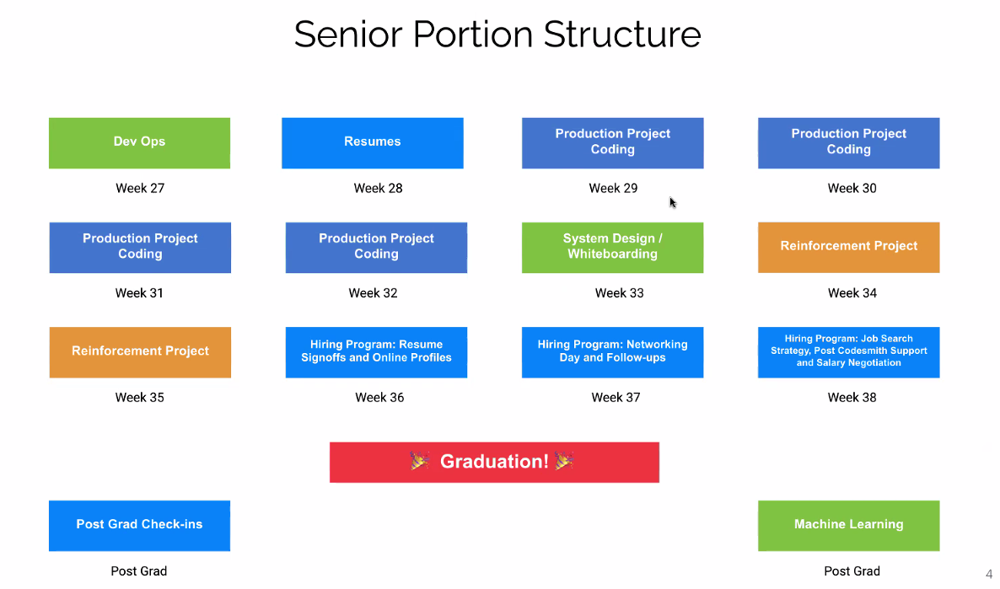

# Senior Kickoff

## Goals - Continue to level up

- Continue to cement your core understanding.
- Continuing to push into new technologies to grow as a T-shaped developer.
- Mentoring mids/juniors.
- Learn strategies for success in the job search.

## Opportunities and Expectations

- Define a culture of welcoming excellence for Juniors
- Bring all your energy to the coming weeks
- Push yourself to maintain balance of exploring new and cementing core
- Advanced concepts and practices
- Diving deep into Hiring Program
- Standups will continue to be at 5pm and give you a clear view of the day.

We Launch in week 32 July 16th.

That leaves:  4 weeks left of production project.

## Tech Talks

Tech talks will start up next week.

There will be a list of topics, you can choose a different topic but it needs to be approved.

- Opportunity to establish yourself as a technical authority on a relevant topic of interest to you.
- Select a topic that supports/advances your technical narrative.
- Can be done solo or as a pair.
- These talks will can be publicly broadcasted if you crush it.
- You will need to provide your slides to your fellow mentor for review (they'll let you know who they are) 1 week prior to your talk.

Take them seriously and be professional.

## Hiring Program

- Set you up for success in the job search!
- Hone your interviewing skills and learn how to best present yourself.
- Optimize your resume and online profiles to stand out as a candidate.
- Learn negotiation strategies and how to maximize job offers.

This support is available to you forever.
