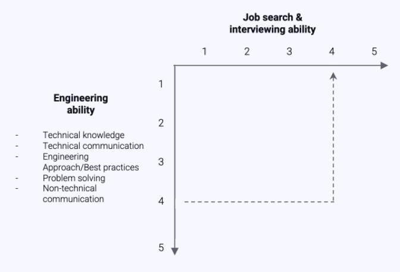
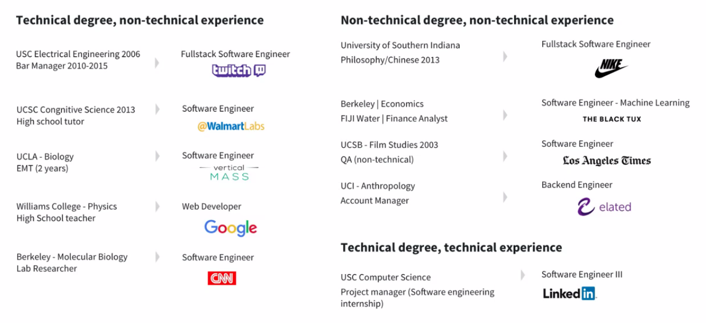
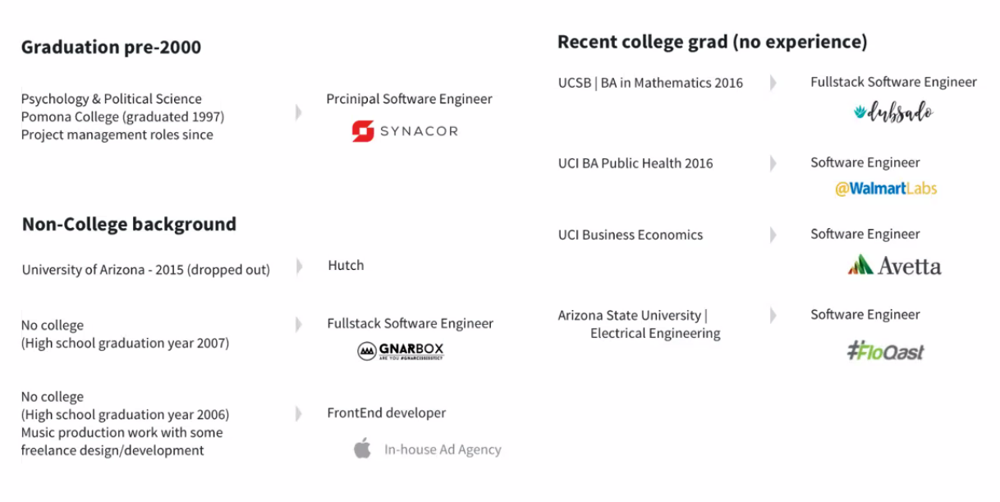
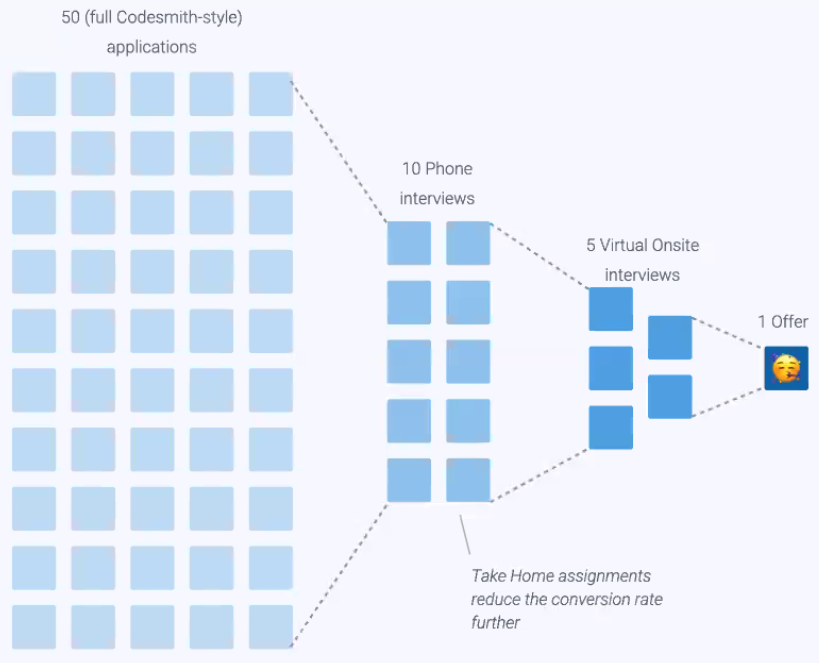
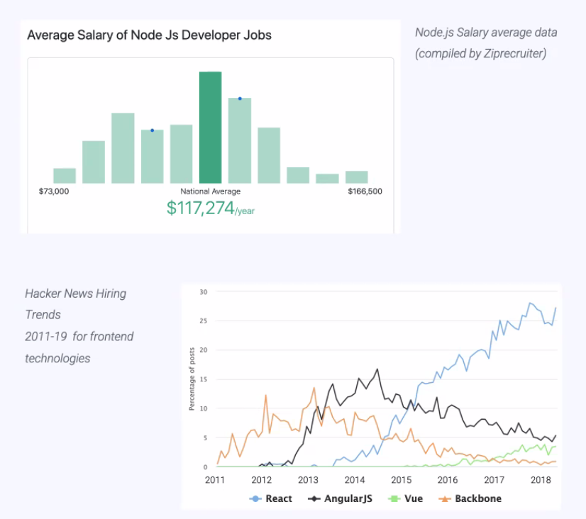
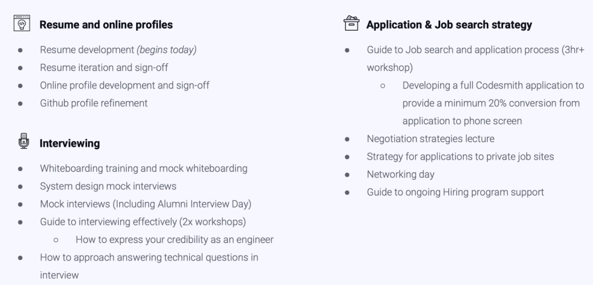
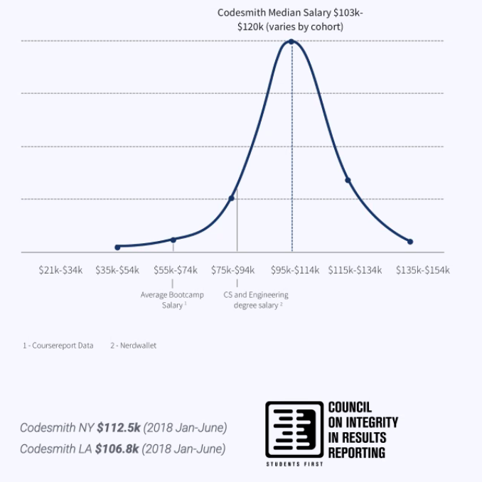
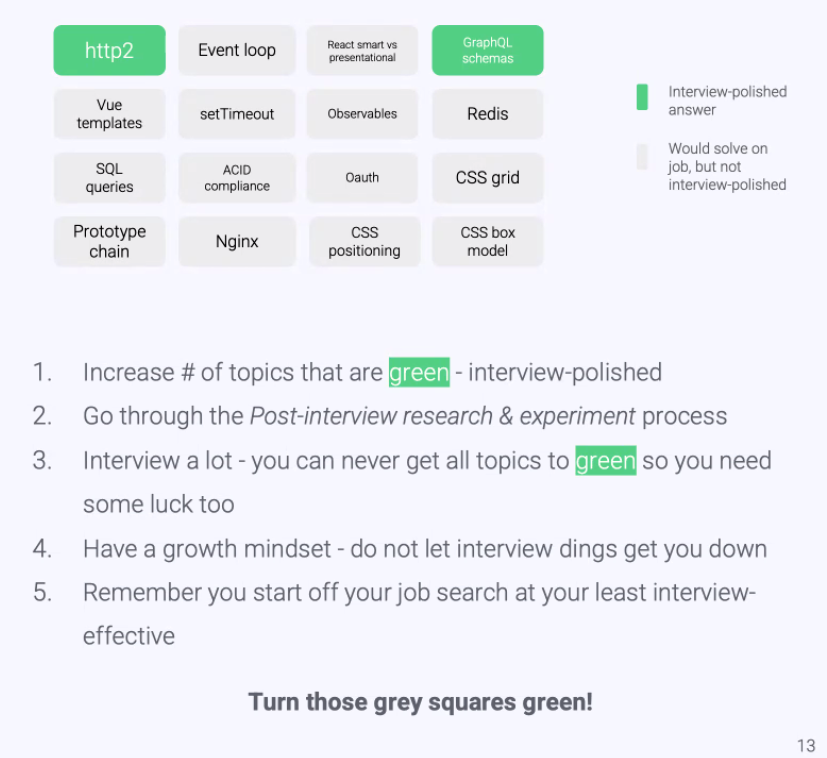
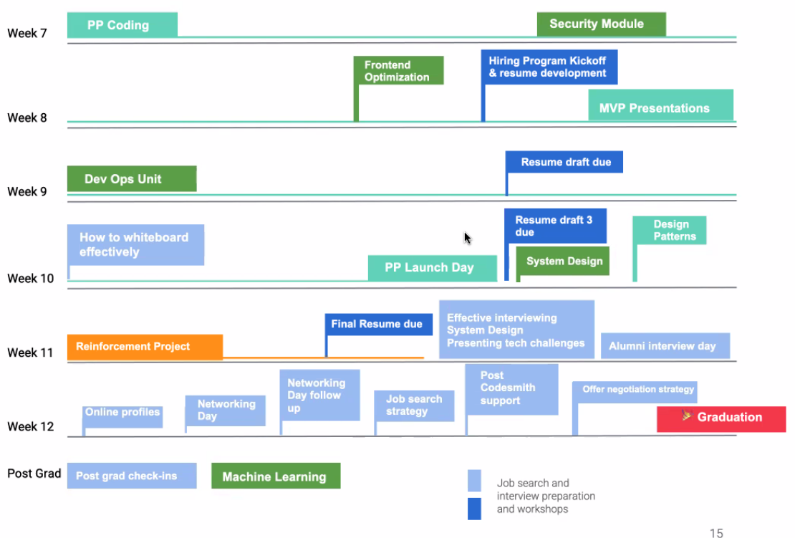
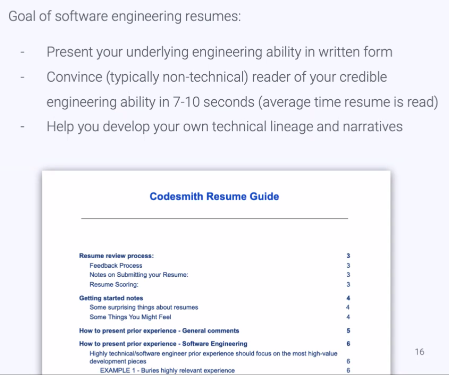

# Codesmith Hiring Kickoff

## Goals of the Hiring Program

- Build a network of leading engineers.
- Give you the tools to build and navigate your career.
- Help you ace interviews.

Be the passionate builder who loves technology.
This should be done from a conversational back and forth.
It shouldn't be a Q&A, it should be two ways.
Finish your response with a question.
Then relate to their response.

## Developing the skill of Job Searching and Interviewing

- Learn to express your engineering ability.
- This is a separate skill

## Fight Imposter Syndrome

15% go onto be senior level and make $180k per year.

The highest salary ever out of Codesmith was someone fresh out of College with a non-technical degree, got $192k base.

## The job search process is a pipeline

- The hiring program is designed to maximize the conversion ratios through his pipeline.

- **You should be getting 20% phone screens.**
  - Then from there 50% Virtual Onsite Interviews.

- If you are not getting the expected rates, there is something wrong with your CV, linkedIN or cover letter etc.
- **IF YOU ARE NOTE GETTING 20% SEND COVER LETTER AND RESUME TO CODESMITH.**

## The job search and interviewing requires a tailored approach

## How to make the most of the job search and hiring program

1. Aspire to excellence.
2. Work hard and smart.
3. Cultivate a growth mindset.
4. Support one another.

## Aspire to Excellence

- Bring high expectations.
- The goal is to be working on challenging material in your job.
  - Hence you need a high salary job to be interesting work.

## Work hard and smart

- The Job Search is serious
  - It can take up to 180 days.
- At Codemsith you've had to balance making it work diving under-the-hood. Now you have to balance growing your skills with applying assertively.

How can you approach the job search process effectively?

## Have a Growth Mindset

## Support each other

- Share resources, opportunities and mentor each other
- Hiring groups
  - Peer resume review, interviews and whiteboarding

## Hiring Support Program

- This is actually for the immersive program:

## Resume Guide

## Tips

- Practice your narrative:
  - Tell me about yourself.
    - 30 sec elevator pitch.
    - Finish with a question
  - Practice with your cohort mates.

- Always send a thank you note the next day.

- Recommends against online easy apply.
  - Codesmith style:
    - 1 line that represents personalization of the cover letter.
    - Should take 15-20 minutes for 1 application.
    - Mention something about their company and their platform
      - E.g. congratulations about launch of x product. I hope that you are succeeding wildly, and I would love to
      - A/B test your cover letters.
    - Double-down:
      - Reach out to someone at the company:
        - Hey sorry to reach out with an introduction. I am software engineer who has been a big fan of x, y, z for a number of years. I am sure you have a thousand plates spinning right now, I would love to reach out for some advice, could we jump on the phone? I will be super efficient with your time.
          - Keep it to 5 mins, 2 questions.
          - Finish with:
            - Before I let you go, is there any final advice or suggestions you have?
            - Send them a thankyou note the next day:
              - Thank you so much for your time, found this awesome article on sailing, just incase you haven't, is there any chance you could refer me to the right person.

- Facebook, Apple, Netflix, Google

- LinkedIn photos
  - Getting professional photos done.

- I saw that so and so is on your board, I love x y z that they do. How involved are they in day to day operations?
- Go for business casual.
  - The next notch up from a TV shirt.

- In the pitch:
  - Don't go too far back in your life:
    - What sparked you in technology.
    - Going into OSLabs.
    - Production Product. I built an open source product/platform.
    - Question about their tech stack

https://vimeo.com/536864216
pw:  cde4K@3k

- Eric does office hours every other Wednesday.

### Questions

- Most of my prior experience is running my own business in the tech space.
  - But I did little technical work myself.
    - How best to communicate/present that?
