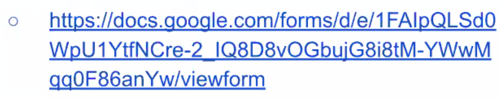

# Launch

## What do I mean by Launch

- Not necessarily referring to putting your project on NPM, launching your website, or making the final commit on your GitHub repo.
- Putting the word out there.

## Production Project Launch Overview

- Best Practices
- Popular sites to launch
- Tools to help you

## Goals

- Get as much traction as possible!!
- Officially launch!!

## Popular Tech sites to post on

- Hacker News `news.ycombinator.com`.
- Echo.js `echojs.com`.
- Reddit `reddit.com`.
  - Post on JS and related subreddits.
- Product Hunt `producthunt.com`.
- Medium `medium.com`.

## Post a related article on tech newsletters

Email the author of the newsletter directly

- ReactJS Newsletter reactjsnewsletter.com

## Tweet/DM prominent figures from your project's field

- Who is the face of your space?

React/Redux - Dan Abramov
- Make it personal
- Share what led you to build the project
- Let them know you will be tweeting so they can simply re-tweet.

## Give a talk on it!

- LA
  - JavaScriptMN
  - SoCal React
  - JavaScript LA
- NY
  - Brooklyn JS
  - Queens JS
  - Manhattan JS

## Launch Allowance

- Up to $100 per group
- Yes for:
  - AWS, Heroku, etc.
  - Domain name registration.
- Use below form to submit for reimbursements
  - Must submit by Friday of Week 37 (2nd to last week)

## Production Project Writeup

- This will help you to:
  - Collect your ideas and high level info about your product in one area.
  - Flesh out a narrative around your responsibilities/contributions.
- Will include:
  - Product descriptions
  - Your motivation to build the product
  - Brief on how it works
  - Technical challenges and team responsibilites
- You will start developing this at the 32nd week.

## Best Practices

- When upvoting the project, upvote using your mobile devices with your own data plan (forums are suspect when lots of upvotes are coming from the same Wifi/IP)
- The best time to launch is 6am PST Tuesday-Thurs
- Upvotes should be distributed evenly over a period of time
- Upvotes should come from as many geographically diverese regions as possible
  - Send to friends, family an classmates

## Summary
- Make this a hard and fast goal for you and your team
- This launch is **as important** as the hard work you put in to create it
- Think about unique ways to get your Mids/Juniors involved.
- You have $100 per group
