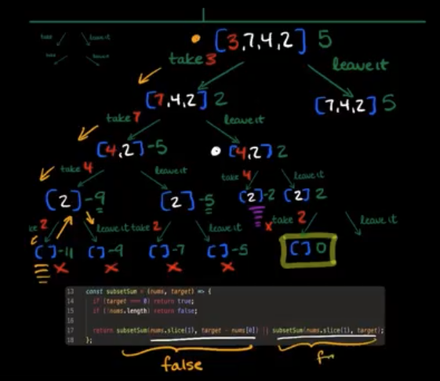
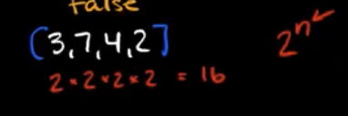

# Notes

- Using recursion to generate combinations is a powerful tool for solving problems

1. Solve a smaller problem that looks like exactly the larger problem => recursion is good for this.
2. Take it or leave it.

## Problem 1: Subset Sum

Given an array of integers and a target value, return if there is a subset of the array that sums up to the target and return false otherwise.

```JavaScript
const subsetSum = (nums, target) => {
  if (target === 0) return true;
  if (!nums.length) return false;
  return subsetSum(nums.slice(1), target - nums[0]) || subsetSum(nums.slice(1), target)
}
```

- Example of true/false example.
- Diagram it out at a high level similar to mergeSort diagram
  - Has sticker for take it/leave it branches
  - Uses example ([3, 7, 4, 2], 5)
- Goes over code
- Looks at code in relation to diagram, goes through diagram flow



- Go over time complexity O(2^n)



## Problem 2: All Subsets

Given an array of distinct integers, return all possible subsets. Do not return any duplicate subsets. Order does not matter.

```JavaScript
const allSubsets = (nums) => {
  const result = [];

  const generateSubset = (nums, subset = []) => {
    if (!nums.length) return result.push(subset);

    generateSubset(nums.slice(1), [...subset, nums[0]])
    generateSubset(nums.slice(1), subset)
  }

  generateSubset(nums)
  return result;
}
```

- Example of true/false
- Diagram it out the same way

## Problem 3: HT Permutations

You flip a coin heads or tails x times. Return an array containing all unique permutations.

```JavaScript
const htPermutations = (heads, tails) => {
  const result = [];

  const generatePermutations = (heads, tails, str = '') => {
    if (heads + tails === 0) return result.push(str);

    if (heads) generatePermutations(heads - 1, tails, str + 'H');
    if (tails) generatePermutations(heads, tails - 1, str + 'T');
  }
  generatePermutations(heads, tails);

  return result;
}
```

- Show results
- Diagram out

## Problem 4: Partition Number

You are given a positive int target. Return an array of all arrays of ordered (ascending) positive integers that sum up to the target. The arrays can be provided in any order.

```JavaScript
const partitionNumber = n => {
  const result = [];

  const generatePartition = (num = 1, partition = [], target = n) => {
    if (target === 0) return result.push(partition);
    if (target < num) return;

    generatePartition(num, [...partition, num], target - num);
    generatePartition(num + 1, [...partition], target);
  }
}
```

- Diagram it out with [1, 3]