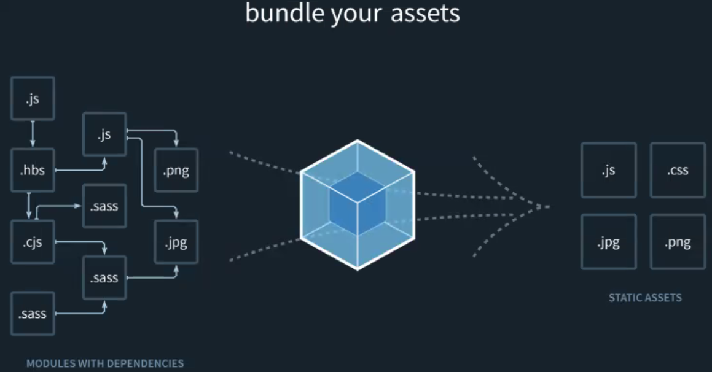
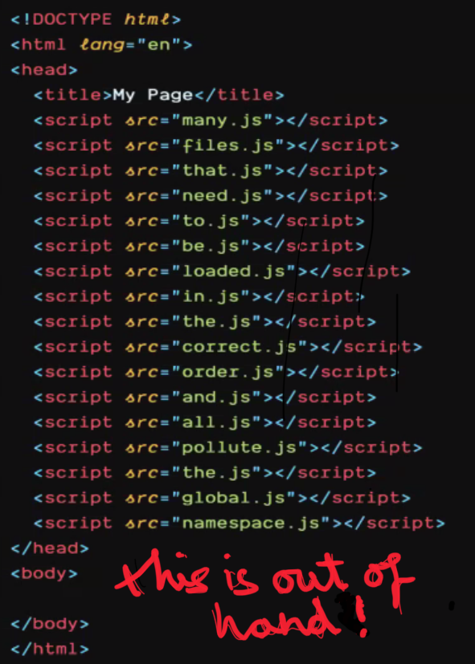
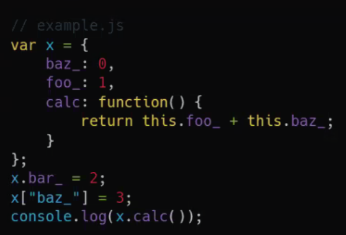
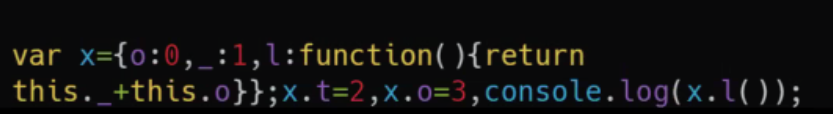
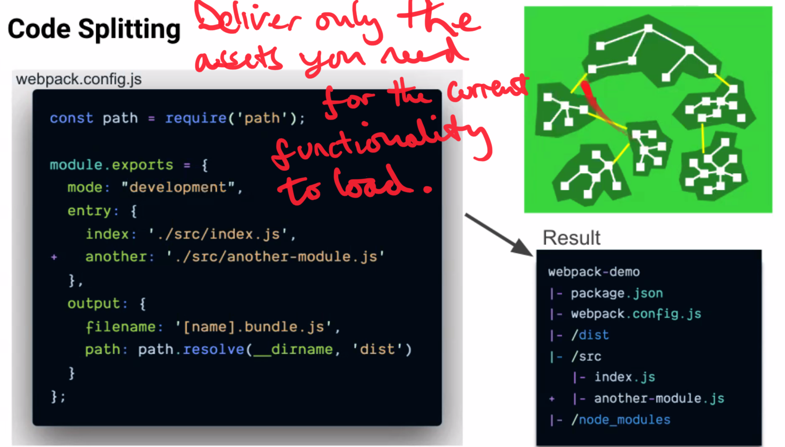

# Build Tools: Webpack

In our react projects we have multiple files.

If we have 10 files, we need them all to build our application.

How do we get those files to the client in an organized and optimized way.

## Motivation

In this lecture, we'll learn about Webpack. Webpack is a module bundler build tool that bundles front end JavaScript applications to be served to the client.

A modern front end project will almost always be delivered Webpack.

`webpack.config.js`

## Roadmap

- Why Webpack? Purpose and feature set.
- Quick review of CommonJS modules in Node.js
- Webpack: bundling front end JS files as (ES6 or CommonJS) modules.
- Webpack features: transpilation, minification/uglification, CSS, images.
- Webpack-dev-server, live reloading.
- Other bundlers and task-runners.



Webpack allows to take all our files and output them into a few bundles of static assets.



Dependency problems, namespace problems request problems.

## Modules in Node.js

Let's remind ourselves how JavaScript modules work in Node.js so we can compare them to the way that Webpack works.

### Node.js modules

- Node.js is based on the CommonJS module system.
  - Each file is a module.
  - Each module exports a variable called `module.exports`
  - Other modules are imported with `require()`
  - Module.exports is by default empty.
  - Either set module.exports to be some object or ...

- Three types of modules:
  - Modules you write.
  - Built-in modules
  - Community node-modules from npm
- These are all based on require and module.exports

### Modules on the browser

How do modules work on the web browser?

#### Modules in Webpack.

- There are two important modules system types: CommonJS and ES6. Webpack supports both.
- CommonJS is based on require and module.exports. Npm node_modules works on this.
- ES6 module syntax is based on import and export. React is based on this.
- ES6 module syntax also has the notion of export default.
- You can (and should) write your front end React code with import and export. There are performance reasons for this.

### ES6 Modules Format

fruit_stand.js
```JavaScript
import Apple from 'fruits'// this will be the default export

// OR
import Apple, * as myModules from 'fruits';
// i.e. import defaultExport, * as name from "module-name:

// OR

import Apple, {Cherry} from 'fruits';
// importing only what we need
```
fruits.js
```JavaScript
export default Apple = props => {
  // apple stuff
}
export const Banana = props => {
  // apple stuff
}
export const Cherry = props => {
  // apple stuff
}
```

### Modules in Webpack

- Webpack is usually run as an npm script defined in your package.json file.
- Webpack is written in JavaScript. It programatically analyzes your project's dependency tree.
- At the most basic level, Webpack pre-combines your 1000s of front end JavaScript files (as well as npm node_modules) into one bundle.js file.

Any import or export statement in our code (ES6 module style) is an instruction for Webpack. We can import either our own JS files, node modules from npm, CSS files, images, etc.

```HTML
<!DOCTYPE html>
<html>
  <head>
    <meta charset="UTF-8">
    <title>Webpack App</title>
  </head>
  <body>
    <script src="bundle.js"></script>
  </body>
</html>
```

### Modules on the browser

- Modern browsers' latest versions (Chrome, Firefox, Edge) do support modules!

```HTML
<script src="my_file.js" type="module">
```

We still need webpack however.

- With modules <script> tags, we still have to make an http GET request for each JavaScript file.
- With potentially 1000s of requests this is infeasible.
- Also we want ot be able tto transpile, bundle other file assets, uglify etc.
- We also can't user snpm node_modules this way because they have a different syntax.

## Webpack features

### Webpack loaders

- Webpack enables use of loaders to preprocess files. This allows you to bundle any static resource way beyond JavaScript.
- Loaders are usually defined in a file called webpack.config.js. Set up webpack.config.js, then run webpack as an npm script.
- Loaders can transform JavaScript files, as well as CSS, images, HTML templates files, etc.
- This completely changes the way we think about the frontend HTML/CSS/JavaScript stack.

- Various babel-loaders transpile JavaScript code.
  - ES6+ to ES5 is for internet explorer (10% internet traffic)
  - React JSZ sugar gets transpiled down to React.createElement
  - TypeScript transpiled to JavaScript
- Various css-loaders allow modularized CSS!
  - You can import an individual CSS file into a JS file.
  - The CSS object will be localized to htis file!
  - Webpack inlines the CSS as a JS object.
- You can transpile CSS.

### Webpack plugins

- Webpack plugins perform any kind of logic that a loader cannot do.
- Minifying the code means stripping away whitespace.
- Uglifying code means going further and renaming variables to be unreadable one- or two- letter names. Code downloads even faster.

By default, Webpack uglifies code if you set the mode in configuration (webpack.config.js) to be in production



To



- Other plugins (for either convenience or performance):
  - HTMLWebpackPlugin - automatically sets up an HTML file with a `<script>` tag for bundle.js. Useful for cache-busting for new versions of a webpage.
  - ExtractTextWebpackPlugin - takes CSS modules and puts them in a separate bundle.css file, rather than inlined within the bundle.js file. This improves performance of initial page load!
  - github.com/webpack-contrib/awesome-webpack

### Code Splitting



```JavaScript
const path = require('path');

module.exports = {
  mode: "development",
  entry: { 
    index: './src/index.js',
    another: '
  }
}
```

### Webpack dev server

#### Production vs Development

- Webpack-based projects have different needs depending on whether we are shipping a final product to be deployed on the web, or developing the codebase at home.
- For production, JS needs to be uglified, and CSS/images need to be separate from the main bundle.js rather than inlined.

- For your Codesmith projects, you will mostly be working in development mode (developing a codebase at home). A quick change in the code we write should show up on the screen as seamlessly as possible. You should use Webpack-dev-server rather than Webpack itself.
- You only

### Webpack-dev-server

- Webpack-dev-server (WDS) allows us to have live-reloading the automatic rebuild of our JS bundle and refresh of the page upon saving a JS file.
- WDS spawns a localhost server under the hood that watches for file system change events. The browser has a websocket connection to the dev-server so that it knows to live-reload.

### Full stack we architecture

- In production for a full-stack React/Node app, we utilize one server:
  - This single server is our express server, which will be hosted on mysite.com (our real website)

### Production

Client <-> Server

### Dev

Client -> localhost:8080 -> localhost:3000
  <---------------------------|

### Alternatives to Webpack

- Browserify
- Require JS
- Brunch
- Steal.js
- bit-bundler
- Pundle
- CommonJS
- Blendid
- rollup.js
- gulp
- grunt


  

### Questions


