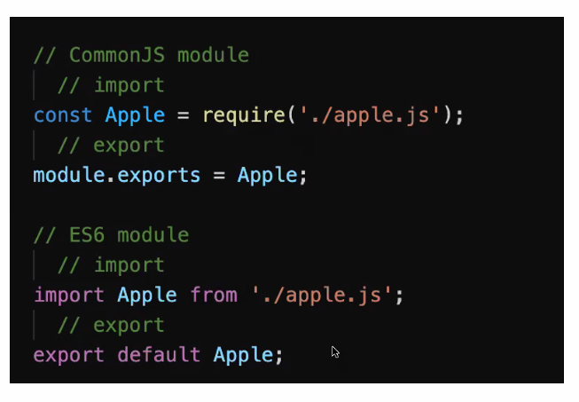

# Build tools approach

- Code Bundling
  - Modularize your source code
  - Modularize your production code
    - Optimize network requests (quantity and file size)

- Transpilation
  - Use JavaScript supersets like JSX
  - Transpile to ES5 for browser compatibility (thanks Babel)

## JS Modules

- CommonJS
  - Introduced by the Node.js developers to solve JavaScript's lack of support for modules

- ES6 Modules
  - When ECMA decided to implement a standard ECMAScript



### Webpack config

- Highly customizable

```JavaScript
module.exports = {
  mode: 'production or development', // string (default)
  entry: 'the file that serves as the entry point of your dependency graph', // string | object | array
  output: {
    path: 'absolute path to the folder (defaults to ./dist)' // string (default)
    filename: 'file name for your bundle (defaults to main.js)' // string (default)
  },
  modules: {
    rules: [
      'rules that tell webpack what loaders to apply to different types of file' // string (default) regex
    ],
  },
}
```

### Webpack serve demo

Kind of like nodemon.

- Allows for live reloading of your application files
- Set mode to 'development' to avoid minifying and uglifying
- Your frontend will be served at localhost:8080 by default

```JavaScript
module.exports = {
  ...
  devServer: {
    publicPath: 'path to directory that WDS should build in memory to save static files' // string
    proxy: {
      '/route_to_match': 'proxy server where requests should be redirected' // string -> backend proxy localhost:3000
    }
  }
}
```


```JavaScript
module.exports = {
  module: {
    rules: [
      {
        test: /\.jsx?/i,
        exclude: /(node_modules)/,
        use: {
          loader: 'babel-loader',
          options: {
            presets: ['@babel/preset-env', '@babel/preset-react'],
          },
        }
      },
      {
        test: /\
      }
    ]
  }
  devServer: {
    publicPath: '/build',
    proxy: {
      '/api': 'http://localhost:3000'
    }
  }
}
```

Use webpack serve, not webpack dev server.

### Code Splitting

1. Use `splitChunks optimization` to separate all the node_modules code into a vendors file.
2. Use `MiniCssExtractPlugin` to separate CSS into another file
3. Use `HtmlWebpackPlugin` to auto-generate an HTML file.

This is ideal for caching files that don't change very often.


### Caching

- Add [contenthash] to
```JavaScript
output: {
  path: path.resolve(__dirname, 'build'),
  filename: 'bundle.[contenthash].js',
}
```
- The file names will become unique based on their content.


### Questions


