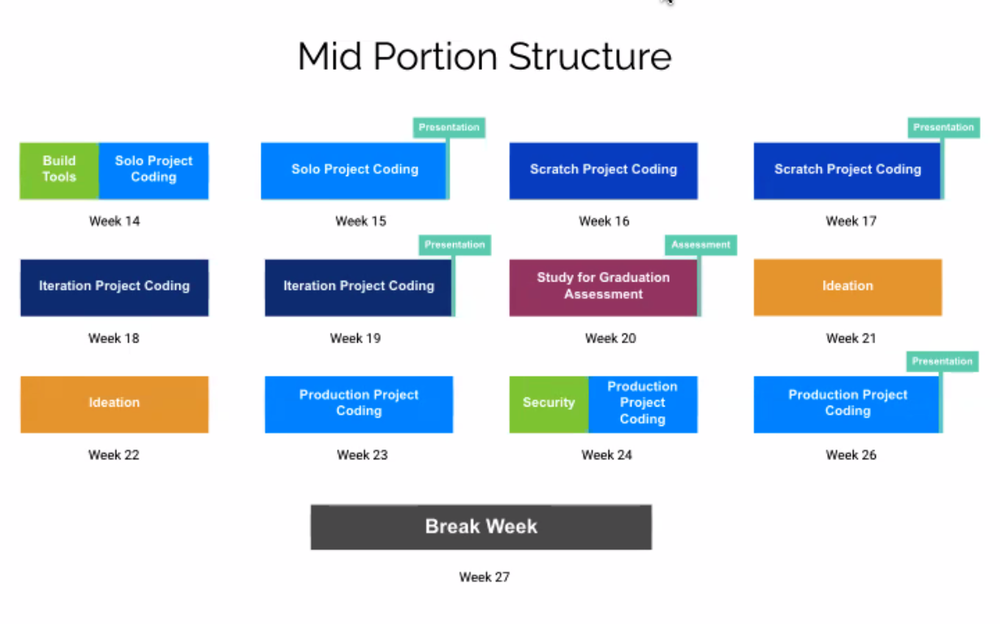

# Project Phase -> solo project kick off

## Goals

- Build a project from idea to functioning MVP.
- Discipline to limit your scope.
- Begin the ongoing process of removing the training wheels
- Cement core curriculum.
- Navigate the unknown.

## Ideation - Stage 1

Build things that:
- Challenge you technically
- Solve problems you face (especially as developers)

## Refine Scope - Stage 2

Start small! You're building the MVP.
- Get down 1-2 features
- Whats the core? Get that working first!

## Complete the Brief - Stage 3

- Identify your users
- Identify the problem you're solving for them
- What are your core features? (MVP scope)
- What are the technical challenges you expect?
- What are your stretch goals?

## Execute - Stage 4

1. Setup your dev environment.
2. Focus on your core feature - get it working the messiest way necessary.
3. Show it around - can others make it work?
4. Refactor to refine and fix.
5. Add you second core feature
6. ...

## Demo! - Stage 5

You'll have two minutes to:
- Introduce your project!
- Demo
- Highlight technical challenges
- Enjoy the praise and adulation of your fellow engineers

## Tips

- Don't use Boilerplate
- Ex: no create-react-app
- Valid to use later when you want to get up and running quick, but:
- This is about making something from nothing
- Don't stress to much about the finished product
- Focus on understanding what is happening in your application
- Usually students leave these off the resume, unlike group/production/reinforcement projects

