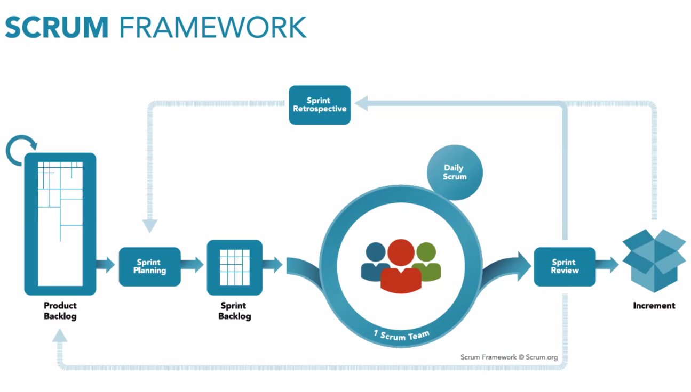
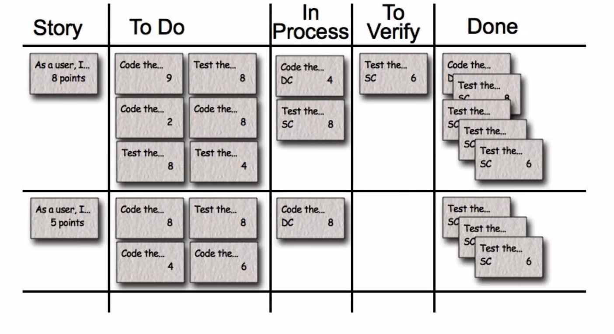

# Scratch Project

## Scratch Project Goals

- Mentoring each other in a team.
- Professional team engineering setting.
- Build a project from idea to functioning MVP.
- Discipline to limit your scope.
- Navigate the unknown.

## Stage 1

### Stage 1 - Team Ideation - Goals

1. Challenge you technically.
2. Solve problems you face (as developers or customers).
3. Are sensitive to each team member's priorities.

Think about how you are going to make this your own. Try and make it something niche, that a solution doesn't already exist for.

### Stage 1 - Team Ideation - Goals

1. List each team member's priorities.
2. Give these priorities start coming up with project ideas - no idea is out of bounds. Generate at least 10-15 ideas.
3. Begin to assess each idea against your core goals.
4. This may require some additional research into feasibility or even some initial MVP coding.
5. Return to the ideas and reassess based on research/MVP coding.

### Suggestions on Team Ideation

- If you notice common themes of each team member's priorities, then try and generate a bunch of ideas around that theme.
- Avoid becoming overly personally attached to any project.
- Avoid separating from the group and developing ideas independently.

## Stage 2 - 5

2. Refine scope -> Start small -> MVP.
3. Complete brief.
4. Execute into the unknown.
5. Iterate

## Scrum

- Making teamwork work.



### How Does It Work?

- A **progress board** is created, where project tasks are divided across a team (e.g. trello).

- The development team works on tasks in one to two week stretches, called **sprints**.

http://www.scrumguides.org/docs/scrumguide/v2016/...

### The Team

- Product Owner:
  - Defines priorities and has final sign-off on completed features.

- Scrum Master:
  - Manages the Scrum board, assigns tasks to team members.

- Development Team:

### The Process

- Stories
  - The various requirements that must be met in order to build the product.
- To Be Started:
  - Stories split into a number of tasks. Should be clear, concise, and achievable within the current sprint.
- In Progress:
  - Developers take ownership of tasks from the `To Be Started` column, into the `In Progress` Column.
- Verify
  - Once a task has reached the testing phase, it is moved here.
- Done:
  - Once it is tested successfully, tasks are moved to a done list.



### Daily Standups

- Daily 15 mins

- Questions:
  - What did you do yesterday to move towards your goal?
  - What will you do today to move towards your goal?
  - Are you having any blocks?

- Can be done multiple times a day.

## Pink Fairy Armadillo

- Mohammed
- Tom
- Ae
- Paulo

## Team Goblin Shark

- Jen
- Eric
- Ethan
- Sean

## Axolotl

- Frank
- Erin
- Kevin S
- Julia

## Red-Lipped Batfish

- Ashley
- Dylan
- Htin
- Pat

## Wunderpus PhotoGenicus

- Josh
- Xiao
- Valerie
- Sam

## Tasselled Wobbegong

- Newas
- Kevin B
- cARLOS


```JavaScript
const thing = 5;
for (let i = 0; i < 5; i++) {
  thing += i;
}
```