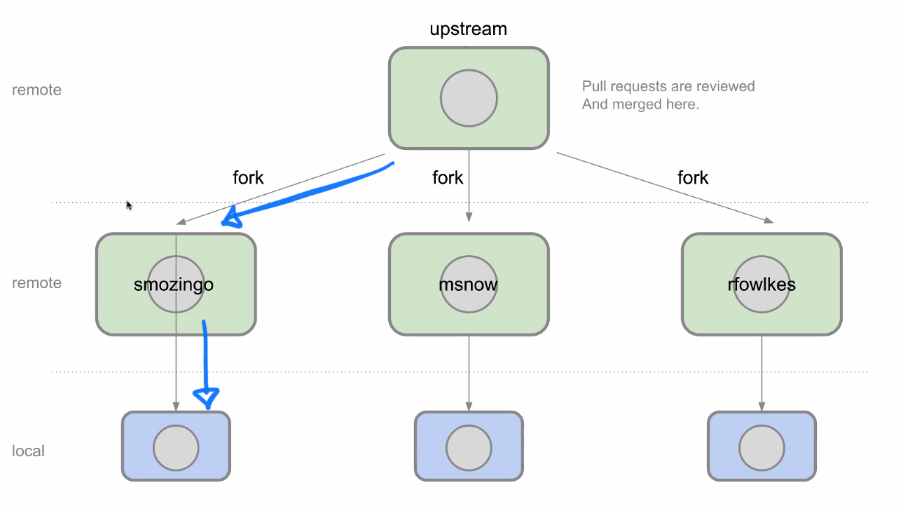
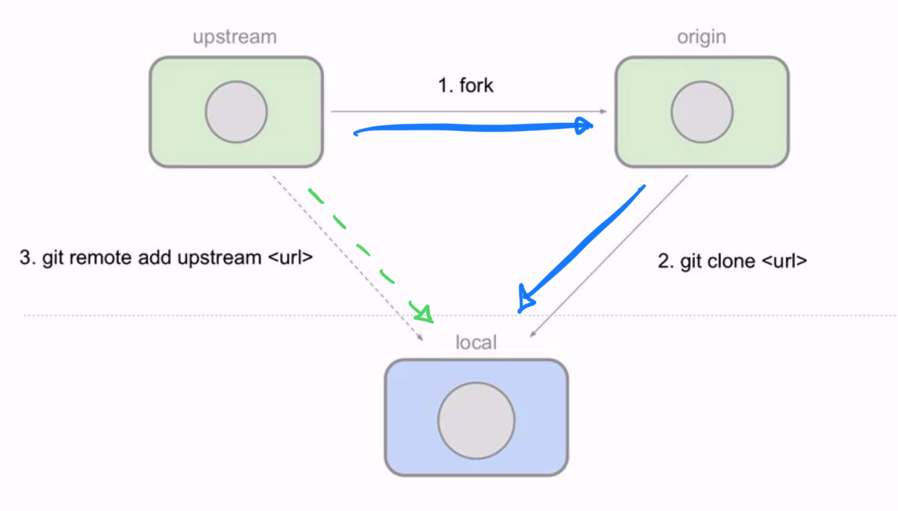
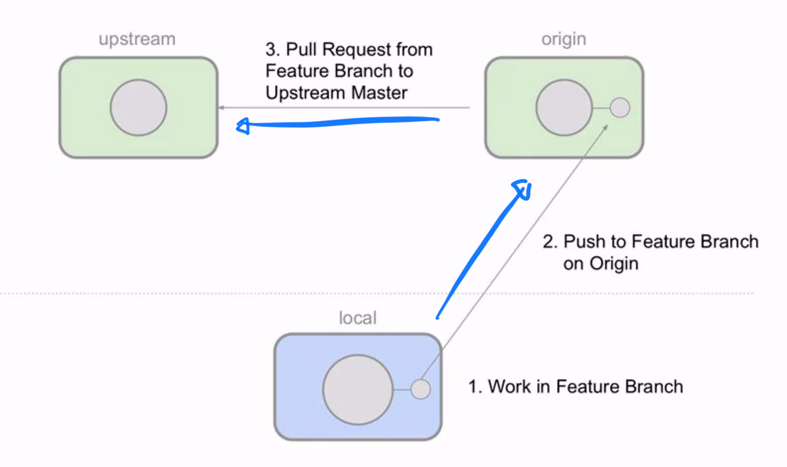
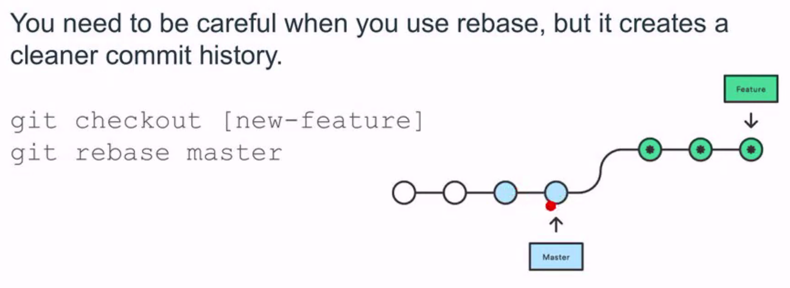

# Advanced Git and Github

## Public & Private

- You can work with public and private repositories.
- You can work collaboratively on your own public repos, or even on other public repos where you don't have push (write) access.

## Git process







## Collaboration

There are two ways of setting up GitHub for team collaboration:

- Organizations: Account owner can create many teams members with differing permission level for various repositories.
- Collaborators: Repo owner can add collaborators with Read and Write access to a single repository.

- You are recommended to use an Organization, and only the git master controls the git repo.

- Whoever is most comfortable should do this.

## To do

- Create organization
- Create a new repository
  - Make sure it is public.
  - Add README
  - Add .gitignore
  - MIT Licence

- Don't immediately fork and clone it.
- First build a good starting base.

## Pull Requests

There are two models of pull requests in GitHub:

- Fork & Pull Model: Used in a public repository for which we don't have push (write) access.
  - Used commonly in open source.
- Shared Repository Model: Used in a private project.

### Workflow

- Create the application boilerplate with the group.
- Fork
- Clone
- Create a new feature branch
  - Make changes to this branch
- Push to origin
- Submit a pull request from feature into organization main.
  - Add descriptions.
    - The problem you were solving.
    - The solution to the problem.
    - Notes on testing.
      - If you didn't add any, how you could.
    - Screenshots/gifs.
- Large changes / new features should have in-depth examples and details.
- Smaller fixes and updates should also include meaningful messages.
- Review the Pull Request
  - Resolve merge conflicts
  - Organization owner has final say.
  - Do this as a group.
    - Review on Github directly -> BAD GUI
    - You can use VSCode Git GUI.
      - Pull down the PR on the organization level.
      - Review/merge, push it back up.
- Then everyone should `git pull upstream main`.

## Protecting Branches

It's best practice to protect a branch:

- Settings
- Branches
- Add rules
- Require PR Reviews before merging.
- Restrict who get dismiss PR reviews
  - Git master only
- Include administrators
- Restrict who can push to matching branches

## Requiring Updates from Upstream Remote

1. As you're developing in your feature branch, you'll want to pull in updates from original upstream branch.
2. Do this by adding an upstream alias and fetching.

```
git remote add upstream <url>
git checkout master
git pull upstream master
```

- Then merge in the new updates to your main branch.

## Git Rebase



## Other things you can add

- Bug tracking
- Analytics
- Documentation

## Questions

Do you make a personal or a business/institution repository?

