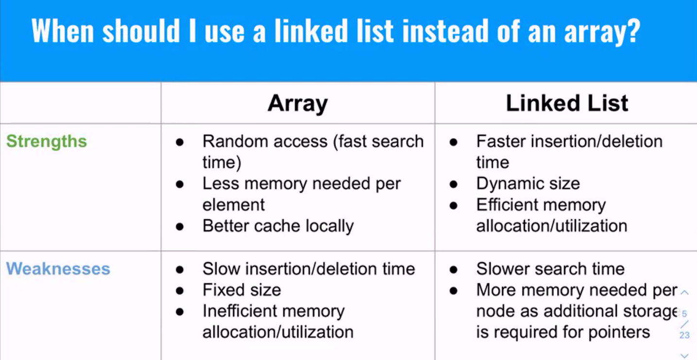

# Linked Lists

## Why use them?

- For efficient insertion and removal in the middle of a list.

## Real world applications

- Git History
- Playlists

## Common Linked List Interview Questions

- Implement a Stack and Queue using a Linked List.

# Binary Search Trees

Common interview questions:

- Search for a given value in a BST
- Find height of a BST
- Check if a BST is valid

