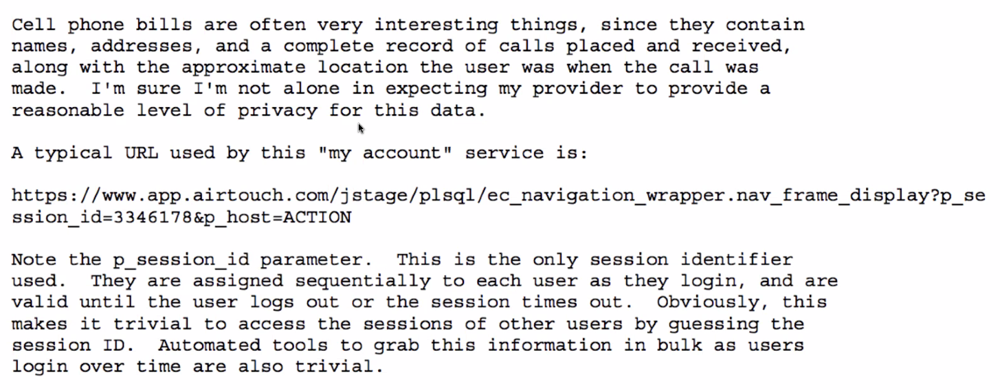
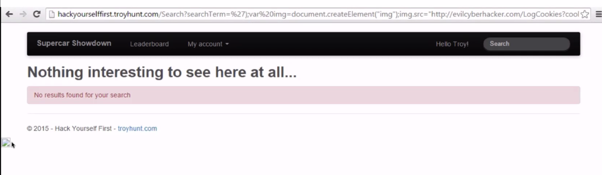
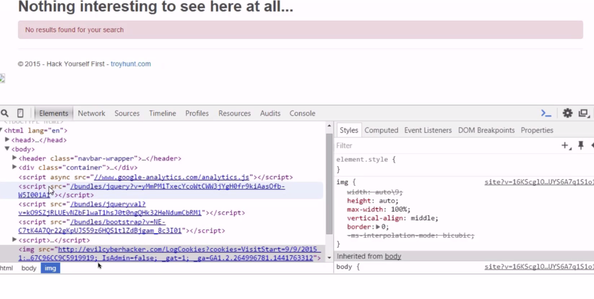
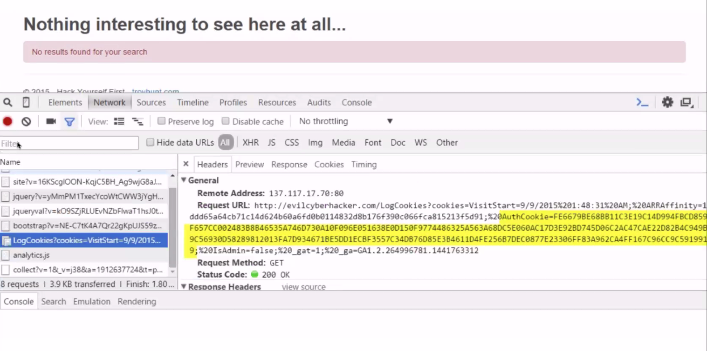
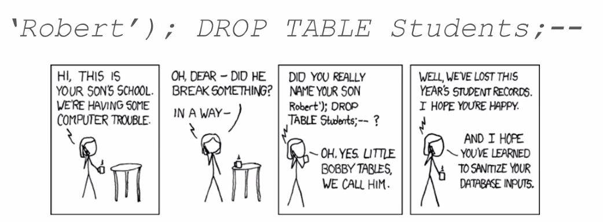
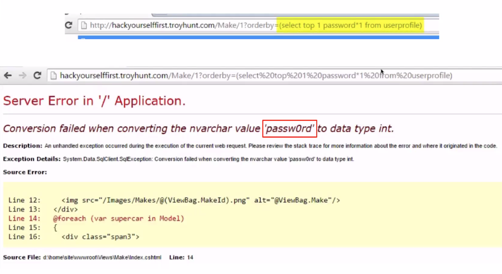
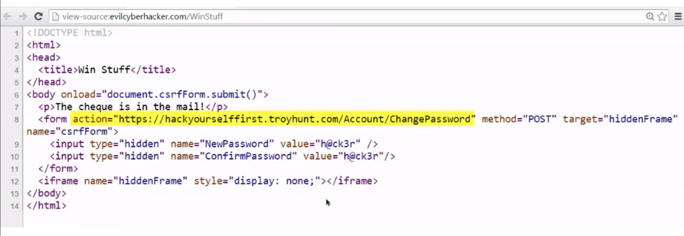
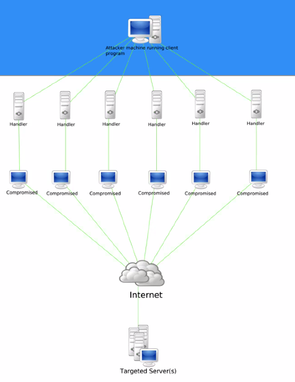

# Security

## Overview

Website are inherently vulnerable to risks.

## What is it?

Vulnerabilities in your web application can be exposed exploiting weaknesses in **HTTP requests**, networks and servers.

## Untrusted Data

Look for vulnerabilities in these types of data:

- Request body
- Request headers
- Query strings
- Route Parameters
- Third-party API responses (external services)

## Web Vulnerabilities

### Example 1: Mass Assignment

Mass assignment is a computer vulnerability where an active record pattern is abused to modify data that should be private.

```JavaScript
create: function(req, res) {
  let newUser = new User(req.body)
  newUser.save(...)
}

userSchema = new Schema({
  username: String,
  password: String,
  isAdmin: Boolean,
  createdAt: { type: Date, default: Date.now }
  updatedAt: { type: Date, default: Date.now }
})
```

Never drop the entire body of a request into the database.

#### Solution

Be Explicit Instead

- Allow list
- Deny list

```JavaScript
// blacklisting
create: function(req, res) {
  delete req.body.isAdmin
  let newUser = new User(req.body)
  newUser.save(...)
}

// whitelisting
create: function(req, res) {
  let newUser = new User({
    username: req.body.username,
    password: req.body.password,
  })
  newUser.save(...)
}
```

### Example 2: Direct Object Reference

When an identifier, used in a route, is exposed to users.

GET api.com/messages/13
DELETE api.com/messages/13

*Malicious attackers use the object reference without authentication*

Cell phone bills are often very interesting things, since they contain names, addresses and a complete record of calls placed and received, along with the approximate location the user was when the call was made. I'm sure I'm not alone in expecting my provider to provide a reasonable level of privacy for this data.

A typical URL used by this "my account" service is:



### Example 3: Cookie Poisoning

Cookie poisoning is the modification/forgery of a cookie by an attacker to gain unauthorized information about the user for purposed of *identity theft*.

*Websites that issue a cookie should protect the cookie through encryption*

### Example 4: User Enumeration

Revealing who owns an account by exposing too much information in feedback and erros.

- Probing for a valid user

E.g.

Attack on Ashley Madison

1. Login attempts were made with a bunch of emails and intentionally wrong passwords.
2. Ashley Madison did not reveal if the email didn't exist, **but...**
3. The HASH algorithm on the password was only attempted if the email was registered.
4. Hackers could determine who was registered by **timing** how fast the response came back! Because the response was **faster** when the email wasn't registered.

### More Examples: Common Attacks

- XSS (Cross-Site Scripting)
- SQL Injection
- CSRF (CORS)
- DoS

#### XSS

Embedding malicious executable code into a website that steals info, often cookies used for authentication.

Types:

- Reflected XSS
- Persisted XSS

###### Reflected XSS

Injects executable code within **a single HTTP request**.

The injected attack is not stored within the application itself; it is non-persistent and only impacts users who open a **maliciously crafted link**.

E.g. you could stick some javascript into the url to steal your cookies.





###### Persisted XSS

Not sent via a link, but via stored data.

- How to prevent?

If a user input ends up in the DOM, scrub it. Ideally all HTML special characters will be replaced with HTML entities.

> (greater than)
< (less than)
& (ampersand)
' (apostrophe or single quote)
" (double quote)

#### SQL Injection

SQL databases are prone to vulnerabilities if not handled properly.

Passing a string to the server that ends up in a SQL statement.





##### How to prevent SQL Injection?

1. Scrub the inputs!
   a. Escape characters that have special meaning in SQL
   b. Pattern-check/validate input to see if it conforms to a valid representation of a pattern.
2. Use an ORM, which scrubs it for you.

#### CSRF (CORS)

Making request to a site/API from a malicious site that looks the same as a legitimate request from an authorized user.

An attacker may trick the user of a web application into executing actions of the attacker's choosing.

This is not about data-theft; it's about hijacking state-changing requests like changing the user's password or deleting their account.



The **same-origin policy** is an important security concept implemented by web browsers to prevent JavaScript code from making requests against a different origin (domain) than the one from which it was served.

##### How to Prevent CSRF?

Express and other popular frameworks disallow CORS by default. Requests from other domains are rejected.

Send a CSRF Token. Randomly generated token inserted into DOM that is validated on the server.

#### DoS

Denial of service attacks aim to shut down a user's account or entire website.

- A **denial-of-service (DoS)**  attack attempts to make a machine or network resource unavailable to its intended users.
- A **distrubuted denail-of-service (DDoS)** is where the attack source is more than one, often thousands of unique IP addresses.



- Can be defended against with throttling (e.g. max 1 req per second per user).

## Summary

Websites and programs are inherently vulnerable. While you may never be able to account for every possible attack, there are some simple best practices to follow which can make your application a far less appealing target.
- Scrub user inputs.
- Be careful about the information / errors passed to your users.
- Be mindful and explicit about what data you allow users to manipulate / access.
- 

## Questions
