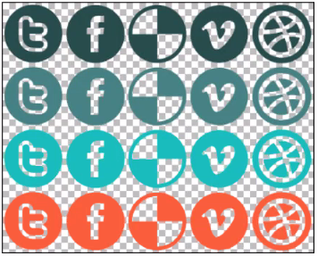
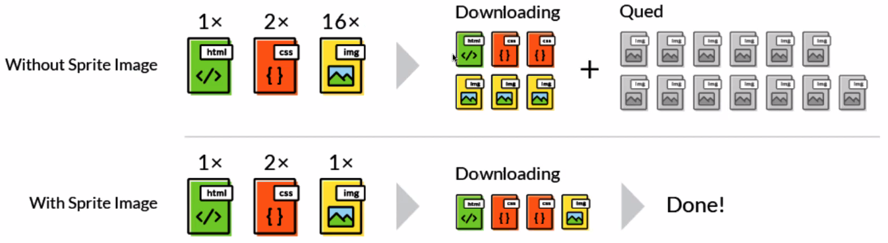

# Frontend Optimization

## Overview

Frontend optimization is all about user experience.

## Why Do We Care?

1. Building large client side applications can cause extended load times.
2. CSS and JavaScript files can be very large in size.
3. Mobile users and users on slow connections (dial-up) can have dramatically bad experiences.

## Slow Connections

1. Over 1.9m people still use **dial-up** connections in the US (as of November 2019 according to AOL).
2. 70% of US users view the internet on much faster broadband connection with an average speed of **11.4 Megabits** per second.
3. That's **200 times** faster than dial-up 56 Kilobits per second.
4. Smartphones are more than **100 times** faster then dial-up.

## Making Sites Fast!

### Making Fewer Requests

1. When a browser sees content that **isn't already cached**, it makes a new HTTP request.
2. That HTTP request has to go through several steps before the asset can be downloaded  (routers, DNS, etc.).
3. Reducing the number of requests reduces overhead.

## Combine Files

1. Minimize JavaScript and CSS requests.
2. Bundle CSS and JavaScript files.
3. Combine images into CSS sprite sheets.

## Images Play a Big Role in Download Overhead

## Minimize Files

We tend to mean minification and uglification. Webpack does this for us in the production build.

1. Minification
  - Removing unnecessary white space and semi-colons.
2. Uglification
  - Turns the code into an unreadable form.
  - E.g. take a function `multipleByTwo` and rename it `a`.
3. GZIP
  - Compresses your static files.
  - All browsers support gzipped files.

### GZIP

1. GZIP performs best on **text assets**: CSS, JavaScript, HTML.
2. All modern browser support GZIP.
3. Your **server** needs to be **configure** to enable GZIP compression.
4. Some CDNs require special care to ensure that GZIP is enabled.

## Optimize Media

### Content Delivery Network (CDN)

1. A CDN is a **globally distributed network** of proxy servers.
2. CDNs serve content and promote high availability and performance.
3. CDNs provide a better chance of **cached assets**.
4. CDNs deliver content based on geographical location.

Available through AWS, Microsoft Azure, Google Cloud Services etc.

## Images

1. On average, images account for more than **63%** of a web page's size.
2. Learn how and when to use common image formats - GIF, JPG, PNG, SVG.
3. Use Scalable Vector Graphics (SVG) to lighten the load for icons and non-photographic images.
4. Use CSS or server support to deliver images sized to the screen.
5. Use CSS sprites.

## Video

There are two types of video - streaming and progressive.
  - Use streaming video whenever possible.
  - Use a CDN or similar service provider.

Use proper compression on your video (or use a service that provides optimization for you).
 - Adjust resolution, bitrate and format etc.

## Loading Content

Use prefetching, lazy loading and caching to manage download timing.

1. **Prefecting** occurs when you load content in the background (i.e. loading images while viewing an image gallery) fetches but doesn't apply until needed.
2. Prefetching can be performed on web pages pages, domain names, scripts, stylesheets, media, etc.
   - All about anticipation
   - `<link rel="prefetch" href="/img/big_image.jpg">
3. Use **pre-rendering** to render an entire webpage in the background.

### Load it Later

**Lazy Loading** is a technique where images are only loaded as they have to show up on the screen.

## Caching 

Browsers implement a cache for temporary storage of HTML, CSS, JavaScript and images.

### Cache Control

1. **Freshness**
   - Allows a cached item to be used without rechecking from the origin server.
2. **Validation**
   - Used to check whether a cached item is still good after it becomes stale.
3. **Invalidation**
   - Side effect of another request that passes through the cache (i.e a cached URL gets a POST, PUT or DELETE request).

## Cross Browser Compatibility

- Each browser uses its own rendering engine to convert HTML, CSS and JavaScript.
...

### Summary

1. Make smart decisions about how you optimize the frontend of your websites to deliver the best possible user experience.
2. Bundle and minimize CSS
3. Images
