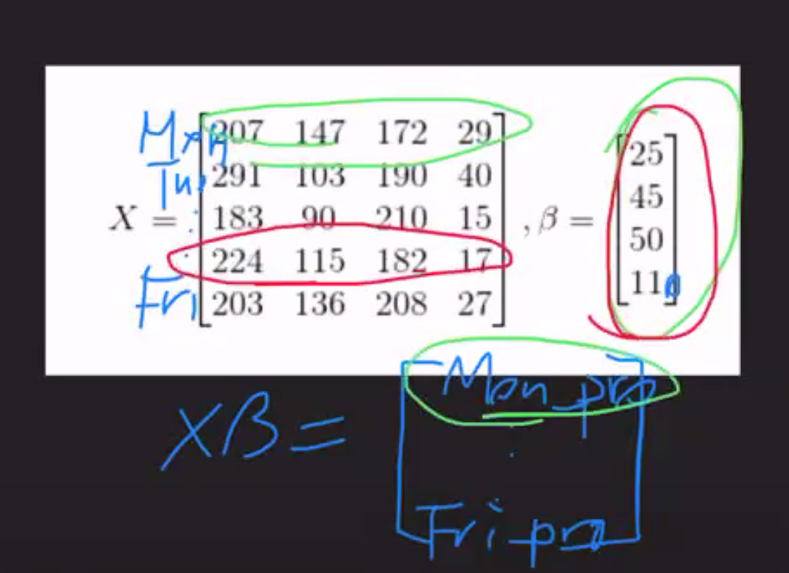

# Math - Catherine Cheng

## Machines


## Classes of machine learning

Supervised Learning - Right answers are given to the computer => labelled
- Regression: Prediction of a continuous value
  - House price
- Classification: Prediction of a discrete value
  - Cat or dog?

Unsupervised learning
- Discovery of relationships between pieces of data through discovering patterns or grouping similar data => unlabelled
  - Clustering
  - Dimensionality

## Supervised learning

- Requires an already labeled data set

Data can be gathered from
- Some online data set
- An experiment
- Scraping, data mining
- Crowd sourced data (re-captcha)

All fo this data must be labeled, meaning, the right output is known

## Discrete vs Continuous Data

Discrete data - Possible values are detached from one another - there is space in between possible values
Continuous data - between any two possible values, there are infinitely many other possible values

## Recap - Raw Car Data


## Linear Algebra

### Supervised Learning Algorithms

- With supervised learning techniques our goal is to find the right (best) data to fit the formula we can use for predictions
- First, we will separate the Label column from the rest of our data frame
- In doing this we get two pieces of data
  1. a two dimensional matrix


y = beta x + epsilon
y = β x + ε


β = weight/importance
ε = error

## Why is this notation useful?

- It conveys a lot of information very compactly!
- Particularly important: what does xβ mean?

- It represents the need to take each column observations and multiply them by their assigned weights

## Dot production, Matrix Multiplication and Function Application

Suppose I own a fruit stand. I sell apples, bananas, oranges and durian.

Apples cost 25 cents, bananas cost 45 cents, oranges cost 50 cents and durian cost 110 cents.

On monday, I sell 207 apples, 147 bananas, 172 oranges and 29 durian.

We can use vectors and matrices to store this data so that calculating my revenue is the same thing as matrix calculation.

= 25*207 + 45*147 + 50*172 + 110*29


We can display this in matrix notation as follows:
```
```

What if we have data from multiple days of fruit sales? What will the shape of the output be?




- Each column on the left matrix is a week of sales for a particular fruit
Output:
x = [
  monProfit = 25*207 + 45*147 + 50*172 + 11*29,
  tueProfit,
  etc...
]

## The vector β represents a function, and the multiplication of xβ represents applying the function to each row of X

In our fruit stand example, each day we want to multiple.

## Consider a slightly different scenario

- We keep track of daily sales

## Assumptions

- We make assumptions on what is discrete and continuous.
  - We actually make the assumption that we can treat cylinders as continuous.

# KNN

The implementation of KNN in the extension challenge has built-in assumptions about the nature of our datasets (e.g. it's okay to treat cylinders as a continuous value)


A large K is bad
A small K is good

## Other forms of bias and/or implicit assumptions our model might contain

1. Is there a large difference in the variance of each feature?
3. Are our features highly correlated?
4. Are we overfitting  our model?


### 1. large difference in the variance

- In our original model, which features tended to contribute more to the distance between K

- Solution: feature scaling
- Standardization scales a feature so that its mean is 0 and its standard deviation is 1. Normalization scales a feature so that its range, or its norm is 1.

### 2. NaNs = should we simply remove observations with NaNs or missing values?

- If you have lots of data => delete them
- If you are startup and you have little data
  - You estimate the missing values
- Solution: impute missing values
- Solution: add missing values in the data set

### 3. Are our features highly correlated?

- What problems would we introduce by adding a feature that measured car weight in lbs?
- Solution: dimensionality reduction algorithms, Principal Component Analysis

### 4. Are we overfitting  our model?

- Because we are tuning hyperparameters based on the performance of our loss function on the test data, we cannot expect our algorithm's performance on the test data to be representative of its performance on unseen data
- Solution: split data into training data, validation data and test data
- Solution: cross validation

## Assumptions By Example - Linear Regression

We are going to walk through a type of supervised learning algorithm - linear regression - and pick out some of the assumptions we make by selecting this type of algorithm

## Linear Regression

- There are two types:
  - Simple: single feature is used to predict a label, x and y axis only
  - Multiple: multiple features are used to predict a single label

- It is one of the simplest approaches in supervised learning!

- A scatterplot can be a helpful tool in determining the strength of the relationship between two variables, and with a linear regression line we are looking for the best possible line to fit the data set and minimize the distance between points
  - Defining distance is a conversation on its own but for now 

## What are we trying to minimize?

- The root mean square error = RMS
  - = sqrt(sum((ypred - yactual)^2))


## Linear Regression Assumptions

- Linear regression models assume that there is a linear relationship between a feature and a label
- Making predictions using linear regression models where features do not have such a clear relationship can result in inaccurate predictions and conclusions.

## ML Unit Summary

- Machine learning is a vast field, and there are plenty of opportunities for software engineers to be involved in the workflow, even without heavy math / stats backgrounds (though these are helpful!)
- There are 2 categories of Machine Learning and 4 patterns which cover ~90% of problems:
  - Supervised Learning: Regression, Classification
  - Unsupervised Learning: Dimensionality Reduction / Clustering, Association Analysis

## Questions

Loss function
What if the relationship is non-linear
How would we handle treating cylinders as discrete
Can AI have consciousness


