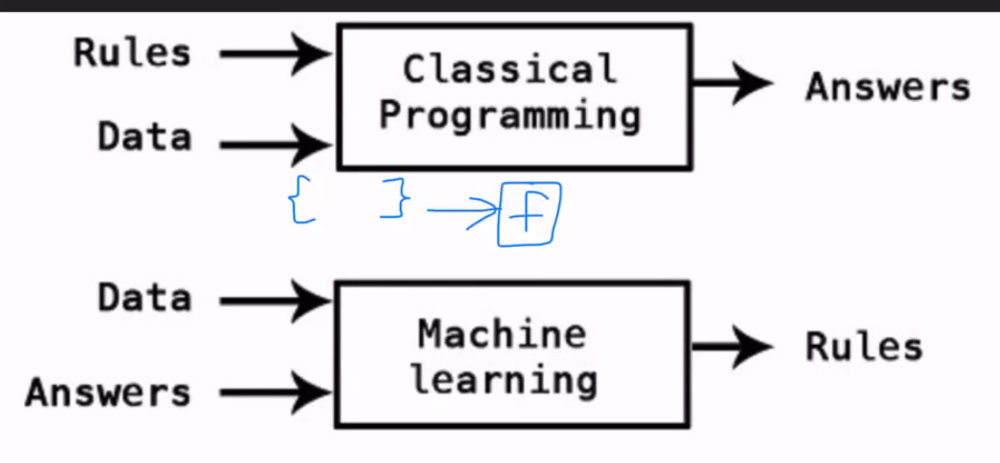
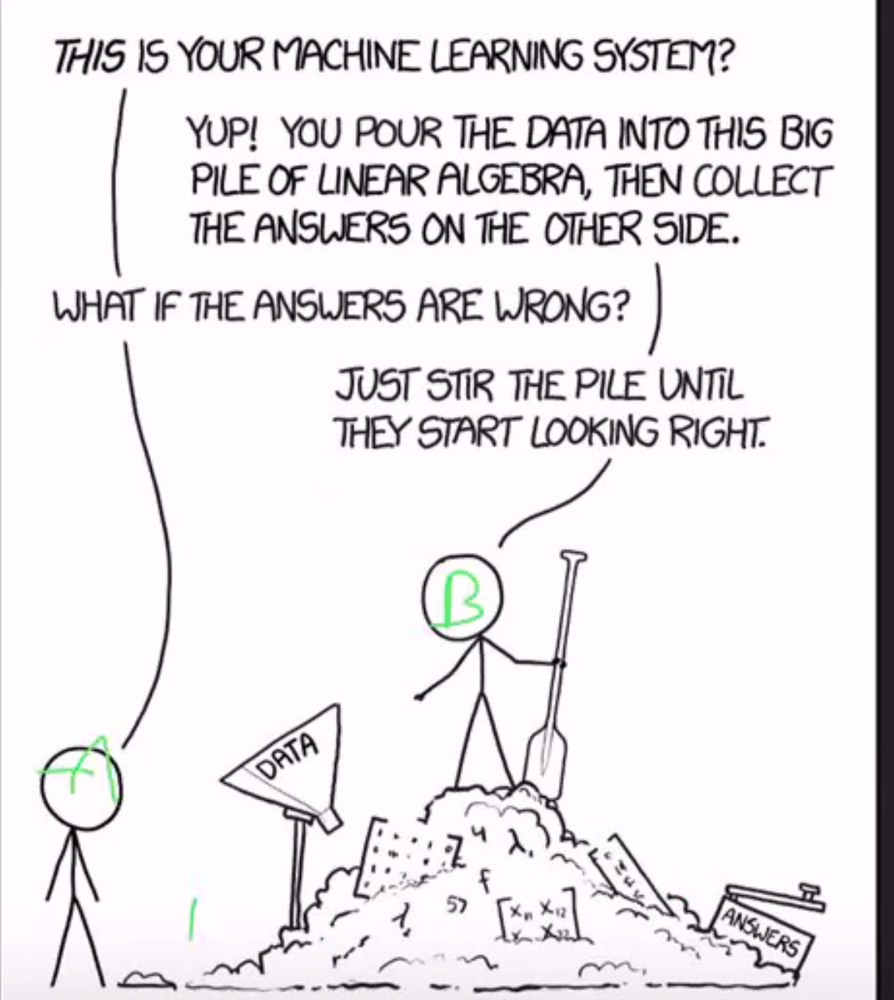
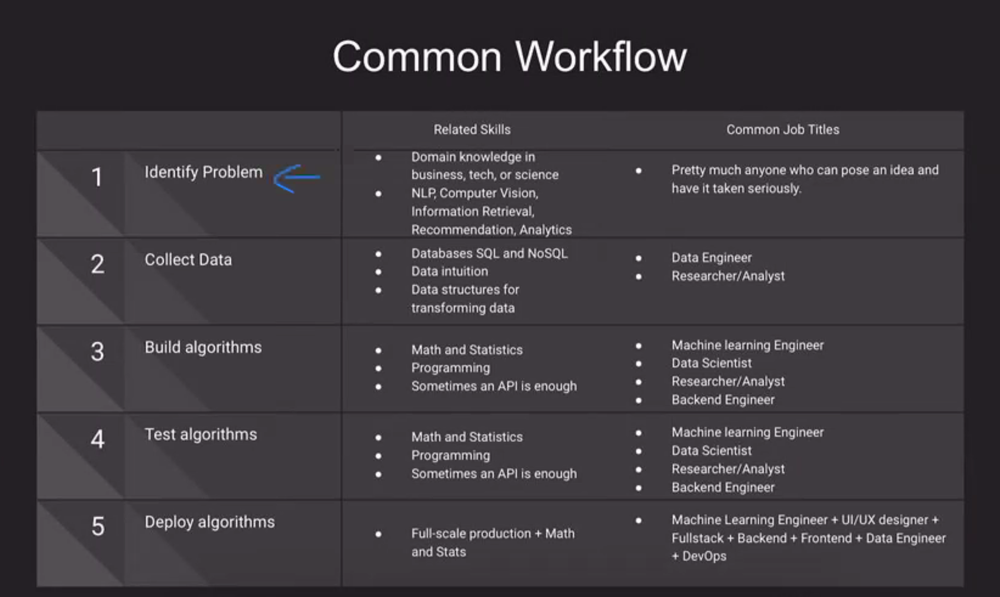
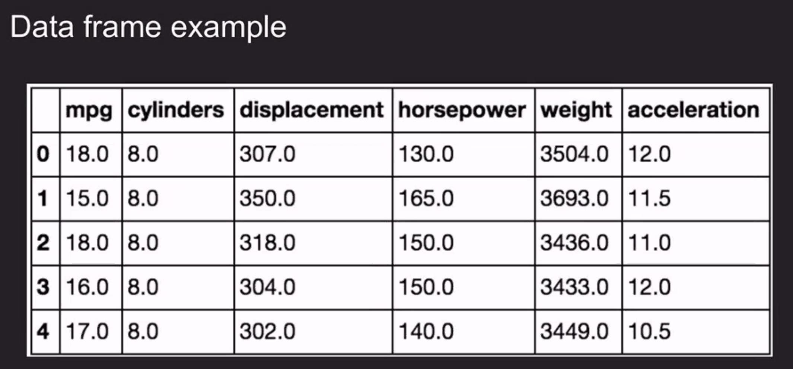
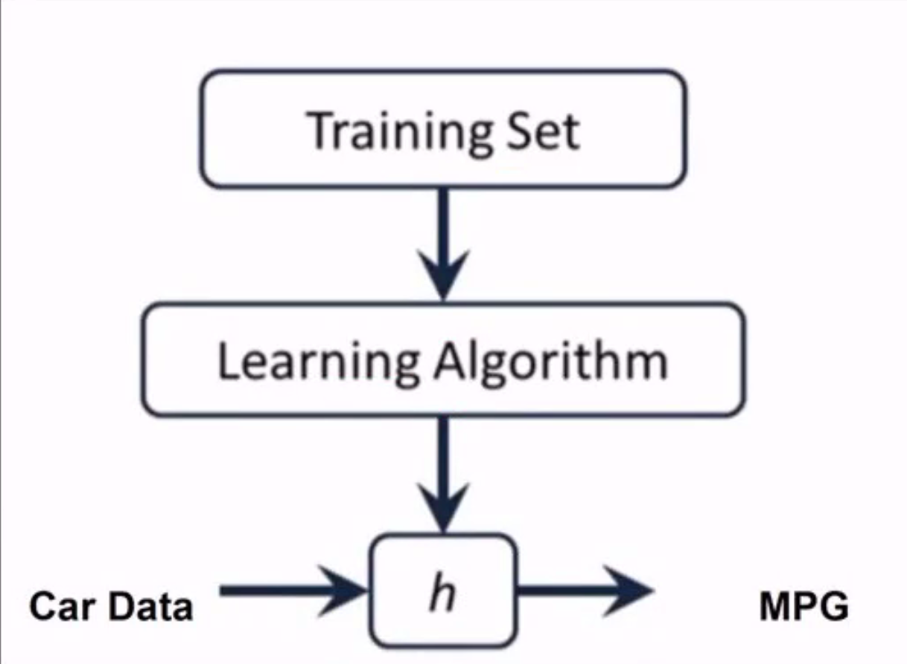
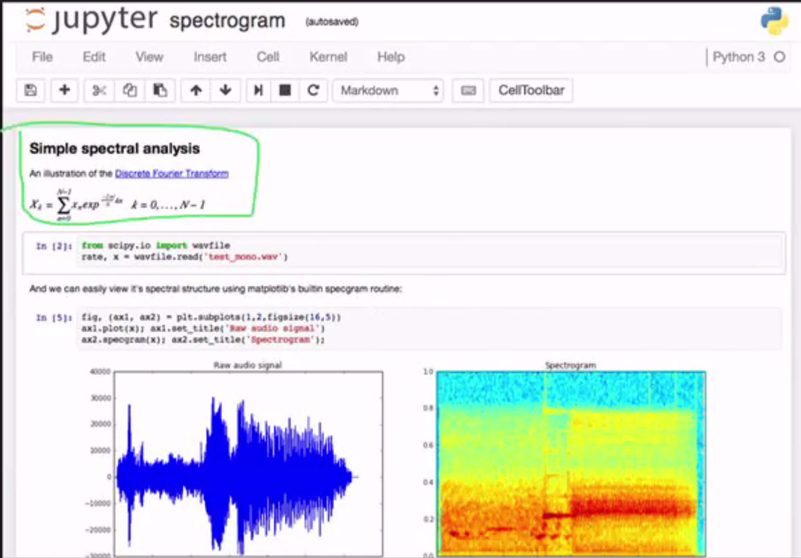

# Machine Learning - Catherine Cheng

## Goals of this unit:

- Acquire exposure to python - practice learning new languages
- Install a scientific python environment suitable for machine learning
- Get started with machine learning using data analysis libraries to understand fundamentals concepts and workflow
- Break down the barrier of entry into ML for software engineers!

## A History of AI and ML...

1960's:
- Josheph Weizenbaum (MIT) built ELIZA, an interactive program that carries on a dialogue in English language on any topic. It was a popular toy at AI centres on the ARPANET with a version that "simulated" the dialogue of a psychotherapist.

Late 1960s and 1970s: AI Cooldown
- Frame Problem, Perceptrons/Neural Networks and the XOR Affair

1980s: New interest in Neural Networks
- Chess Bot performance, First robotic car

1990s:
- Deep Blue

Early 2010s:
- hardware, data generation, algorithm improvements, cloud services, advanced neural nets

## The downsides

Data monopolies
- FANG, ISPs, security agencies
- This breaks the dreams of startups
- Weapons of Math Destruction: How Big Data Increases Inequality and Threatens Democracy (2016)

## What is Machine Learning?

- ML is the science of getting computes to act in desirable ways without being explicitly programmed. Mostly pattern recognition.
- Based on existing data, computers learn how to predict results in the future on unseen data.
- In a sense, it is a form of metaprogramming.



## Data augmentation



## Machine learning is not magic!

The majority of machine learning problems fall into four patterns:

- Regression: Can our data predict a number?
- Classification: Can our data predict a category?
- Dimensionality Reduction: Can our data be combined into a simpler format?
- Clustering: Can we find natural grouping in our data?

Note: Picking the approach

## Some simple examples

- Classification => tagging product categories in ebay
- Regression => calculating platform forecasts for expected inventory stock
- Regression/Classification/Clustering => is a bank transaction fraudulent?

## AlphaGo

- Positions: 2.08*10^170
- 10^80 atoms in the universe

## Movie Recommendation

- Hulu, netflix etc.

## Search Engine Results

- Google: https://adssettings.google.com/authenticated

## Self Driving Cars

- Tesla

## Common Workflow

1. Identify Problem
   - Related skill:
   - Common Job Titles
     - Pretty much anyone who can have an idea taken seriously
2. Collect Data
   - Related Skills
     - Database SQL and NoSQL
   - Common Job Titles
     - Data Engineer
     - Researcher/Analyst
3. Build algorithms
   - Common Job Titles
     - Machine learning Engineer
     - Data Scientist
     - Researcher/Analyst
     - Backend Engineer
4. Test algorithms
   - Common Job Tiltes
     - 
5. Deploy algorithms



## What is numpy?

- Number manipulation in python
- Python library for fast computation with arrays
- Particularly strong at computation with multi-dimensional arrays
- We frequently refer to a one-dimensional array as a vector and a two-dimensional array a matrix
- Ex row vector: `np.array([1, 2, 3, 4, 5])`
- Ex column vector: `np.array([[1], [2], [3]])`

## Important Data Vocabulary

- Independent variables / Features: The variables we are using to make a prediction about another value (Dependent variable / Label)
- Dependent variables / Label: The variable whose value we are trying to predict
- Data frame: a rectangular structure that stores our data (kind of like an excel table or sheet)
- Observation: a row in our data frame: 

## Data frame examples



- Independent variables/features:
  - cylinders, displacement, horsepower, weight, acceleration

- Dependent variable/label:
  - mpg

- Data frame:
  - Whole tables

- Observation:
  - A row



- Training phase => testing phase
  - We use a cost function or an error functions
    - Usually best industry practice is to push to production at a ~75% accuracy rate
    - Then you use production data and hopefully the rate goes up to 80% and then hopefully 90%
      - Anything above 90% is considered EXTREMELY good

- Usually for MVP 60-75% accuracy rate is considered good enough

## Jupyter Notebooks and Literate Programming

Let's take a look at the environment we will be using to write and run our machine learning algorithms

## Jupyter Notebooks

We will be writing code in jupyter notebook, which are modeled after age-old tradition of a scientific lab notebooks.

Benefits of jupyter notebooks:
- Intersperse cells of code with cells of markdown
- Encourages plain english explanation of what we are doing and why
- Experiments and findings are **reproducible**
- Notebooks are hosted by a server, making them easily shareable



## Why python?

There are few main languages used in ml and data science:
- R
- Matlab
- Python

But python has gained supremacy due to its simplicity, accessibility and substantial libraries

## Libraries

- Matplotlib: data visualization library to help us understand our data, developed by matlab
- Numpy: math library with powerful multi-dimensional array methods
- Scipy: a scientific library made for computation of large data sets, using numpy
- Scikitlearn: a powerful machine learning library built with numpy and scipy
- Keras: an ease of use artificial neural network library
  - Used in research in many top unis

## Python Basics

- Dynamically typed
- Interpreted
- Whitespace dependant
- No semicolons
- No braces
- Used heavily in scientific research
- Language with the most Machine Learning Libraries

## Python data types

- str: 'string value' or "string value"
- int: 10
- list: [1, 2, 3, 4]
- dict: {"key": "value"}
- tuple = (1,2,3)

## Tuple

A tuple is a list like structure that is immutable
It can be used to return multiple values from a function
They can be used as keys in a dictionary (unlike lists)

```python
my_tuple = (1,2)
my_dict = {}
...
```

## List operations

```python
list.append(value)
list.remove(value)
len(someList) # returns the length
```

## List Slicing

```python
myList = ['one', 'two', 'three', 'four', 'five']
print(myList[:2]) => ['one', 'two']
print(myList[1:3]) => ['two', 'three']
print(myList[-2:]) => ['four', 'five']
# stepping
print(mylist[::2]) => ['one', 'three', 'five']
```

## Broadcasting

```python
a = np.array([1,2,3], [4,5,6])
b = np.array([10,20,30])
a + b => ([[11, 22, 33], [14, 25, 36]])
```

## Numpy index selection

```python
a = np.array([0,10,20,30,40,50,60])
indexes = [0,2,4,6]
b = a[indexes]
b = a[[0,2,4,6]]
print(b) => [0, 20, 40, 60]
```

## np.random.seed()

Seeds a random value to the PRNG
Makes your code repeatable
```python
np.random.seed(42)
print(np.random.rand(1)) # [.104]
np.random.seed(42)
print(np.random.rand(1)) # [.104]
```


## For faang tips

- 200 letcode problems
  - 10% hard
  - 80% medium
  - 10% easy

- focus on graph and dynamic programming problems

### Questions

What is Dimensionality example?

