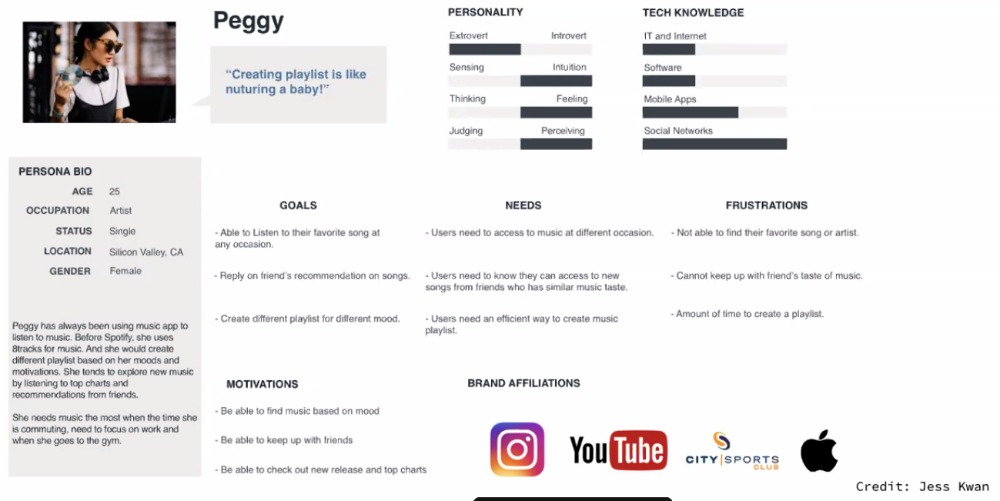
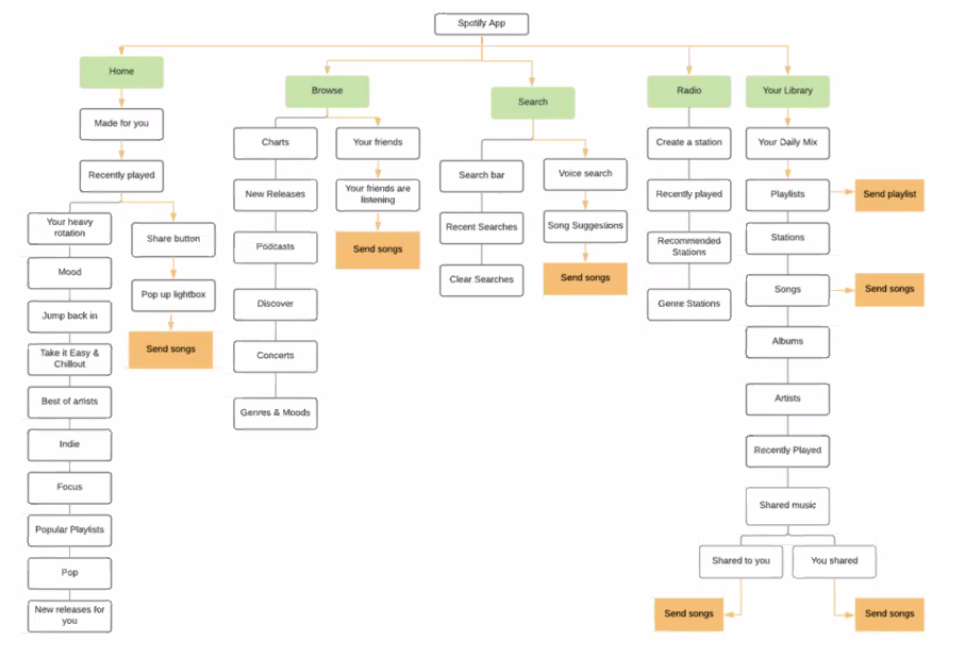
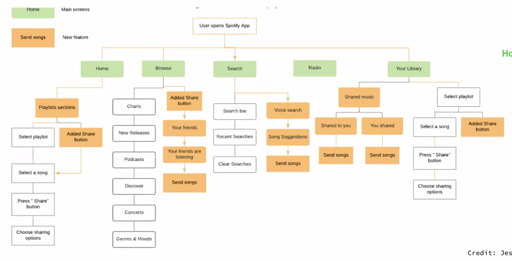
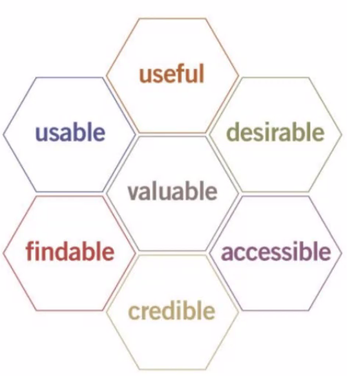

# UX

## Personas

- Personals represent a user.
- E.g. Spotify has 335 million users, but 5 personas.
- All about putting yourself in your users shoes.

E.g.

## The Jobs To Be Done framework

- Users don't want to buy a quarter-inch drill, they want a quarter-inch hole.

## What and How

- What:
  - Defining the avenues and paths of the information architecture.

- How:
  - Understanding the specific actions your user takes. And how they feel as they do it.

Information architecture is a bird's-eye view of the entire product.

E.g.

User Flows -> The how:

## Usability HoneyComb

