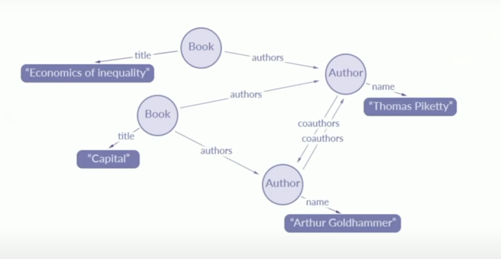
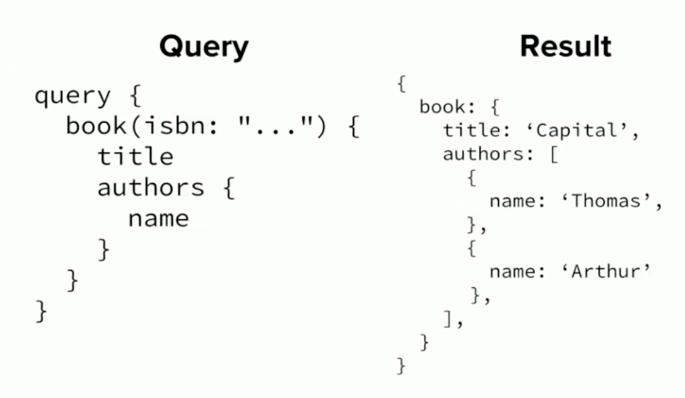
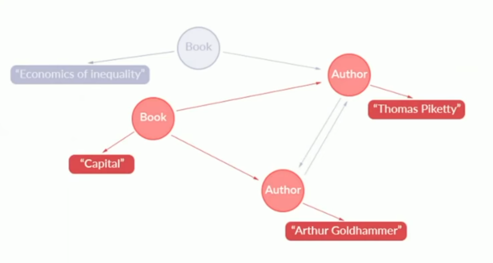
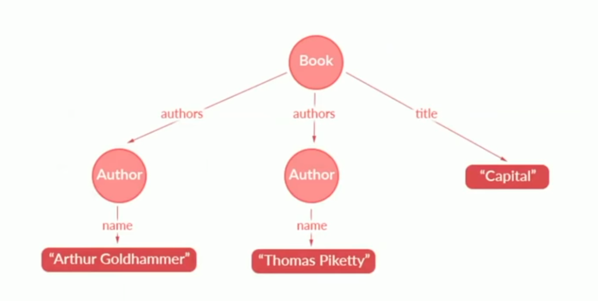
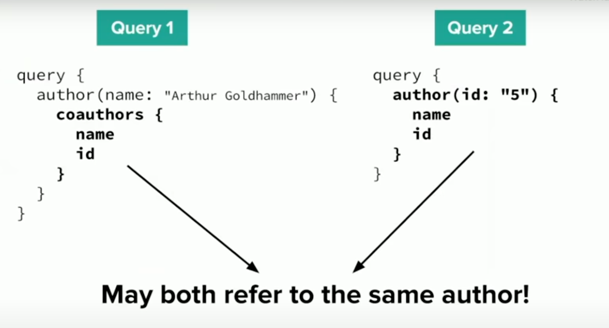
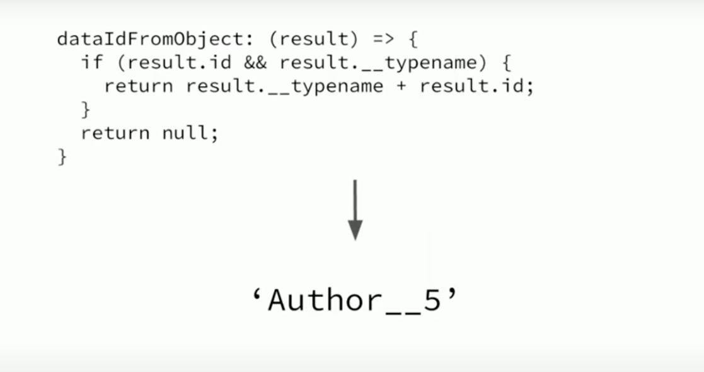
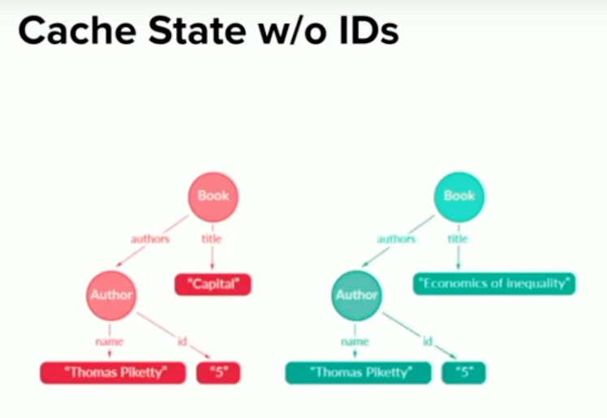
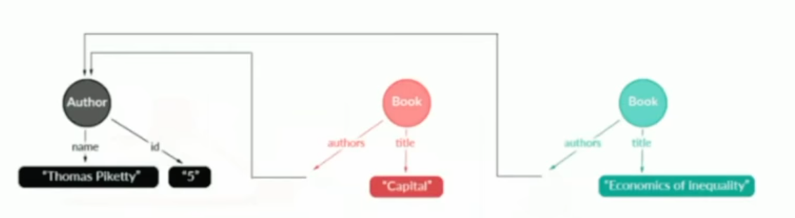
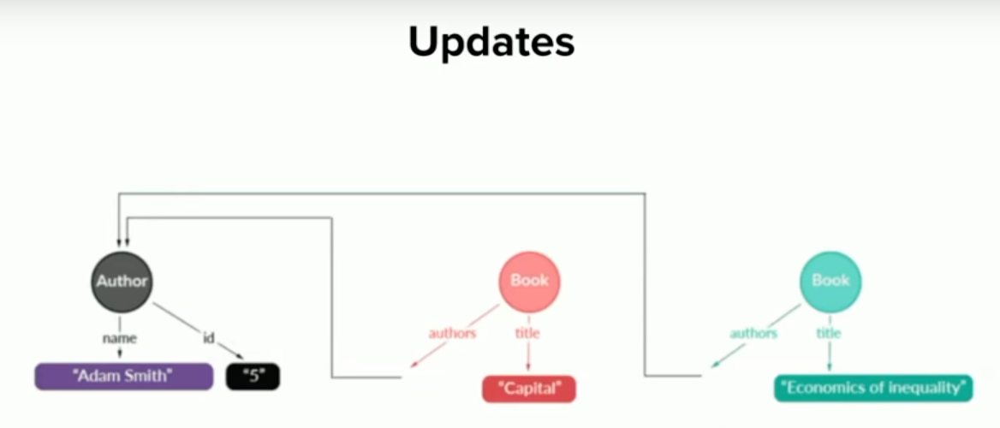
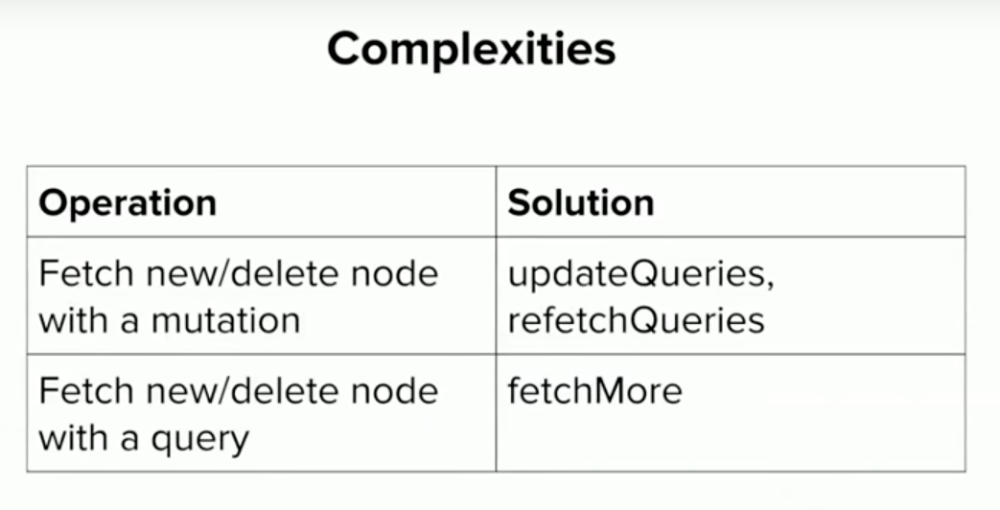

# GraphQL

https://www.apollographql.com/blog/the-concepts-of-graphql-bc68bd819be3/#.94scr3agl

https://www.youtube.com/watch?v=zWhVAN4Tg6M&t=1s

The true heart of GraphQL lies in what I think of as the application data graph.

Why is it called GraphQL?

Because of the App Data Graph

GraphQL lets us pick trees out of the graph.

GraphQL allows to traverse our Application Data Graph, and pull trees out of it.

## Traversal

Root Query is where you start when you start traversing your Application Data Graph.

Each GraphQL query tells the client what is being fetched.

GraphQL and caching area match made in heaven.

Queries are associated with view components.

## Couple of different approaches to caching

### The Apollo Client Way

Cache query result trees.

Relay works differently. Instead of working with trees it works with the entire Graph of information that you have, and goes so you have this information already, what information do you need in order to fulfill this query.

Goal: Update queries associated with objects in the cache.

Problem: How do we identify when we're fetching the same object again?

### Assumption 1

Same traversal path => same object.

Bu what if we access the same object through two different paths?

Solution: dataIdFromObject

GraphQL Result Data -> Unique ID

This way we can tell that both queries access the same object, as they both have the same dataId.

### Assumption 2

Same data ID => same object

This is what cache might look like without IDs:

With dataIdFromObject:

So to recap:

Assumption 1: Same path, same object

Assumption 2: Same ID, same object

## Complexities

That's how caching works!
