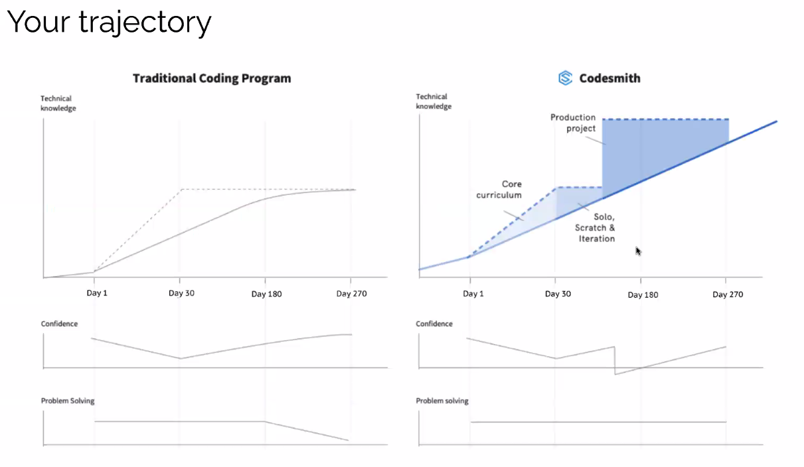

# Production Project Overview

## Goals

Level Up

- Cementing your core understanding (in production project MVP features)
- Continuing to push into new technologies to grow as a T-shaped developer
- Continuing to work on team-oriented AGILE/Scrum development.
- Working on Testing a larger-scaled application.

Notes:
- 9 Weeks for the project.
- You need Testing.

## Production Project Schedule 

### Weeks

- 23 - 25 - Production Project to MVP Presentations (May 29th)
- 24 - 2 day Security Unity, Hiring Prep Lecture, Frontend Optimization Lecture
- 26 - Break Week
- 27 - 32 - Production Project MVP to Launch (Tent. July 15th)
- Keep in mind that DevOps Unit, Hiring Program, Resumes and more will be throughout Senior Portion
- More detail in Senior Program Kickoff

## Opportunities and Expectations

- Define a culture of welcoming excellence for Juniors
- Bring all your energy to the coming weeks
- Push yourself to maintain balance of exploring new and cementing core
- Advanced concepts and practices
- Diving deep into Hiring Program
- Stand ups will continue to be at 5pm PT and give you a clear view of the day - Be in attendance

## Your Trajectory

### Questions